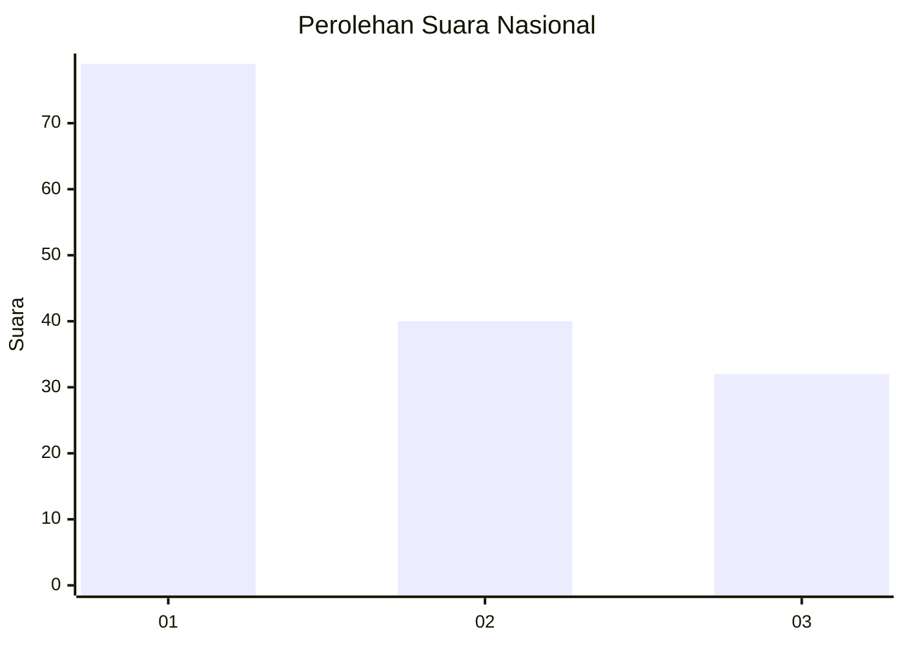
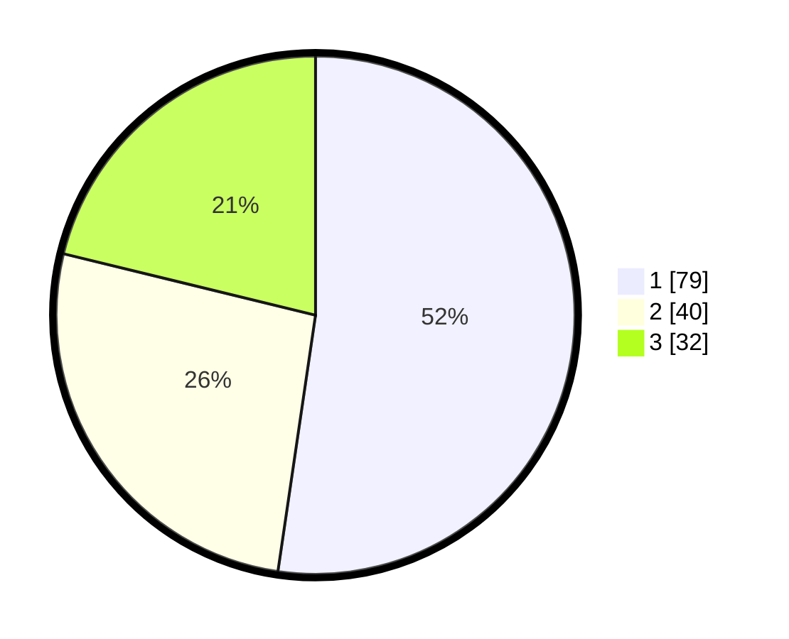

# Hasil

## Grafik

## Tabel

| No. | Nama Paslon    | Suara | Suara (raw) | Persentase |
|:--- |:-------------- | -----:| -----------:| ----------:|
| 1   | ANIES MUHAIMIN | 79    | [79][p-1]   | 52,32      |
| 2   | PRABOWO GIBRAN | 40    | [40][p-2]   | 26,49      |
| 3   | GANJAR MAHFUD  | 32    | [32][p-3]   | 21,19      |

[p-1]: https://github.com/gigit-pemilu/pemilu-2024/blob/main/pilpres/hitung-suara/sub/61-kalimantan-barat/sub/02-mempawah/sub/01-mempawah-hilir/sub/2003-pasir/sub/025-tps/sub/paslon-1.txt
[p-2]: https://github.com/gigit-pemilu/pemilu-2024/blob/main/pilpres/hitung-suara/sub/61-kalimantan-barat/sub/02-mempawah/sub/01-mempawah-hilir/sub/2003-pasir/sub/025-tps/sub/paslon-2.txt
[p-3]: https://github.com/gigit-pemilu/pemilu-2024/blob/main/pilpres/hitung-suara/sub/61-kalimantan-barat/sub/02-mempawah/sub/01-mempawah-hilir/sub/2003-pasir/sub/025-tps/sub/paslon-3.txt

## Foto C Plano

https://sirekap-obj-formc.kpu.go.id/ed01/pemilu/ppwp/61/02/01/20/03/6102012003025-20240214-214746--cb4fefa1-1acf-4526-b87a-6c86c3d4650d.jpg

https://sirekap-obj-formc.kpu.go.id/ed01/pemilu/ppwp/61/02/01/20/03/6102012003025-20240214-215051--3fd32e51-fabd-4180-90d4-be2fc606e5bd.jpg

https://sirekap-obj-formc.kpu.go.id/ed01/pemilu/ppwp/61/02/01/20/03/6102012003025-20240214-215201--fa3941a9-ca95-4c88-bd80-eabadcd958d6.jpg

## Metadata

| Key        | Value               |
| ---------- | ------------------- |
| Time Stamp | 2024-02-15 20:30:46 |

