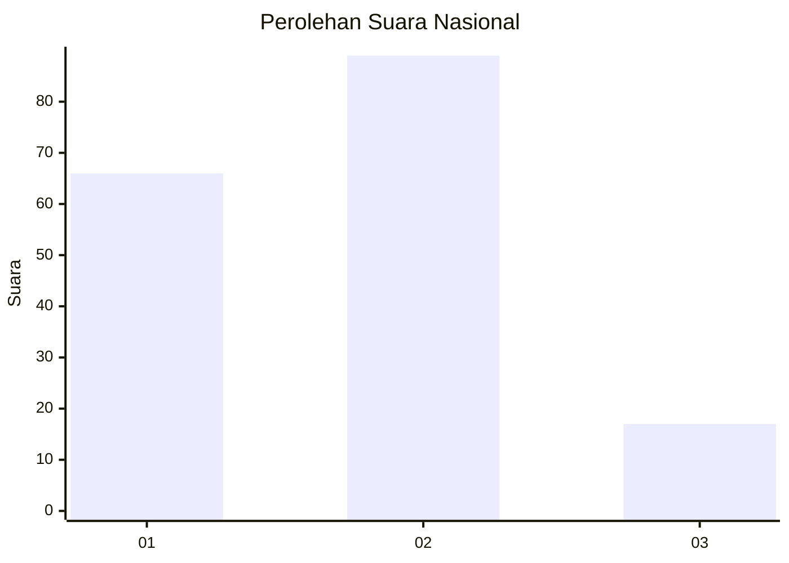
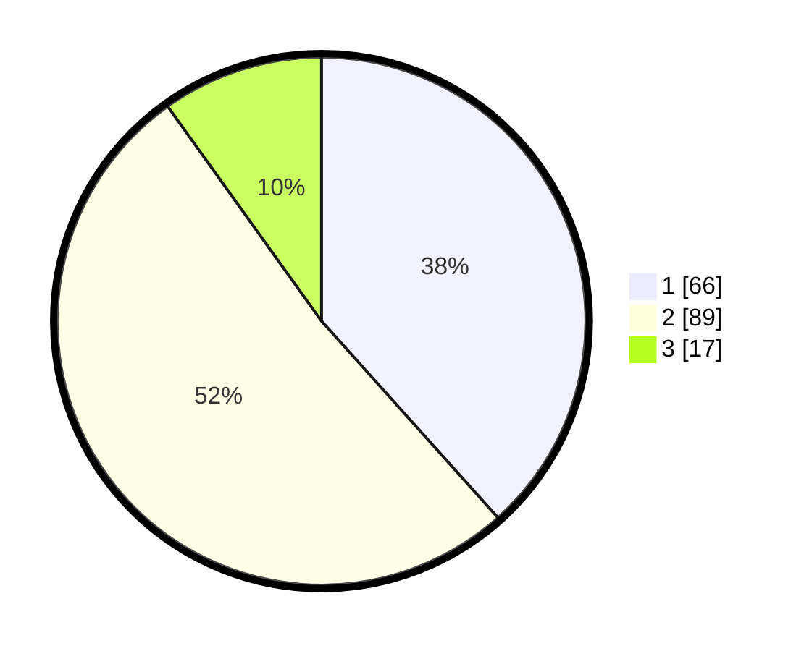

# Hasil

## Grafik

## Tabel

| No. | Nama Paslon    | Suara | Suara (raw) | Persentase |
|:--- |:-------------- | -----:| -----------:| ----------:|
| 1   | ANIES MUHAIMIN | 66    | [66][p-1]   | 38,37      |
| 2   | PRABOWO GIBRAN | 89    | [89][p-2]   | 51,74      |
| 3   | GANJAR MAHFUD  | 17    | [17][p-3]   | 9,88       |

[p-1]: https://github.com/gigit-pemilu/pemilu-2024/blob/main/pilpres/hitung-suara/sub/61-kalimantan-barat/sub/02-mempawah/sub/01-mempawah-hilir/sub/2013-kuala-secapah/sub/001-tps/sub/paslon-1.txt
[p-2]: https://github.com/gigit-pemilu/pemilu-2024/blob/main/pilpres/hitung-suara/sub/61-kalimantan-barat/sub/02-mempawah/sub/01-mempawah-hilir/sub/2013-kuala-secapah/sub/001-tps/sub/paslon-2.txt
[p-3]: https://github.com/gigit-pemilu/pemilu-2024/blob/main/pilpres/hitung-suara/sub/61-kalimantan-barat/sub/02-mempawah/sub/01-mempawah-hilir/sub/2013-kuala-secapah/sub/001-tps/sub/paslon-3.txt

## Foto C Plano

https://sirekap-obj-formc.kpu.go.id/8bdb/pemilu/ppwp/61/02/01/20/13/6102012013001-20240214-224207--6162683a-0a15-4cd2-96d5-092e44cf21dc.jpg

https://sirekap-obj-formc.kpu.go.id/8bdb/pemilu/ppwp/61/02/01/20/13/6102012013001-20240214-235451--ee211f3c-b690-479b-ab75-e9cb5d0cd991.jpg

https://sirekap-obj-formc.kpu.go.id/8bdb/pemilu/ppwp/61/02/01/20/13/6102012013001-20240214-235454--6d035f4c-f09d-4efb-9bf4-5992bee474f2.jpg

## Metadata

| Key        | Value               |
| ---------- | ------------------- |
| Time Stamp | 2024-02-17 08:30:03 |

