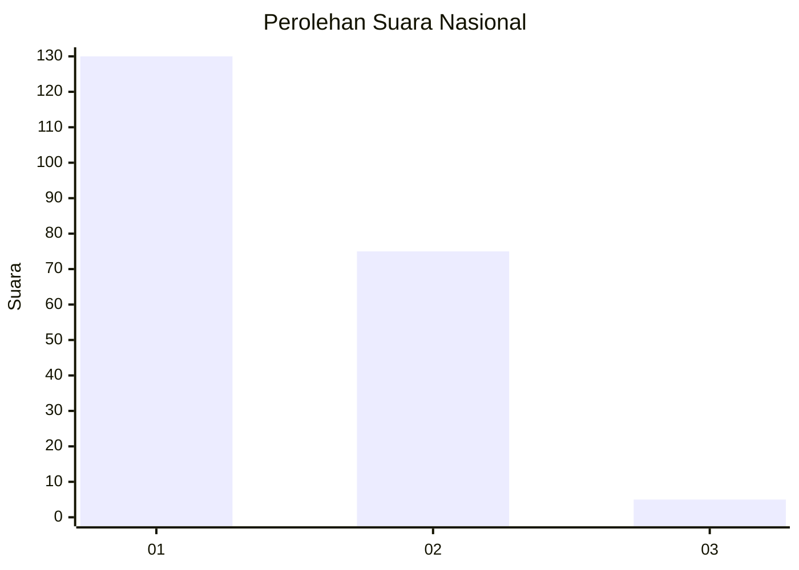
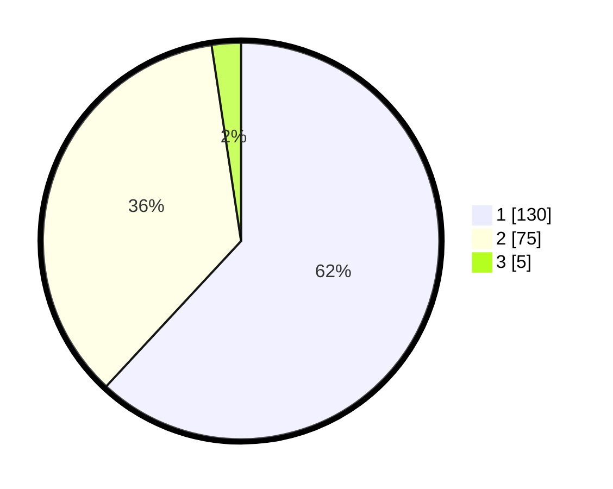

# Hasil

## Grafik

## Tabel

| No. | Nama Paslon    | Suara | Suara (raw) | Persentase |
|:--- |:-------------- | -----:| -----------:| ----------:|
| 1   | ANIES MUHAIMIN | 130   | [130][p-1]  | 61,90      |
| 2   | PRABOWO GIBRAN | 75    | [75][p-2]   | 35,71      |
| 3   | GANJAR MAHFUD  | 5     | [5][p-3]    | 2,38       |

[p-1]: https://github.com/gigit-pemilu/pemilu-2024/blob/main/pilpres/hitung-suara/sub/61-kalimantan-barat/sub/02-mempawah/sub/07-sungai-pinyuh/sub/1011-sungai-pinyuh/sub/048-tps/sub/paslon-1.txt
[p-2]: https://github.com/gigit-pemilu/pemilu-2024/blob/main/pilpres/hitung-suara/sub/61-kalimantan-barat/sub/02-mempawah/sub/07-sungai-pinyuh/sub/1011-sungai-pinyuh/sub/048-tps/sub/paslon-2.txt
[p-3]: https://github.com/gigit-pemilu/pemilu-2024/blob/main/pilpres/hitung-suara/sub/61-kalimantan-barat/sub/02-mempawah/sub/07-sungai-pinyuh/sub/1011-sungai-pinyuh/sub/048-tps/sub/paslon-3.txt

## Foto C Plano

https://sirekap-obj-formc.kpu.go.id/a2cb/pemilu/ppwp/61/02/07/10/11/6102071011048-20240215-022744--6d0b9707-9055-4486-b21b-c3da6f527f17.jpg

https://sirekap-obj-formc.kpu.go.id/a2cb/pemilu/ppwp/61/02/07/10/11/6102071011048-20240215-022829--75314191-5b54-4f75-bcfa-f00119be1eb2.jpg

https://sirekap-obj-formc.kpu.go.id/a2cb/pemilu/ppwp/61/02/07/10/11/6102071011048-20240215-022932--1e6b74a9-6622-4502-a05f-1803082f9bfd.jpg

## Metadata

| Key        | Value               |
| ---------- | ------------------- |
| Time Stamp | 2024-02-15 23:29:50 |

