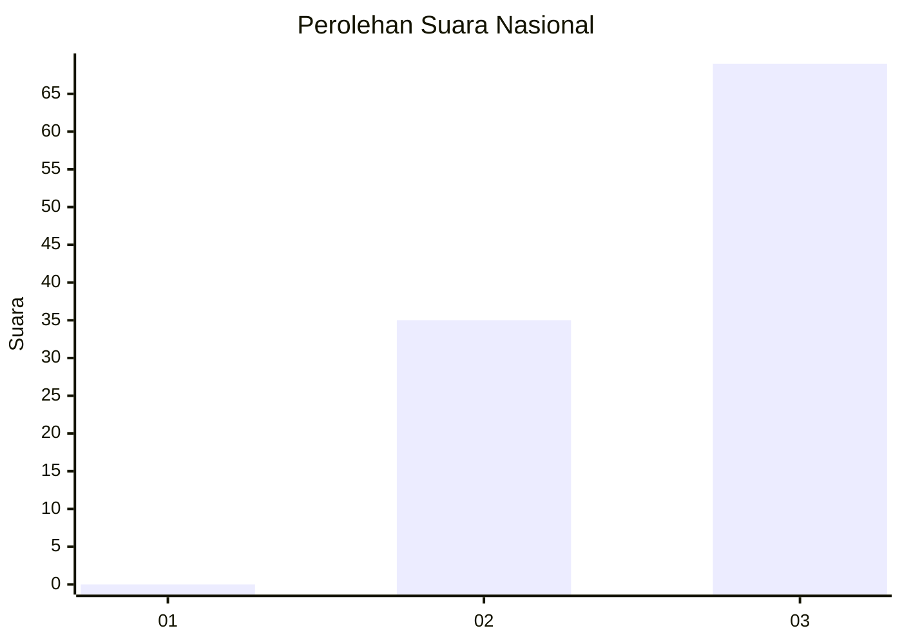
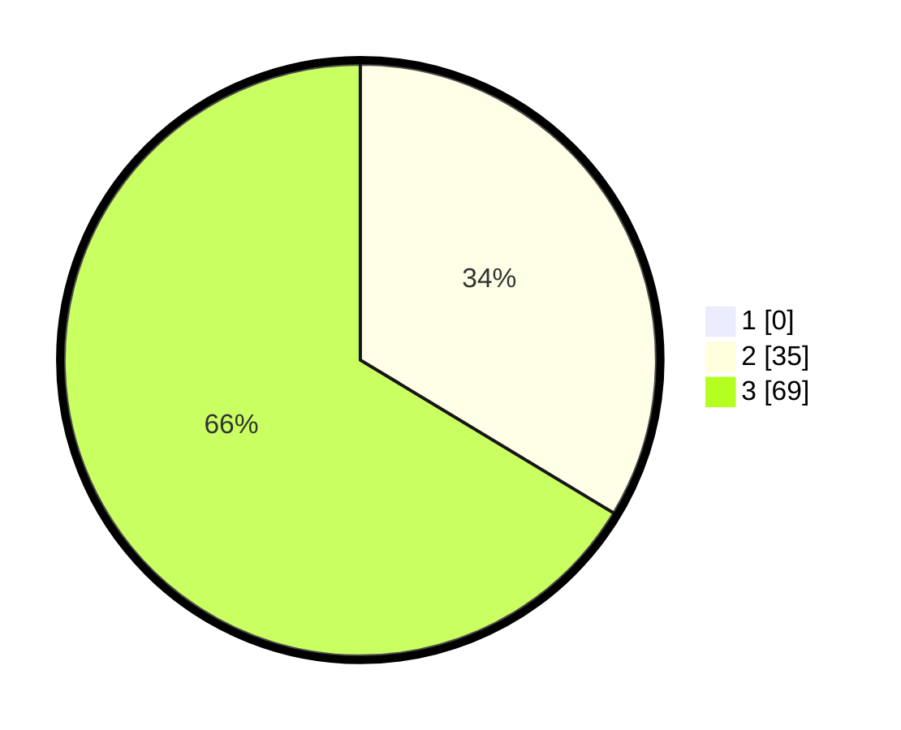

# Hasil

## Grafik

## Tabel

| No. | Nama Paslon    | Suara | Suara (raw) | Persentase |
|:--- |:-------------- | -----:| -----------:| ----------:|
| 1   | ANIES MUHAIMIN | 0     | [0][p-1]    | 0,00       |
| 2   | PRABOWO GIBRAN | 35    | [35][p-2]   | 33,65      |
| 3   | GANJAR MAHFUD  | 69    | [69][p-3]   | 66,35      |

[p-1]: https://github.com/gigit-pemilu/pemilu-2024/blob/main/pilpres/hitung-suara/sub/61-kalimantan-barat/sub/02-mempawah/sub/07-sungai-pinyuh/sub/1011-sungai-pinyuh/sub/056-tps/sub/paslon-1.txt
[p-2]: https://github.com/gigit-pemilu/pemilu-2024/blob/main/pilpres/hitung-suara/sub/61-kalimantan-barat/sub/02-mempawah/sub/07-sungai-pinyuh/sub/1011-sungai-pinyuh/sub/056-tps/sub/paslon-2.txt
[p-3]: https://github.com/gigit-pemilu/pemilu-2024/blob/main/pilpres/hitung-suara/sub/61-kalimantan-barat/sub/02-mempawah/sub/07-sungai-pinyuh/sub/1011-sungai-pinyuh/sub/056-tps/sub/paslon-3.txt

## Foto C Plano

https://sirekap-obj-formc.kpu.go.id/6ee9/pemilu/ppwp/61/02/07/10/11/6102071011056-20240214-203008--25a0996e-b2be-4bef-a8fa-74f94fa8fd1e.jpg

https://sirekap-obj-formc.kpu.go.id/6ee9/pemilu/ppwp/61/02/07/10/11/6102071011056-20240214-203347--45abdc4b-b654-4696-b430-beebf3991753.jpg

https://sirekap-obj-formc.kpu.go.id/6ee9/pemilu/ppwp/61/02/07/10/11/6102071011056-20240214-203634--5a2c9cad-24bf-4295-b992-dff620e8a66e.jpg

## Metadata

| Key        | Value               |
| ---------- | ------------------- |
| Time Stamp | 2024-02-15 23:29:50 |

