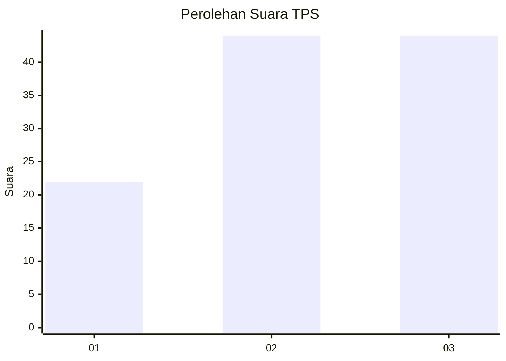
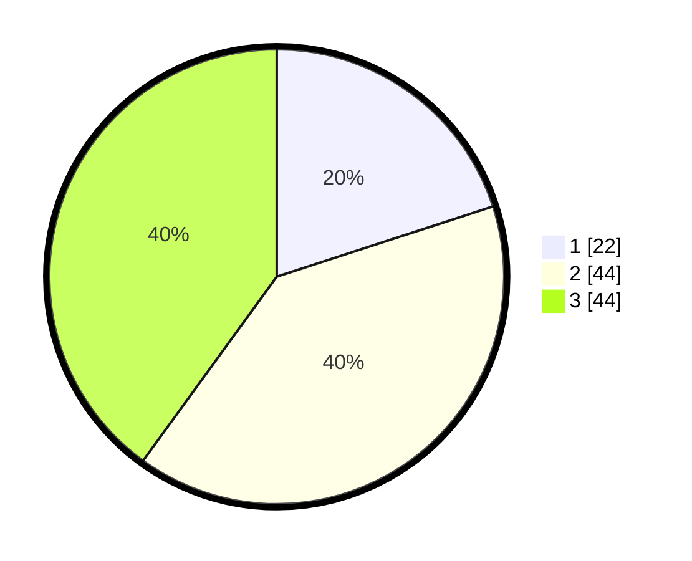

# Hasil

## Grafik

## Tabel

| No. | Nama Paslon    | Suara | Suara (raw) | Persentase |
|:--- |:-------------- | -----:| -----------:| ----------:|
| 1   | ANIES MUHAIMIN | 22    | [22][p-1]   | 20,00      |
| 2   | PRABOWO GIBRAN | 44    | [44][p-2]   | 40,00      |
| 3   | GANJAR MAHFUD  | 44    | [44][p-3]   | 40,00      |

[p-1]: https://github.com/gigit-pemilu/pemilu-2024-61-kalimantan-barat/blob/main/pilpres/hitung-suara/sub/61-kalimantan-barat/sub/02-mempawah/sub/07-sungai-pinyuh/sub/1011-sungai-pinyuh/sub/057-tps/sub/paslon-1.txt
[p-2]: https://github.com/gigit-pemilu/pemilu-2024-61-kalimantan-barat/blob/main/pilpres/hitung-suara/sub/61-kalimantan-barat/sub/02-mempawah/sub/07-sungai-pinyuh/sub/1011-sungai-pinyuh/sub/057-tps/sub/paslon-2.txt
[p-3]: https://github.com/gigit-pemilu/pemilu-2024-61-kalimantan-barat/blob/main/pilpres/hitung-suara/sub/61-kalimantan-barat/sub/02-mempawah/sub/07-sungai-pinyuh/sub/1011-sungai-pinyuh/sub/057-tps/sub/paslon-3.txt

## Foto C Plano

https://sirekap-obj-formc.kpu.go.id/669e/pemilu/ppwp/61/02/07/10/11/6102071011057-20240214-214444--df61d501-821d-46e4-91df-36ee43033308.jpg

https://sirekap-obj-formc.kpu.go.id/669e/pemilu/ppwp/61/02/07/10/11/6102071011057-20240214-214758--39b4257e-e088-496c-bc4e-8453d4ea45e7.jpg

https://sirekap-obj-formc.kpu.go.id/669e/pemilu/ppwp/61/02/07/10/11/6102071011057-20240214-214907--c52635e2-ca22-477b-bf63-521575cdc0a5.jpg

## Metadata

| Key        | Value               |
| ---------- | ------------------- |
| Time Stamp | 2024-02-15 23:29:50 |

