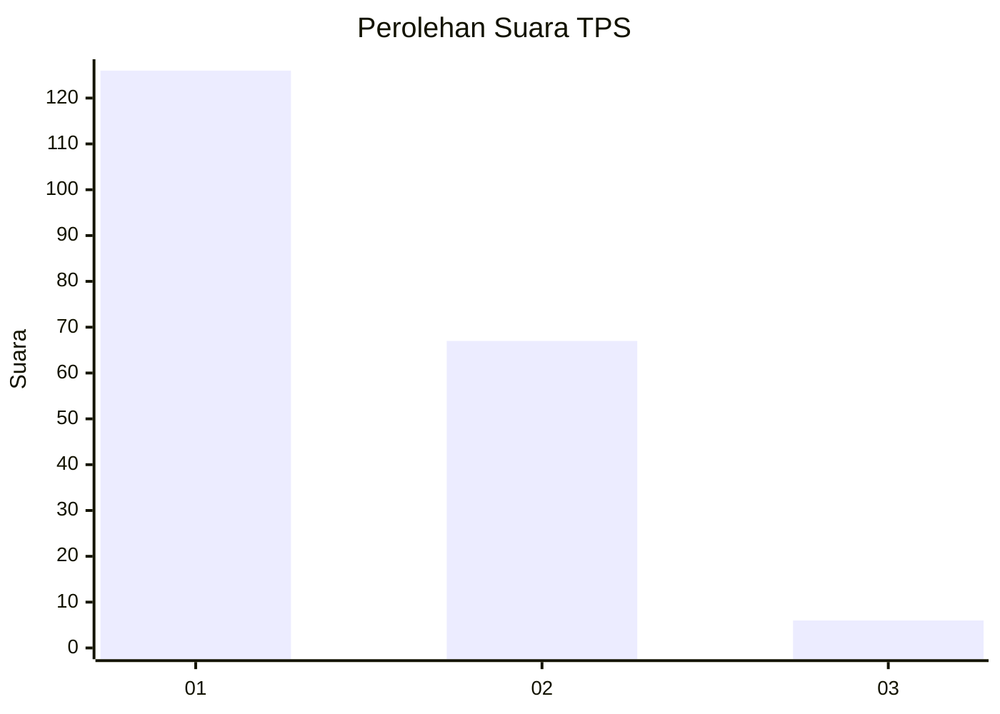
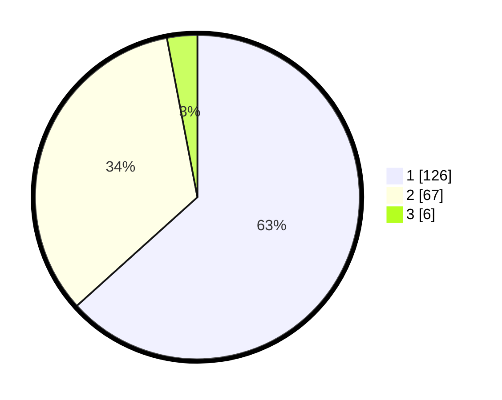

# Hasil

## Grafik

## Tabel

| No. | Nama Paslon    | Suara | Suara (raw) | Persentase |
|:--- |:-------------- | -----:| -----------:| ----------:|
| 1   | ANIES MUHAIMIN | 126   | [126][p-1]  | 63,32      |
| 2   | PRABOWO GIBRAN | 67    | [67][p-2]   | 33,67      |
| 3   | GANJAR MAHFUD  | 6     | [6][p-3]    | 3,02       |

[p-1]: https://github.com/gigit-pemilu/pemilu-2024-61-kalimantan-barat/blob/main/pilpres/hitung-suara/sub/61-kalimantan-barat/sub/02-mempawah/sub/07-sungai-pinyuh/sub/2006-peniraman/sub/001-tps/sub/paslon-1.txt
[p-2]: https://github.com/gigit-pemilu/pemilu-2024-61-kalimantan-barat/blob/main/pilpres/hitung-suara/sub/61-kalimantan-barat/sub/02-mempawah/sub/07-sungai-pinyuh/sub/2006-peniraman/sub/001-tps/sub/paslon-2.txt
[p-3]: https://github.com/gigit-pemilu/pemilu-2024-61-kalimantan-barat/blob/main/pilpres/hitung-suara/sub/61-kalimantan-barat/sub/02-mempawah/sub/07-sungai-pinyuh/sub/2006-peniraman/sub/001-tps/sub/paslon-3.txt

## Foto C Plano

https://sirekap-obj-formc.kpu.go.id/f0e1/pemilu/ppwp/61/02/07/20/06/6102072006001-20240215-031224--d4e54356-819c-40ad-8d86-591faa55237d.jpg

https://sirekap-obj-formc.kpu.go.id/f0e1/pemilu/ppwp/61/02/07/20/06/6102072006001-20240215-031418--2475ad5c-18f8-4f67-b86a-60c3f5e641ea.jpg

https://sirekap-obj-formc.kpu.go.id/f0e1/pemilu/ppwp/61/02/07/20/06/6102072006001-20240215-031612--1323397b-ce60-47cc-9dc1-71a0b2ef01a9.jpg

## Metadata

| Key        | Value               |
| ---------- | ------------------- |
| Time Stamp | 2024-02-22 17:00:00 |

