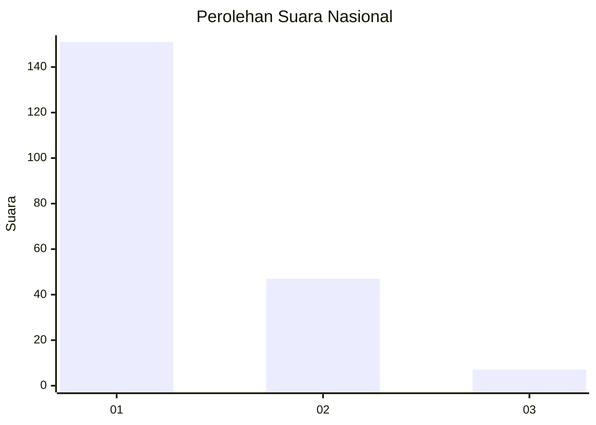
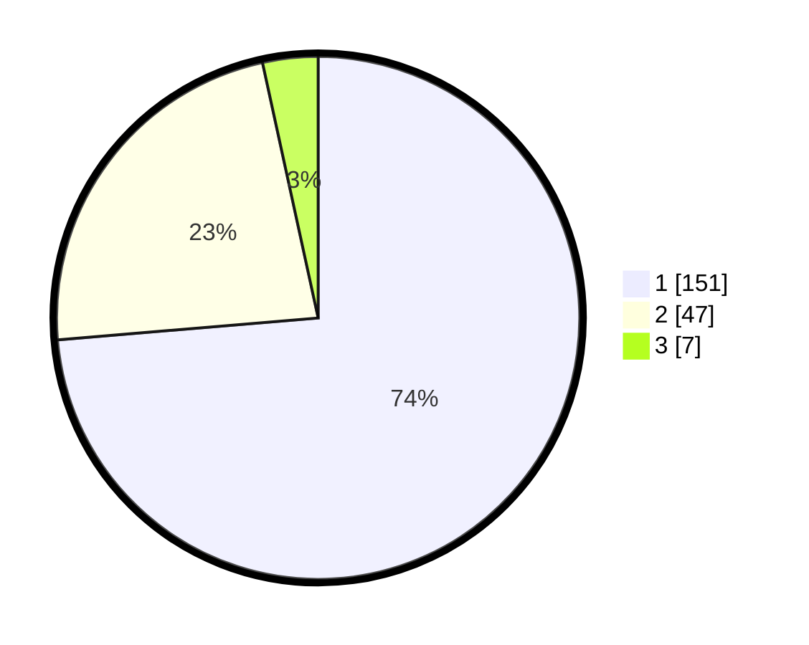

# Hasil

## Grafik

## Tabel

| No. | Nama Paslon    | Suara | Suara (raw) | Persentase |
|:--- |:-------------- | -----:| -----------:| ----------:|
| 1   | ANIES MUHAIMIN | 151   | [151][p-1]  | 73,66      |
| 2   | PRABOWO GIBRAN | 47    | [47][p-2]   | 22,93      |
| 3   | GANJAR MAHFUD  | 7     | [7][p-3]    | 3,41       |

[p-1]: https://github.com/gigit-pemilu/pemilu-2024/blob/main/pilpres/hitung-suara/sub/61-kalimantan-barat/sub/02-mempawah/sub/07-sungai-pinyuh/sub/2006-peniraman/sub/003-tps/sub/paslon-1.txt
[p-2]: https://github.com/gigit-pemilu/pemilu-2024/blob/main/pilpres/hitung-suara/sub/61-kalimantan-barat/sub/02-mempawah/sub/07-sungai-pinyuh/sub/2006-peniraman/sub/003-tps/sub/paslon-2.txt
[p-3]: https://github.com/gigit-pemilu/pemilu-2024/blob/main/pilpres/hitung-suara/sub/61-kalimantan-barat/sub/02-mempawah/sub/07-sungai-pinyuh/sub/2006-peniraman/sub/003-tps/sub/paslon-3.txt

## Foto C Plano

https://sirekap-obj-formc.kpu.go.id/36db/pemilu/ppwp/61/02/07/20/06/6102072006003-20240215-013257--ebdadee4-909b-453f-a29d-41588a1de914.jpg

https://sirekap-obj-formc.kpu.go.id/36db/pemilu/ppwp/61/02/07/20/06/6102072006003-20240215-014309--b1c73921-5056-436d-9fca-450dcba29957.jpg

https://sirekap-obj-formc.kpu.go.id/36db/pemilu/ppwp/61/02/07/20/06/6102072006003-20240215-014544--a830cbca-0d50-4cc8-b7cf-127c1be1b487.jpg

## Metadata

| Key        | Value               |
| ---------- | ------------------- |
| Time Stamp | 2024-02-16 00:00:26 |

