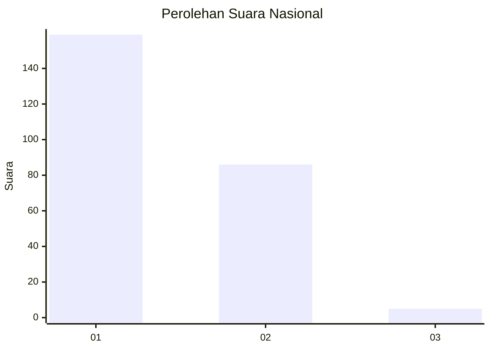
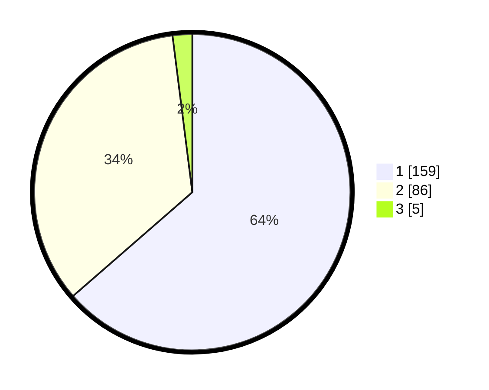

# Hasil

## Grafik

## Tabel

| No. | Nama Paslon    | Suara | Suara (raw) | Persentase |
|:--- |:-------------- | -----:| -----------:| ----------:|
| 1   | ANIES MUHAIMIN | 159   | [159][p-1]  | 63,60      |
| 2   | PRABOWO GIBRAN | 86    | [86][p-2]   | 34,40      |
| 3   | GANJAR MAHFUD  | 5     | [5][p-3]    | 2,00       |

[p-1]: https://github.com/gigit-pemilu/pemilu-2024/blob/main/pilpres/hitung-suara/sub/61-kalimantan-barat/sub/02-mempawah/sub/07-sungai-pinyuh/sub/2006-peniraman/sub/008-tps/sub/paslon-1.txt
[p-2]: https://github.com/gigit-pemilu/pemilu-2024/blob/main/pilpres/hitung-suara/sub/61-kalimantan-barat/sub/02-mempawah/sub/07-sungai-pinyuh/sub/2006-peniraman/sub/008-tps/sub/paslon-2.txt
[p-3]: https://github.com/gigit-pemilu/pemilu-2024/blob/main/pilpres/hitung-suara/sub/61-kalimantan-barat/sub/02-mempawah/sub/07-sungai-pinyuh/sub/2006-peniraman/sub/008-tps/sub/paslon-3.txt

## Foto C Plano

https://sirekap-obj-formc.kpu.go.id/cb9a/pemilu/ppwp/61/02/07/20/06/6102072006008-20240220-213224--cda75e51-a8f1-41a7-a975-a169a9750fca.jpg

https://sirekap-obj-formc.kpu.go.id/cb9a/pemilu/ppwp/61/02/07/20/06/6102072006008-20240215-011758--419b508e-1fe2-4d1a-ac8a-3faa968f6bb2.jpg

https://sirekap-obj-formc.kpu.go.id/cb9a/pemilu/ppwp/61/02/07/20/06/6102072006008-20240215-011818--c1a48fd1-e5b0-47c9-b4aa-43eaf5078f9c.jpg

## Metadata

| Key        | Value               |
| ---------- | ------------------- |
| Time Stamp | 2024-02-20 22:00:00 |

