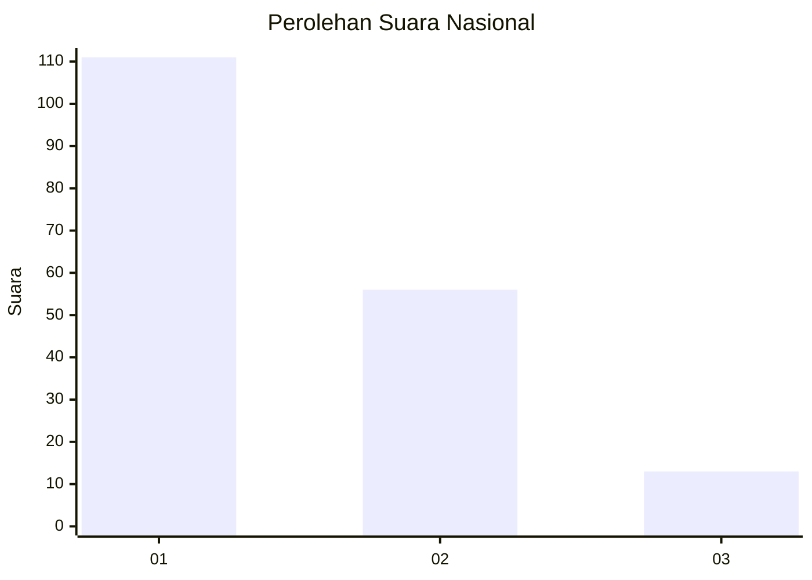
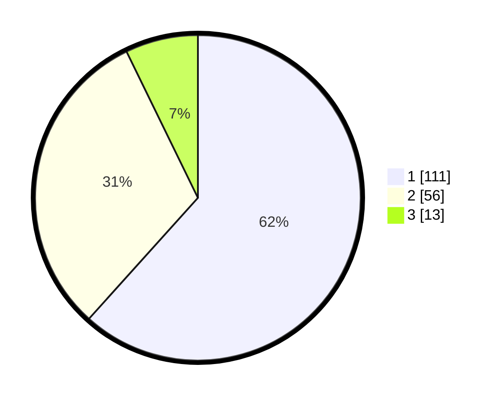

# Hasil

## Grafik

## Tabel

| No. | Nama Paslon    | Suara | Suara (raw) | Persentase |
|:--- |:-------------- | -----:| -----------:| ----------:|
| 1   | ANIES MUHAIMIN | 111   | [111][p-1]  | 61,67      |
| 2   | PRABOWO GIBRAN | 56    | [56][p-2]   | 31,11      |
| 3   | GANJAR MAHFUD  | 13    | [13][p-3]   | 7,22       |

[p-1]: https://github.com/gigit-pemilu/pemilu-2024/blob/main/pilpres/hitung-suara/sub/61-kalimantan-barat/sub/02-mempawah/sub/08-jongkat/sub/2009-wajok-hulu/sub/023-tps/sub/paslon-1.txt
[p-2]: https://github.com/gigit-pemilu/pemilu-2024/blob/main/pilpres/hitung-suara/sub/61-kalimantan-barat/sub/02-mempawah/sub/08-jongkat/sub/2009-wajok-hulu/sub/023-tps/sub/paslon-2.txt
[p-3]: https://github.com/gigit-pemilu/pemilu-2024/blob/main/pilpres/hitung-suara/sub/61-kalimantan-barat/sub/02-mempawah/sub/08-jongkat/sub/2009-wajok-hulu/sub/023-tps/sub/paslon-3.txt

## Foto C Plano

https://sirekap-obj-formc.kpu.go.id/87f5/pemilu/ppwp/61/02/08/20/09/6102082009023-20240214-153911--7c359049-1486-4f0e-9240-1eec2371106b.jpg

https://sirekap-obj-formc.kpu.go.id/87f5/pemilu/ppwp/61/02/08/20/09/6102082009023-20240215-031422--8af521b7-e5d7-4890-93a7-3ce36fa529bf.jpg

https://sirekap-obj-formc.kpu.go.id/87f5/pemilu/ppwp/61/02/08/20/09/6102082009023-20240214-154256--d0f99321-ca36-4948-8faa-c43fa70a55c3.jpg

## Metadata

| Key        | Value               |
| ---------- | ------------------- |
| Time Stamp | 2024-02-16 23:30:00 |

