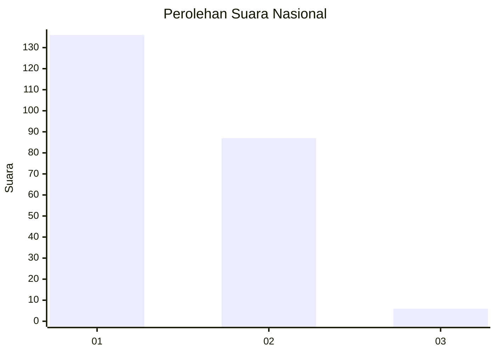
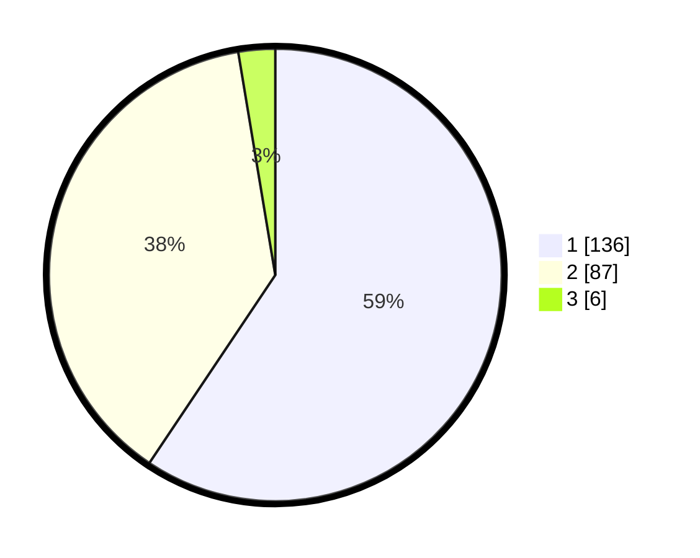

# Hasil

## Grafik

## Tabel

| No. | Nama Paslon    | Suara | Suara (raw) | Persentase |
|:--- |:-------------- | -----:| -----------:| ----------:|
| 1   | ANIES MUHAIMIN | 136   | [136][p-1]  | 59,39      |
| 2   | PRABOWO GIBRAN | 87    | [87][p-2]   | 37,99      |
| 3   | GANJAR MAHFUD  | 6     | [6][p-3]    | 2,62       |

[p-1]: https://github.com/gigit-pemilu/pemilu-2024/blob/main/pilpres/hitung-suara/sub/61-kalimantan-barat/sub/02-mempawah/sub/15-segedong/sub/2002-sungai-purun-besar/sub/008-tps/sub/paslon-1.txt
[p-2]: https://github.com/gigit-pemilu/pemilu-2024/blob/main/pilpres/hitung-suara/sub/61-kalimantan-barat/sub/02-mempawah/sub/15-segedong/sub/2002-sungai-purun-besar/sub/008-tps/sub/paslon-2.txt
[p-3]: https://github.com/gigit-pemilu/pemilu-2024/blob/main/pilpres/hitung-suara/sub/61-kalimantan-barat/sub/02-mempawah/sub/15-segedong/sub/2002-sungai-purun-besar/sub/008-tps/sub/paslon-3.txt

## Foto C Plano

https://sirekap-obj-formc.kpu.go.id/c845/pemilu/ppwp/61/02/15/20/02/6102152002008-20240215-005323--9716315e-9563-4d37-997c-c991098e89ef.jpg

https://sirekap-obj-formc.kpu.go.id/c845/pemilu/ppwp/61/02/15/20/02/6102152002008-20240215-020035--3cc6d912-cd04-4208-b0cd-835514ec9a7c.jpg

https://sirekap-obj-formc.kpu.go.id/c845/pemilu/ppwp/61/02/15/20/02/6102152002008-20240215-020400--c3aa0899-e735-4d09-913b-cd0271c77416.jpg

## Metadata

| Key        | Value               |
| ---------- | ------------------- |
| Time Stamp | 2024-02-15 20:00:44 |

