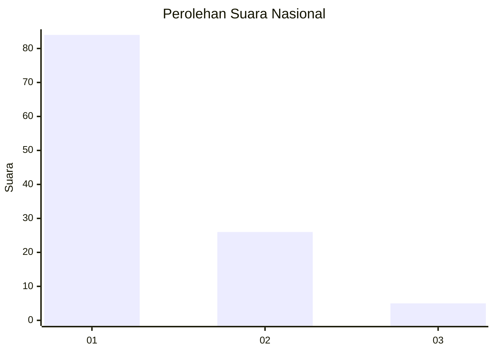
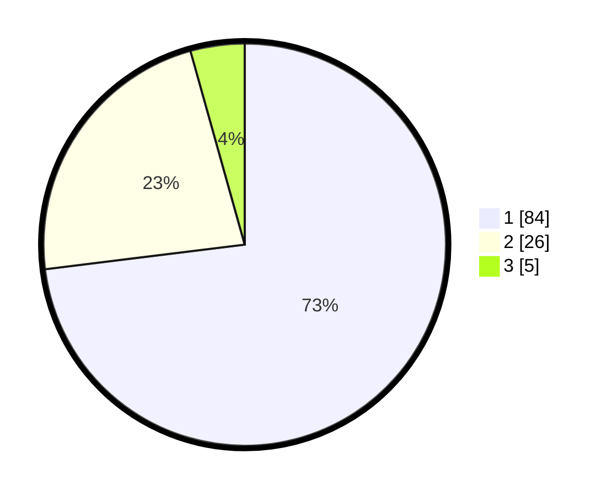

# Hasil

## Grafik

## Tabel

| No. | Nama Paslon    | Suara | Suara (raw) | Persentase |
|:--- |:-------------- | -----:| -----------:| ----------:|
| 1   | ANIES MUHAIMIN | 84    | [84][p-1]   | 73,04      |
| 2   | PRABOWO GIBRAN | 26    | [26][p-2]   | 22,61      |
| 3   | GANJAR MAHFUD  | 5     | [5][p-3]    | 4,35       |

[p-1]: https://github.com/gigit-pemilu/pemilu-2024/blob/main/pilpres/hitung-suara/sub/61-kalimantan-barat/sub/02-mempawah/sub/15-segedong/sub/2005-peniti-dalam-ii/sub/009-tps/sub/paslon-1.txt
[p-2]: https://github.com/gigit-pemilu/pemilu-2024/blob/main/pilpres/hitung-suara/sub/61-kalimantan-barat/sub/02-mempawah/sub/15-segedong/sub/2005-peniti-dalam-ii/sub/009-tps/sub/paslon-2.txt
[p-3]: https://github.com/gigit-pemilu/pemilu-2024/blob/main/pilpres/hitung-suara/sub/61-kalimantan-barat/sub/02-mempawah/sub/15-segedong/sub/2005-peniti-dalam-ii/sub/009-tps/sub/paslon-3.txt

## Foto C Plano

https://sirekap-obj-formc.kpu.go.id/d279/pemilu/ppwp/61/02/15/20/05/6102152005009-20240222-153602--8ec07563-4388-41fe-aa56-ae84050428e4.jpg

https://sirekap-obj-formc.kpu.go.id/d279/pemilu/ppwp/61/02/15/20/05/6102152005009-20240222-153620--1f0b886c-e590-4b8a-9c0b-d05ea057a7c1.jpg

https://sirekap-obj-formc.kpu.go.id/d279/pemilu/ppwp/61/02/15/20/05/6102152005009-20240222-153637--4272026b-fd09-4d8d-b512-f3e77170f990.jpg

## Metadata

| Key        | Value               |
| ---------- | ------------------- |
| Time Stamp | 2024-02-22 16:00:00 |

