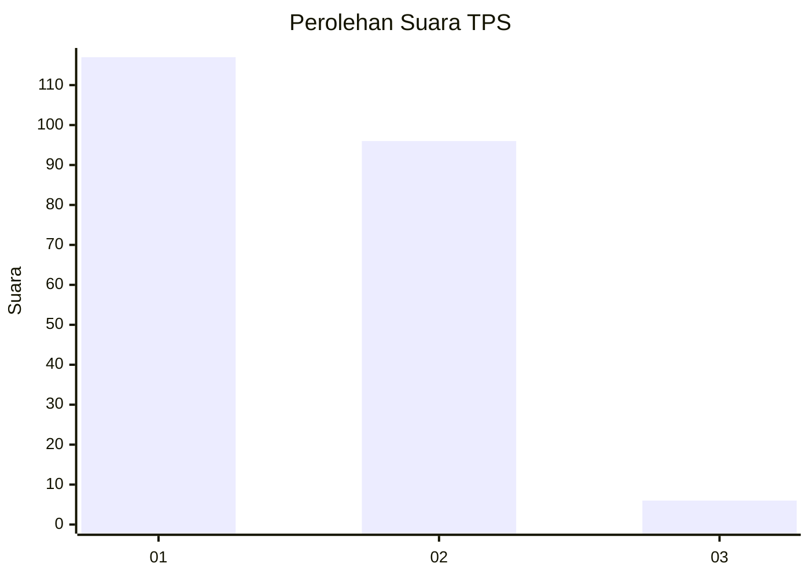
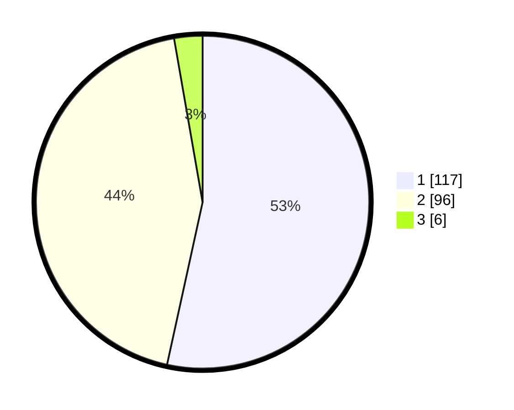

# Hasil

## Grafik

## Tabel

| No. | Nama Paslon    | Suara | Suara (raw) | Persentase |
|:--- |:-------------- | -----:| -----------:| ----------:|
| 1   | ANIES MUHAIMIN | 117   | [117][p-1]  | 53,42      |
| 2   | PRABOWO GIBRAN | 96    | [96][p-2]   | 43,84      |
| 3   | GANJAR MAHFUD  | 6     | [6][p-3]    | 2,74       |

[p-1]: https://github.com/gigit-pemilu/pemilu-2024-61-kalimantan-barat/blob/main/pilpres/hitung-suara/sub/61-kalimantan-barat/sub/02-mempawah/sub/16-anjongan/sub/1001-anjungan-melancar/sub/003-tps/sub/paslon-1.txt
[p-2]: https://github.com/gigit-pemilu/pemilu-2024-61-kalimantan-barat/blob/main/pilpres/hitung-suara/sub/61-kalimantan-barat/sub/02-mempawah/sub/16-anjongan/sub/1001-anjungan-melancar/sub/003-tps/sub/paslon-2.txt
[p-3]: https://github.com/gigit-pemilu/pemilu-2024-61-kalimantan-barat/blob/main/pilpres/hitung-suara/sub/61-kalimantan-barat/sub/02-mempawah/sub/16-anjongan/sub/1001-anjungan-melancar/sub/003-tps/sub/paslon-3.txt

## Foto C Plano

https://sirekap-obj-formc.kpu.go.id/a784/pemilu/ppwp/61/02/16/10/01/6102161001003-20240214-212423--320a5457-09ea-4ddf-a392-342388d52960.jpg

https://sirekap-obj-formc.kpu.go.id/a784/pemilu/ppwp/61/02/16/10/01/6102161001003-20240214-212641--d378396c-bfa4-4bea-bb5a-8bac46161a16.jpg

https://sirekap-obj-formc.kpu.go.id/a784/pemilu/ppwp/61/02/16/10/01/6102161001003-20240214-212743--0fc424e8-2b93-44ac-9c5e-e202478ac36c.jpg

## Metadata

| Key        | Value               |
| ---------- | ------------------- |
| Time Stamp | 2024-02-15 12:00:28 |

