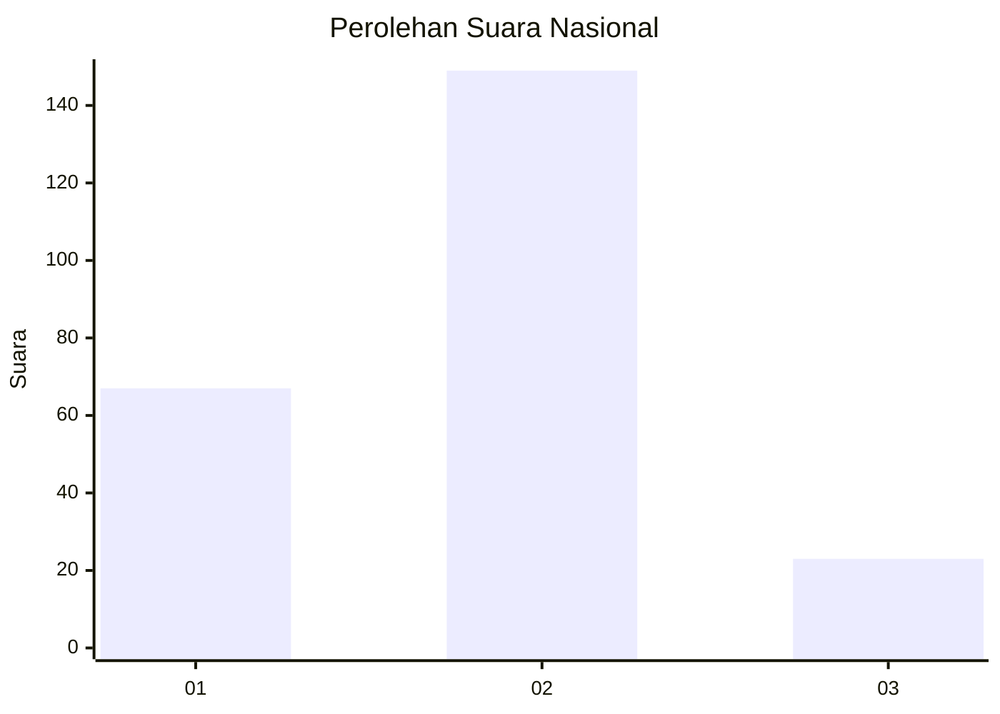
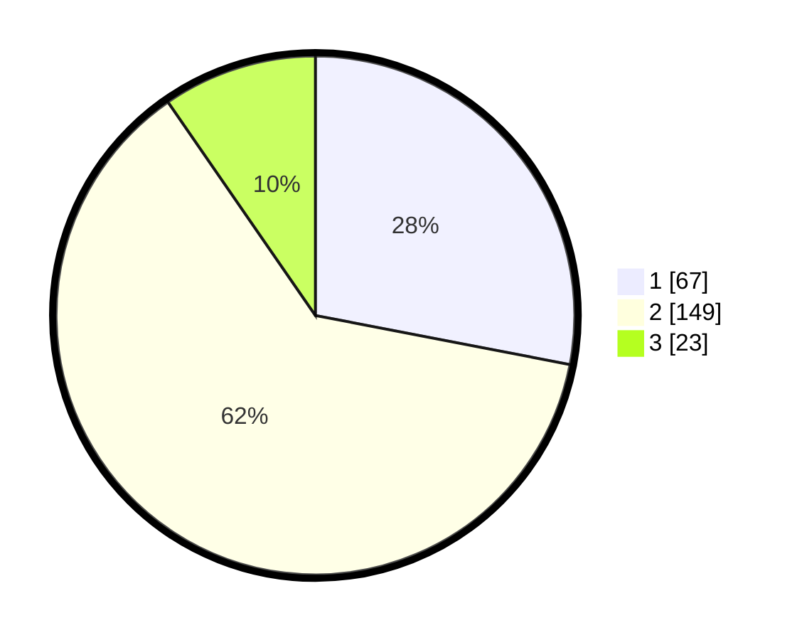

# Hasil

## Grafik

## Tabel

| No. | Nama Paslon    | Suara | Suara (raw) | Persentase |
|:--- |:-------------- | -----:| -----------:| ----------:|
| 1   | ANIES MUHAIMIN | 67    | [67][p-1]   | 28,03      |
| 2   | PRABOWO GIBRAN | 149   | [149][p-2]  | 62,34      |
| 3   | GANJAR MAHFUD  | 23    | [23][p-3]   | 9,62       |

[p-1]: https://github.com/gigit-pemilu/pemilu-2024/blob/main/pilpres/hitung-suara/sub/61-kalimantan-barat/sub/02-mempawah/sub/16-anjongan/sub/1001-anjungan-melancar/sub/004-tps/sub/paslon-1.txt
[p-2]: https://github.com/gigit-pemilu/pemilu-2024/blob/main/pilpres/hitung-suara/sub/61-kalimantan-barat/sub/02-mempawah/sub/16-anjongan/sub/1001-anjungan-melancar/sub/004-tps/sub/paslon-2.txt
[p-3]: https://github.com/gigit-pemilu/pemilu-2024/blob/main/pilpres/hitung-suara/sub/61-kalimantan-barat/sub/02-mempawah/sub/16-anjongan/sub/1001-anjungan-melancar/sub/004-tps/sub/paslon-3.txt

## Foto C Plano

https://sirekap-obj-formc.kpu.go.id/f4d0/pemilu/ppwp/61/02/16/10/01/6102161001004-20240215-003331--c0a3a1ac-7528-4157-a8cf-c317c3fc579a.jpg

https://sirekap-obj-formc.kpu.go.id/f4d0/pemilu/ppwp/61/02/16/10/01/6102161001004-20240215-003627--2a022ae1-c861-47b8-b7d8-b9a295d26602.jpg

https://sirekap-obj-formc.kpu.go.id/f4d0/pemilu/ppwp/61/02/16/10/01/6102161001004-20240215-003828--f489b9db-9a44-42b6-ba43-f12fdc360142.jpg

## Metadata

| Key        | Value               |
| ---------- | ------------------- |
| Time Stamp | 2024-02-15 04:00:24 |

