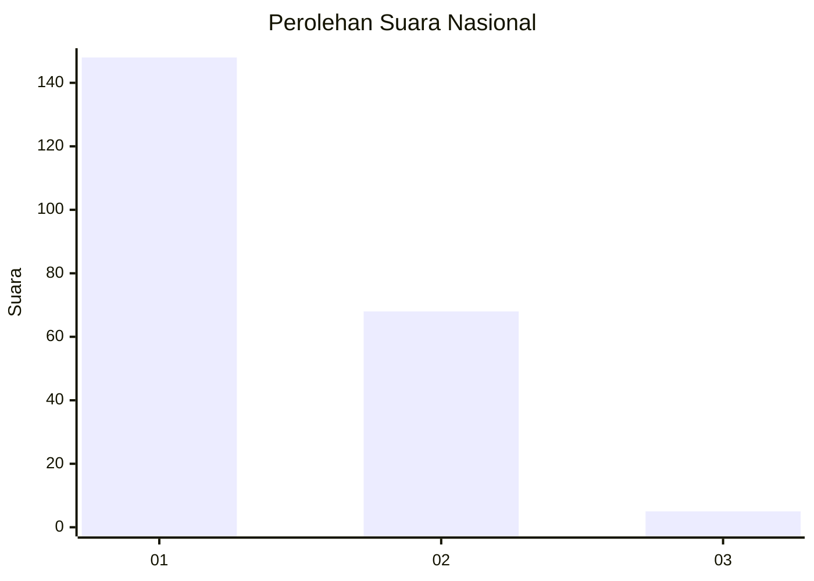
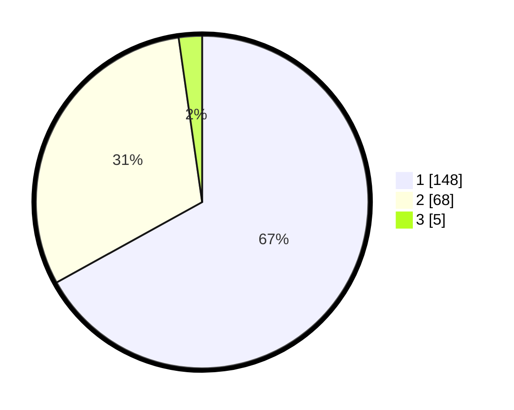

# Hasil

## Grafik

## Tabel

| No. | Nama Paslon    | Suara | Suara (raw) | Persentase |
|:--- |:-------------- | -----:| -----------:| ----------:|
| 1   | ANIES MUHAIMIN | 148   | [148][p-1]  | 66,97      |
| 2   | PRABOWO GIBRAN | 68    | [68][p-2]   | 30,77      |
| 3   | GANJAR MAHFUD  | 5     | [5][p-3]    | 2,26       |

[p-1]: https://github.com/gigit-pemilu/pemilu-2024/blob/main/pilpres/hitung-suara/sub/61-kalimantan-barat/sub/02-mempawah/sub/18-mempawah-timur/sub/2003-antibar/sub/010-tps/sub/paslon-1.txt
[p-2]: https://github.com/gigit-pemilu/pemilu-2024/blob/main/pilpres/hitung-suara/sub/61-kalimantan-barat/sub/02-mempawah/sub/18-mempawah-timur/sub/2003-antibar/sub/010-tps/sub/paslon-2.txt
[p-3]: https://github.com/gigit-pemilu/pemilu-2024/blob/main/pilpres/hitung-suara/sub/61-kalimantan-barat/sub/02-mempawah/sub/18-mempawah-timur/sub/2003-antibar/sub/010-tps/sub/paslon-3.txt

## Foto C Plano

https://sirekap-obj-formc.kpu.go.id/f136/pemilu/ppwp/61/02/18/20/03/6102182003010-20240214-225305--5ac85a35-514b-47fc-8a4d-223e5f52bc58.jpg

https://sirekap-obj-formc.kpu.go.id/f136/pemilu/ppwp/61/02/18/20/03/6102182003010-20240214-225439--80b0645b-88b7-43ee-aaf7-8166391de60f.jpg

https://sirekap-obj-formc.kpu.go.id/f136/pemilu/ppwp/61/02/18/20/03/6102182003010-20240214-225619--73ad5e7f-b328-4cd1-8a51-174bdc436b42.jpg

## Metadata

| Key        | Value               |
| ---------- | ------------------- |
| Time Stamp | 2024-02-15 16:00:26 |

