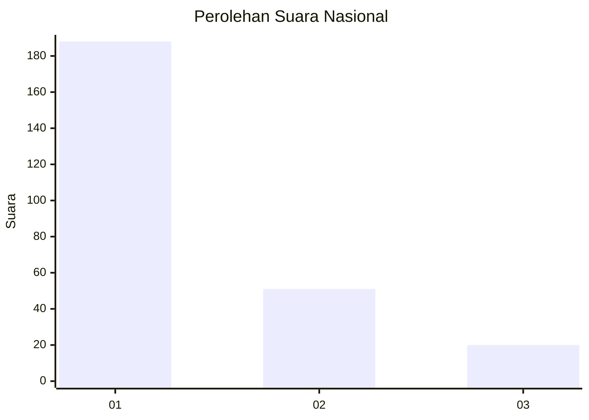
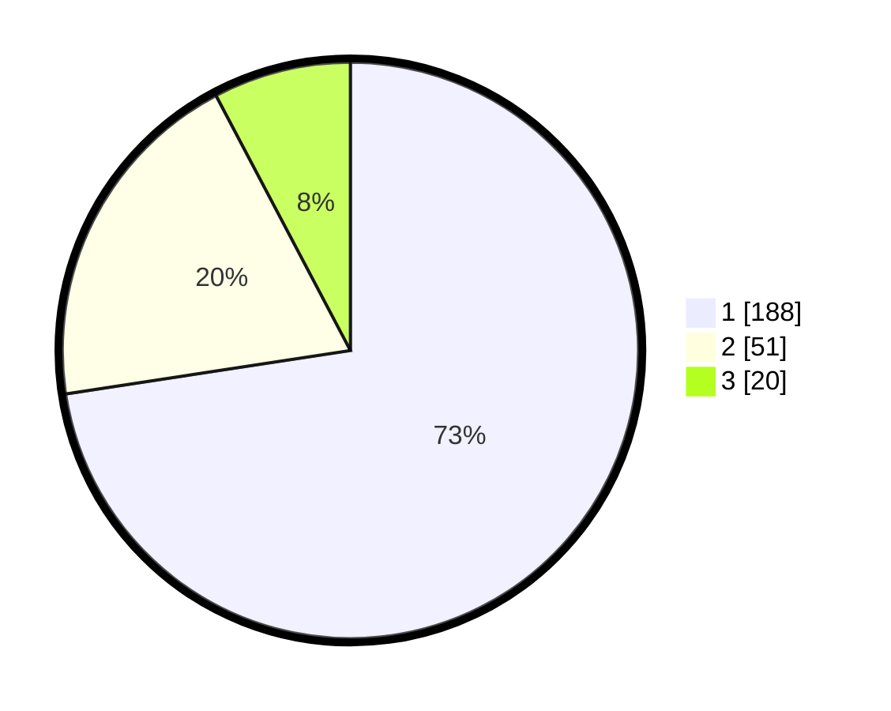

# Hasil

## Grafik

## Tabel

| No. | Nama Paslon    | Suara | Suara (raw) | Persentase |
|:--- |:-------------- | -----:| -----------:| ----------:|
| 1   | ANIES MUHAIMIN | 188   | [188][p-1]  | 72,59      |
| 2   | PRABOWO GIBRAN | 51    | [51][p-2]   | 19,69      |
| 3   | GANJAR MAHFUD  | 20    | [20][p-3]   | 7,72       |

[p-1]: https://github.com/gigit-pemilu/pemilu-2024/blob/main/pilpres/hitung-suara/sub/61-kalimantan-barat/sub/02-mempawah/sub/18-mempawah-timur/sub/2003-antibar/sub/014-tps/sub/paslon-1.txt
[p-2]: https://github.com/gigit-pemilu/pemilu-2024/blob/main/pilpres/hitung-suara/sub/61-kalimantan-barat/sub/02-mempawah/sub/18-mempawah-timur/sub/2003-antibar/sub/014-tps/sub/paslon-2.txt
[p-3]: https://github.com/gigit-pemilu/pemilu-2024/blob/main/pilpres/hitung-suara/sub/61-kalimantan-barat/sub/02-mempawah/sub/18-mempawah-timur/sub/2003-antibar/sub/014-tps/sub/paslon-3.txt

## Foto C Plano

https://sirekap-obj-formc.kpu.go.id/d6d5/pemilu/ppwp/61/02/18/20/03/6102182003014-20240223-102629--7897e931-bfeb-4d23-8bef-2638a50ab982.jpg

https://sirekap-obj-formc.kpu.go.id/d6d5/pemilu/ppwp/61/02/18/20/03/6102182003014-20240215-020717--72d86db4-4f82-4dcf-96e2-5cce626bc331.jpg

https://sirekap-obj-formc.kpu.go.id/d6d5/pemilu/ppwp/61/02/18/20/03/6102182003014-20240215-020901--358b3123-0604-400e-9f27-4eb9cf52912f.jpg

## Metadata

| Key        | Value               |
| ---------- | ------------------- |
| Time Stamp | 2024-02-24 22:31:28 |

