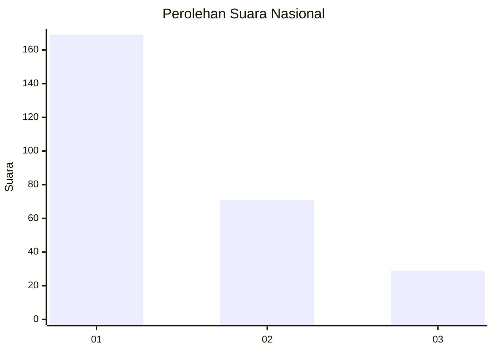
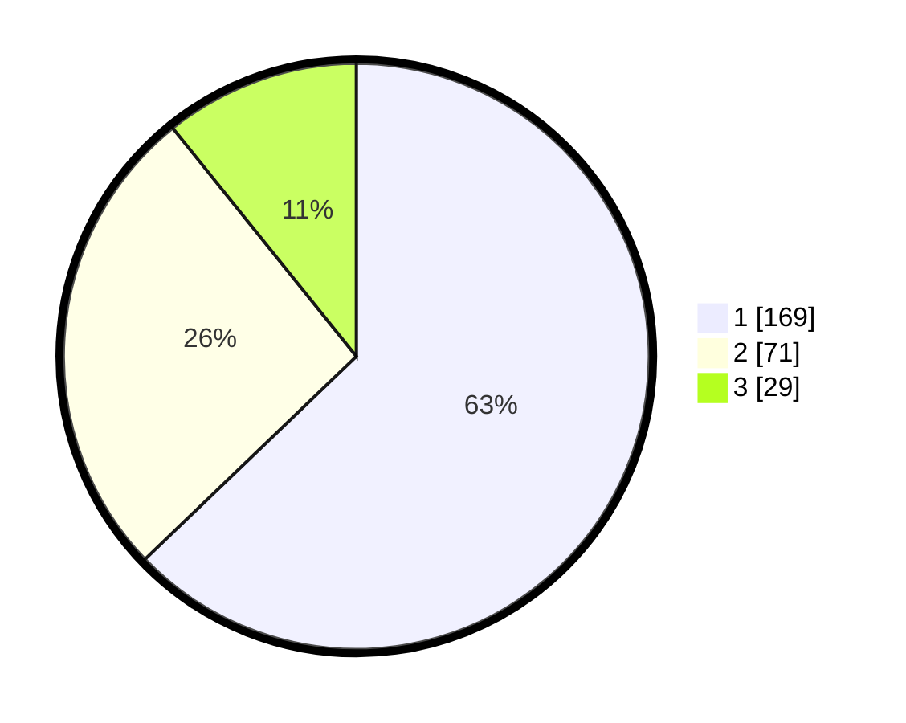

# Hasil

## Grafik

## Tabel

| No. | Nama Paslon    | Suara | Suara (raw) | Persentase |
|:--- |:-------------- | -----:| -----------:| ----------:|
| 1   | ANIES MUHAIMIN | 169   | [169][p-1]  | 62,83      |
| 2   | PRABOWO GIBRAN | 71    | [71][p-2]   | 26,39      |
| 3   | GANJAR MAHFUD  | 29    | [29][p-3]   | 10,78      |

[p-1]: https://github.com/gigit-pemilu/pemilu-2024/blob/main/pilpres/hitung-suara/sub/61-kalimantan-barat/sub/02-mempawah/sub/18-mempawah-timur/sub/2003-antibar/sub/015-tps/sub/paslon-1.txt
[p-2]: https://github.com/gigit-pemilu/pemilu-2024/blob/main/pilpres/hitung-suara/sub/61-kalimantan-barat/sub/02-mempawah/sub/18-mempawah-timur/sub/2003-antibar/sub/015-tps/sub/paslon-2.txt
[p-3]: https://github.com/gigit-pemilu/pemilu-2024/blob/main/pilpres/hitung-suara/sub/61-kalimantan-barat/sub/02-mempawah/sub/18-mempawah-timur/sub/2003-antibar/sub/015-tps/sub/paslon-3.txt

## Foto C Plano

https://sirekap-obj-formc.kpu.go.id/362c/pemilu/ppwp/61/02/18/20/03/6102182003015-20240214-160130--bcd2fa90-29fd-4274-a0ab-002941bf4fc9.jpg

https://sirekap-obj-formc.kpu.go.id/362c/pemilu/ppwp/61/02/18/20/03/6102182003015-20240215-014015--db8d8601-48ff-4c90-ab10-f65b7120adf7.jpg

https://sirekap-obj-formc.kpu.go.id/362c/pemilu/ppwp/61/02/18/20/03/6102182003015-20240215-014100--98937832-4adb-457a-a45b-00f4abc87355.jpg

## Metadata

| Key        | Value               |
| ---------- | ------------------- |
| Time Stamp | 2024-02-15 20:30:46 |

