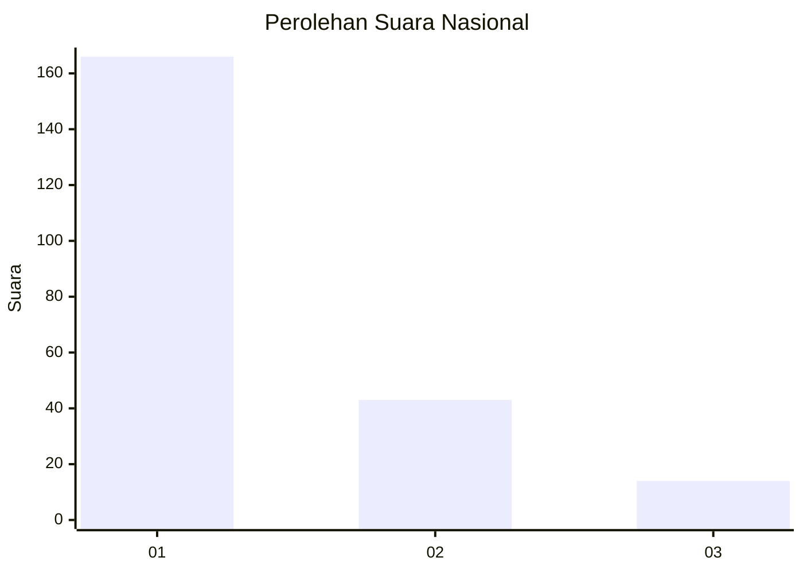
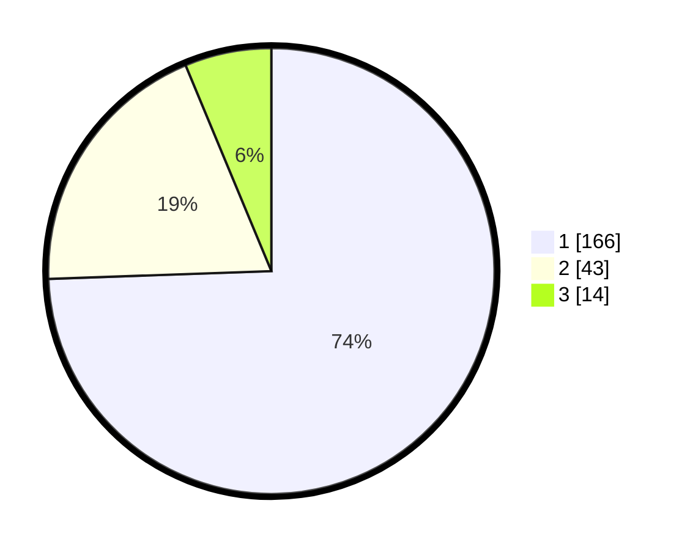

# Hasil

## Grafik

## Tabel

| No. | Nama Paslon    | Suara | Suara (raw) | Persentase |
|:--- |:-------------- | -----:| -----------:| ----------:|
| 1   | ANIES MUHAIMIN | 166   | [166][p-1]  | 74,44      |
| 2   | PRABOWO GIBRAN | 43    | [43][p-2]   | 19,28      |
| 3   | GANJAR MAHFUD  | 14    | [14][p-3]   | 6,28       |

[p-1]: https://github.com/gigit-pemilu/pemilu-2024/blob/main/pilpres/hitung-suara/sub/61-kalimantan-barat/sub/02-mempawah/sub/18-mempawah-timur/sub/2005-pasir-palembang/sub/008-tps/sub/paslon-1.txt
[p-2]: https://github.com/gigit-pemilu/pemilu-2024/blob/main/pilpres/hitung-suara/sub/61-kalimantan-barat/sub/02-mempawah/sub/18-mempawah-timur/sub/2005-pasir-palembang/sub/008-tps/sub/paslon-2.txt
[p-3]: https://github.com/gigit-pemilu/pemilu-2024/blob/main/pilpres/hitung-suara/sub/61-kalimantan-barat/sub/02-mempawah/sub/18-mempawah-timur/sub/2005-pasir-palembang/sub/008-tps/sub/paslon-3.txt

## Foto C Plano

https://sirekap-obj-formc.kpu.go.id/f151/pemilu/ppwp/61/02/18/20/05/6102182005008-20240215-005905--9e5aee8f-ef64-44cb-be17-3198ad47c1f8.jpg

https://sirekap-obj-formc.kpu.go.id/f151/pemilu/ppwp/61/02/18/20/05/6102182005008-20240214-193947--2c28c883-6e77-4150-a5e6-e4d595530d1f.jpg

https://sirekap-obj-formc.kpu.go.id/f151/pemilu/ppwp/61/02/18/20/05/6102182005008-20240214-194051--63f52688-b948-4ae2-9095-515a6b585811.jpg

## Metadata

| Key        | Value               |
| ---------- | ------------------- |
| Time Stamp | 2024-02-15 16:30:25 |

