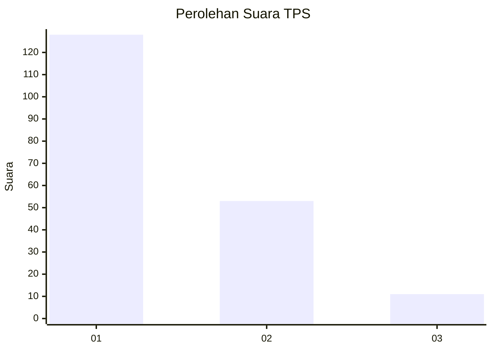
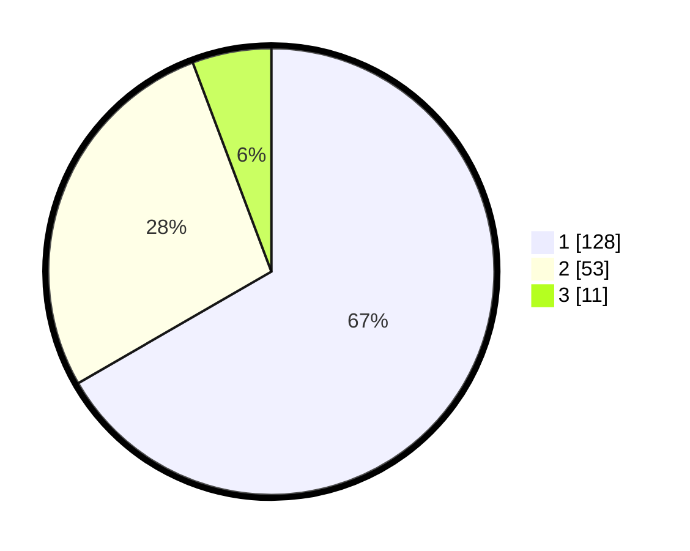

# Hasil

## Grafik

## Tabel

| No. | Nama Paslon    | Suara | Suara (raw) | Persentase |
|:--- |:-------------- | -----:| -----------:| ----------:|
| 1   | ANIES MUHAIMIN | 128   | [128][p-1]  | 66,67      |
| 2   | PRABOWO GIBRAN | 53    | [53][p-2]   | 27,60      |
| 3   | GANJAR MAHFUD  | 11    | [11][p-3]   | 5,73       |

[p-1]: https://github.com/gigit-pemilu/pemilu-2024-61-kalimantan-barat/blob/main/pilpres/hitung-suara/sub/61-kalimantan-barat/sub/02-mempawah/sub/18-mempawah-timur/sub/2005-pasir-palembang/sub/009-tps/sub/paslon-1.txt
[p-2]: https://github.com/gigit-pemilu/pemilu-2024-61-kalimantan-barat/blob/main/pilpres/hitung-suara/sub/61-kalimantan-barat/sub/02-mempawah/sub/18-mempawah-timur/sub/2005-pasir-palembang/sub/009-tps/sub/paslon-2.txt
[p-3]: https://github.com/gigit-pemilu/pemilu-2024-61-kalimantan-barat/blob/main/pilpres/hitung-suara/sub/61-kalimantan-barat/sub/02-mempawah/sub/18-mempawah-timur/sub/2005-pasir-palembang/sub/009-tps/sub/paslon-3.txt

## Foto C Plano

https://sirekap-obj-formc.kpu.go.id/0df4/pemilu/ppwp/61/02/18/20/05/6102182005009-20240215-043149--f63896e1-a823-4cd5-bd1c-cb9a66447529.jpg

https://sirekap-obj-formc.kpu.go.id/0df4/pemilu/ppwp/61/02/18/20/05/6102182005009-20240217-112234--bab69c68-4735-4ddb-ac71-50d083edcaee.jpg

https://sirekap-obj-formc.kpu.go.id/0df4/pemilu/ppwp/61/02/18/20/05/6102182005009-20240217-093549--e1e15dc0-0ac3-4d3d-b5b1-db1419dbe3c1.jpg

## Metadata

| Key        | Value               |
| ---------- | ------------------- |
| Time Stamp | 2024-02-19 06:16:00 |

