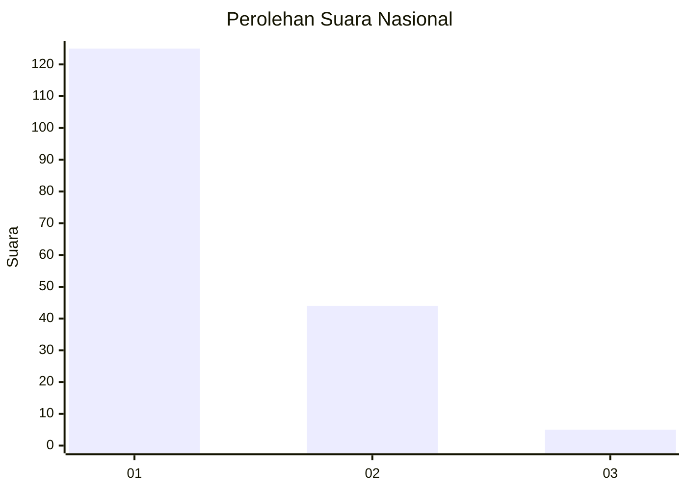
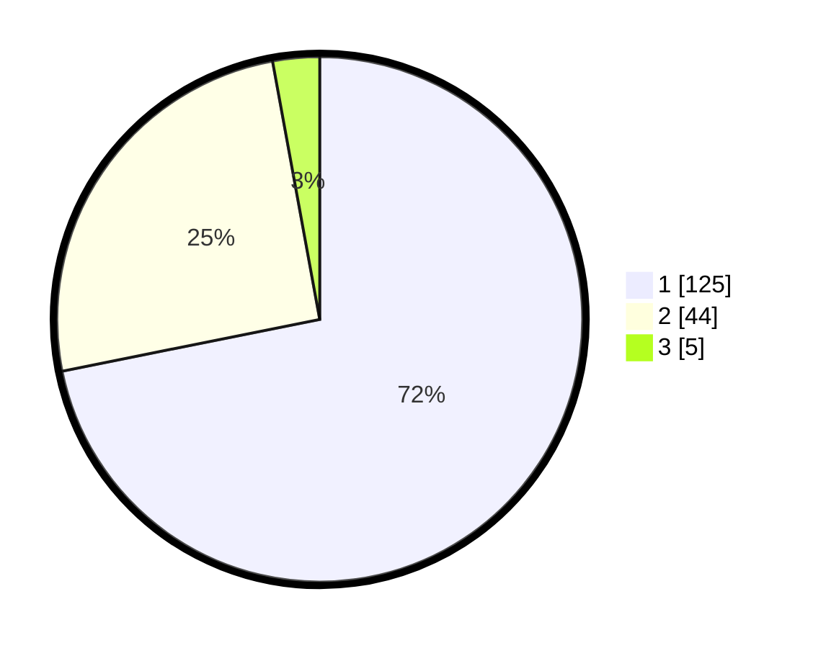

# Hasil

## Grafik

## Tabel

| No. | Nama Paslon    | Suara | Suara (raw) | Persentase |
|:--- |:-------------- | -----:| -----------:| ----------:|
| 1   | ANIES MUHAIMIN | 125   | [125][p-1]  | 71,84      |
| 2   | PRABOWO GIBRAN | 44    | [44][p-2]   | 25,29      |
| 3   | GANJAR MAHFUD  | 5     | [5][p-3]    | 2,87       |

[p-1]: https://github.com/gigit-pemilu/pemilu-2024/blob/main/pilpres/hitung-suara/sub/61-kalimantan-barat/sub/02-mempawah/sub/18-mempawah-timur/sub/2006-pasir-panjang/sub/004-tps/sub/paslon-1.txt
[p-2]: https://github.com/gigit-pemilu/pemilu-2024/blob/main/pilpres/hitung-suara/sub/61-kalimantan-barat/sub/02-mempawah/sub/18-mempawah-timur/sub/2006-pasir-panjang/sub/004-tps/sub/paslon-2.txt
[p-3]: https://github.com/gigit-pemilu/pemilu-2024/blob/main/pilpres/hitung-suara/sub/61-kalimantan-barat/sub/02-mempawah/sub/18-mempawah-timur/sub/2006-pasir-panjang/sub/004-tps/sub/paslon-3.txt

## Foto C Plano

https://sirekap-obj-formc.kpu.go.id/563f/pemilu/ppwp/61/02/18/20/06/6102182006004-20240214-204405--bb724f46-71cc-4829-92e3-e2cb3e5af956.jpg

https://sirekap-obj-formc.kpu.go.id/563f/pemilu/ppwp/61/02/18/20/06/6102182006004-20240214-204417--d27341e0-7cae-444b-ae4e-6ce98c178b92.jpg

https://sirekap-obj-formc.kpu.go.id/563f/pemilu/ppwp/61/02/18/20/06/6102182006004-20240214-204423--8827c635-baff-49cf-aa65-f429cda85f9e.jpg

## Metadata

| Key        | Value               |
| ---------- | ------------------- |
| Time Stamp | 2024-02-15 15:00:29 |

