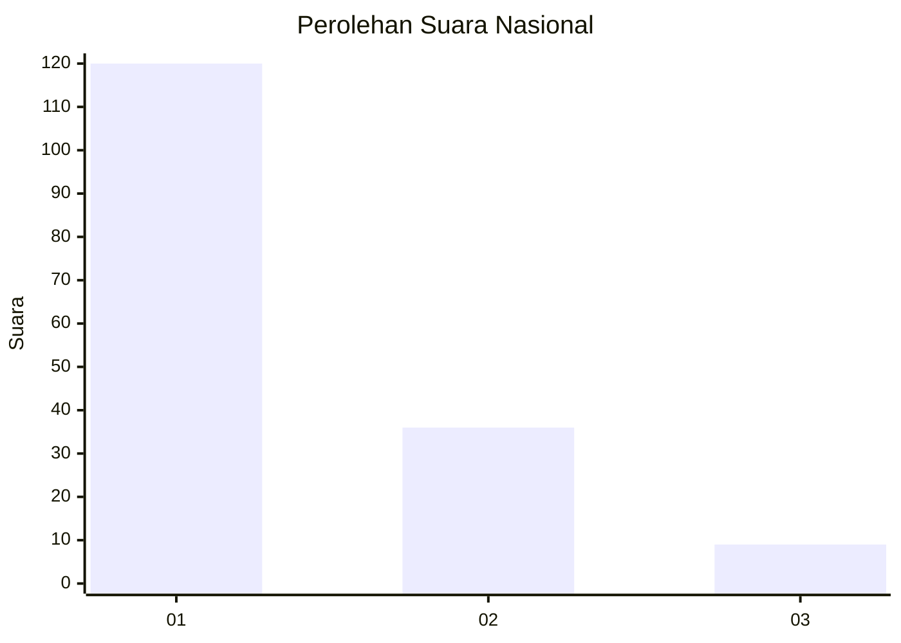
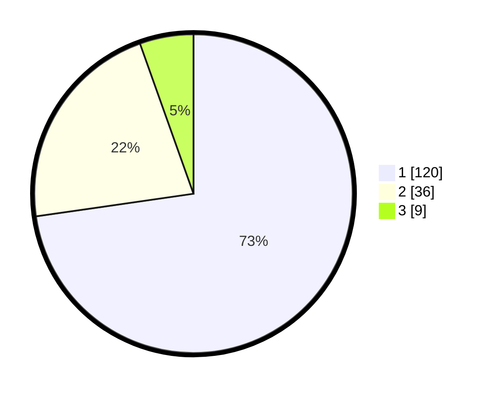

# Hasil

## Grafik

## Tabel

| No. | Nama Paslon    | Suara | Suara (raw) | Persentase |
|:--- |:-------------- | -----:| -----------:| ----------:|
| 1   | ANIES MUHAIMIN | 120   | [120][p-1]  | 72,73      |
| 2   | PRABOWO GIBRAN | 36    | [36][p-2]   | 21,82      |
| 3   | GANJAR MAHFUD  | 9     | [9][p-3]    | 5,45       |

[p-1]: https://github.com/gigit-pemilu/pemilu-2024/blob/main/pilpres/hitung-suara/sub/61-kalimantan-barat/sub/02-mempawah/sub/18-mempawah-timur/sub/2007-sungai-bakau-kecil/sub/010-tps/sub/paslon-1.txt
[p-2]: https://github.com/gigit-pemilu/pemilu-2024/blob/main/pilpres/hitung-suara/sub/61-kalimantan-barat/sub/02-mempawah/sub/18-mempawah-timur/sub/2007-sungai-bakau-kecil/sub/010-tps/sub/paslon-2.txt
[p-3]: https://github.com/gigit-pemilu/pemilu-2024/blob/main/pilpres/hitung-suara/sub/61-kalimantan-barat/sub/02-mempawah/sub/18-mempawah-timur/sub/2007-sungai-bakau-kecil/sub/010-tps/sub/paslon-3.txt

## Foto C Plano

https://sirekap-obj-formc.kpu.go.id/3f8d/pemilu/ppwp/61/02/18/20/07/6102182007010-20240214-224508--d61f1334-de7f-4697-add7-bdcf82985ef0.jpg

https://sirekap-obj-formc.kpu.go.id/3f8d/pemilu/ppwp/61/02/18/20/07/6102182007010-20240215-005731--07d97544-e90b-4885-8748-316335ca5ac0.jpg

https://sirekap-obj-formc.kpu.go.id/3f8d/pemilu/ppwp/61/02/18/20/07/6102182007010-20240215-005841--c5eca425-c571-41a5-824e-60c2f3d6b588.jpg

## Metadata

| Key        | Value               |
| ---------- | ------------------- |
| Time Stamp | 2024-02-15 17:00:25 |

