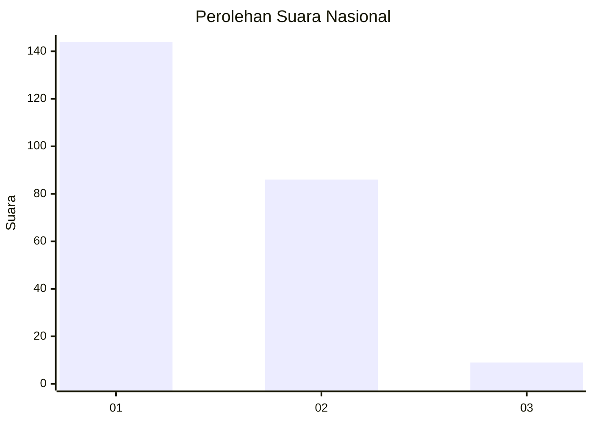
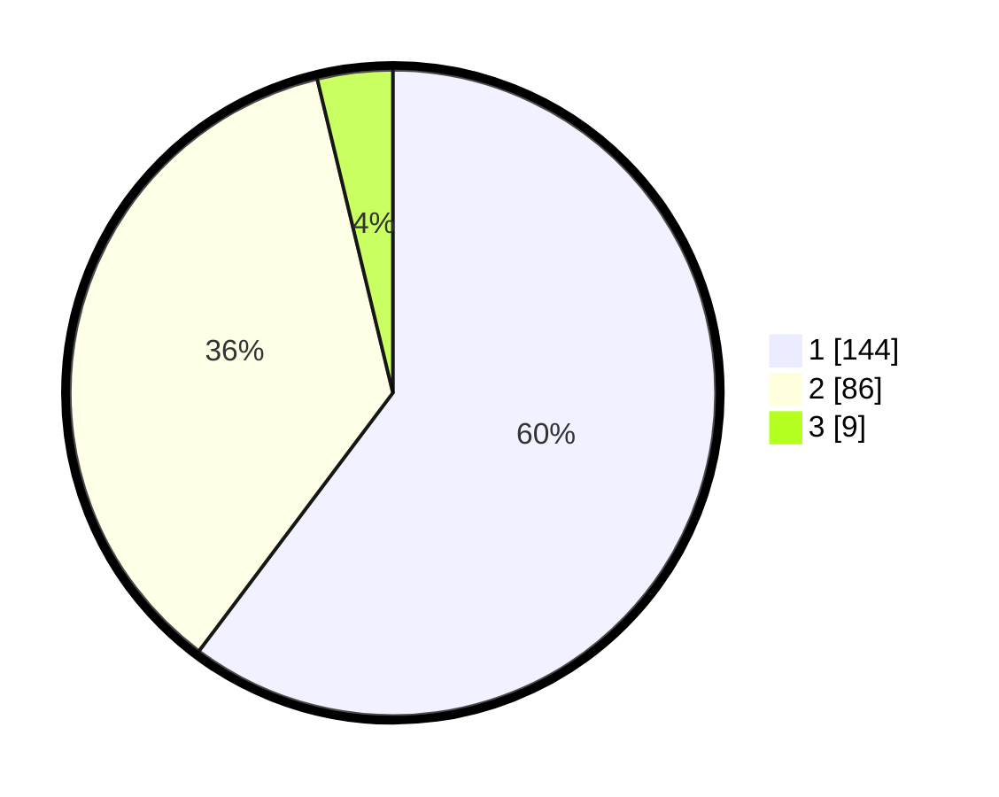

# Hasil

## Grafik

## Tabel

| No. | Nama Paslon    | Suara | Suara (raw) | Persentase |
|:--- |:-------------- | -----:| -----------:| ----------:|
| 1   | ANIES MUHAIMIN | 144   | [144][p-1]  | 60,25      |
| 2   | PRABOWO GIBRAN | 86    | [86][p-2]   | 35,98      |
| 3   | GANJAR MAHFUD  | 9     | [9][p-3]    | 3,77       |

[p-1]: https://github.com/gigit-pemilu/pemilu-2024/blob/main/pilpres/hitung-suara/sub/61-kalimantan-barat/sub/03-sanggau/sub/01-kapuas/sub/1002-tanjung-sekayam/sub/003-tps/sub/paslon-1.txt
[p-2]: https://github.com/gigit-pemilu/pemilu-2024/blob/main/pilpres/hitung-suara/sub/61-kalimantan-barat/sub/03-sanggau/sub/01-kapuas/sub/1002-tanjung-sekayam/sub/003-tps/sub/paslon-2.txt
[p-3]: https://github.com/gigit-pemilu/pemilu-2024/blob/main/pilpres/hitung-suara/sub/61-kalimantan-barat/sub/03-sanggau/sub/01-kapuas/sub/1002-tanjung-sekayam/sub/003-tps/sub/paslon-3.txt

## Foto C Plano

https://sirekap-obj-formc.kpu.go.id/a09c/pemilu/ppwp/61/03/01/10/02/6103011002003-20240215-003018--f3fea7f2-0cbc-4d50-858d-aa2bed8d22c4.jpg

https://sirekap-obj-formc.kpu.go.id/a09c/pemilu/ppwp/61/03/01/10/02/6103011002003-20240215-003130--6b7c9771-e0a2-488f-b23c-a6fcc567cbf7.jpg

https://sirekap-obj-formc.kpu.go.id/a09c/pemilu/ppwp/61/03/01/10/02/6103011002003-20240215-003218--1f6404ba-1dd6-4cbc-806b-e411c6f41a2c.jpg

## Metadata

| Key        | Value               |
| ---------- | ------------------- |
| Time Stamp | 2024-02-15 15:00:29 |

