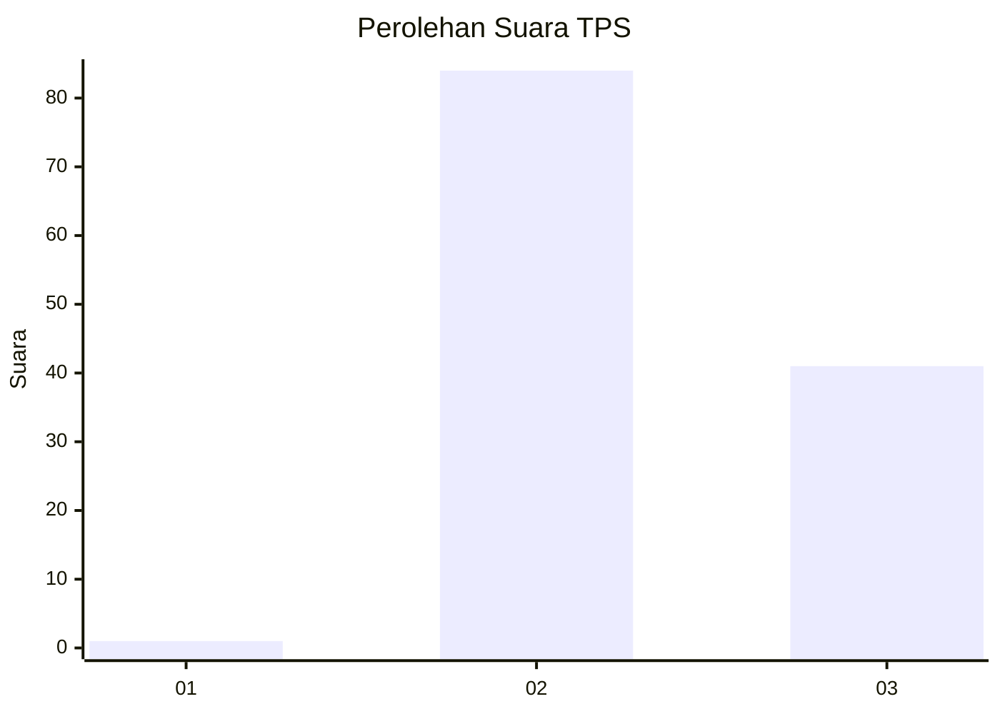
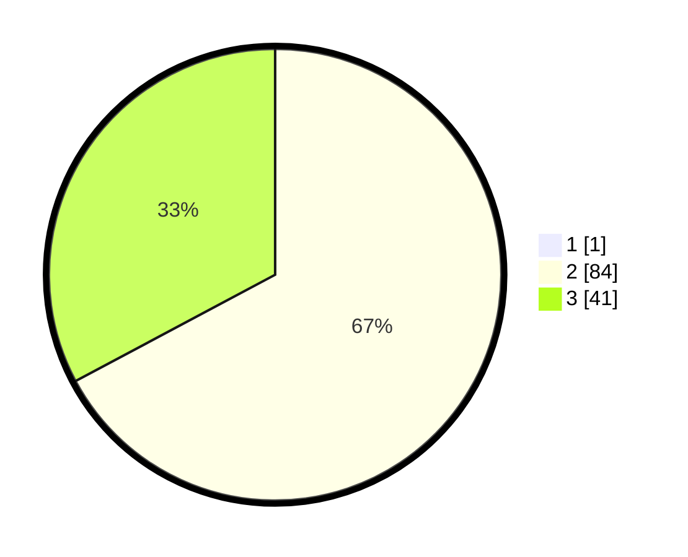

# Hasil

## Grafik

## Tabel

| No. | Nama Paslon    | Suara | Suara (raw) | Persentase |
|:--- |:-------------- | -----:| -----------:| ----------:|
| 1   | ANIES MUHAIMIN | 1     | [1][p-1]    | 0,79       |
| 2   | PRABOWO GIBRAN | 84    | [84][p-2]   | 66,67      |
| 3   | GANJAR MAHFUD  | 41    | [41][p-3]   | 32,54      |

[p-1]: https://github.com/gigit-pemilu/pemilu-2024-61-kalimantan-barat/blob/main/pilpres/hitung-suara/sub/61-kalimantan-barat/sub/03-sanggau/sub/01-kapuas/sub/2013-kambong/sub/002-tps/sub/paslon-1.txt
[p-2]: https://github.com/gigit-pemilu/pemilu-2024-61-kalimantan-barat/blob/main/pilpres/hitung-suara/sub/61-kalimantan-barat/sub/03-sanggau/sub/01-kapuas/sub/2013-kambong/sub/002-tps/sub/paslon-2.txt
[p-3]: https://github.com/gigit-pemilu/pemilu-2024-61-kalimantan-barat/blob/main/pilpres/hitung-suara/sub/61-kalimantan-barat/sub/03-sanggau/sub/01-kapuas/sub/2013-kambong/sub/002-tps/sub/paslon-3.txt

## Foto C Plano

https://sirekap-obj-formc.kpu.go.id/9599/pemilu/ppwp/61/03/01/20/13/6103012013002-20240216-065756--625975c7-dab4-4ad2-9873-6195f8890a94.jpg

https://sirekap-obj-formc.kpu.go.id/9599/pemilu/ppwp/61/03/01/20/13/6103012013002-20240216-065814--574e13b3-1371-49b1-8b29-badede3acc2d.jpg

https://sirekap-obj-formc.kpu.go.id/9599/pemilu/ppwp/61/03/01/20/13/6103012013002-20240216-065826--d5238abc-d475-437d-ab09-215f2d166506.jpg

## Metadata

| Key        | Value               |
| ---------- | ------------------- |
| Time Stamp | 2024-02-19 13:00:00 |

