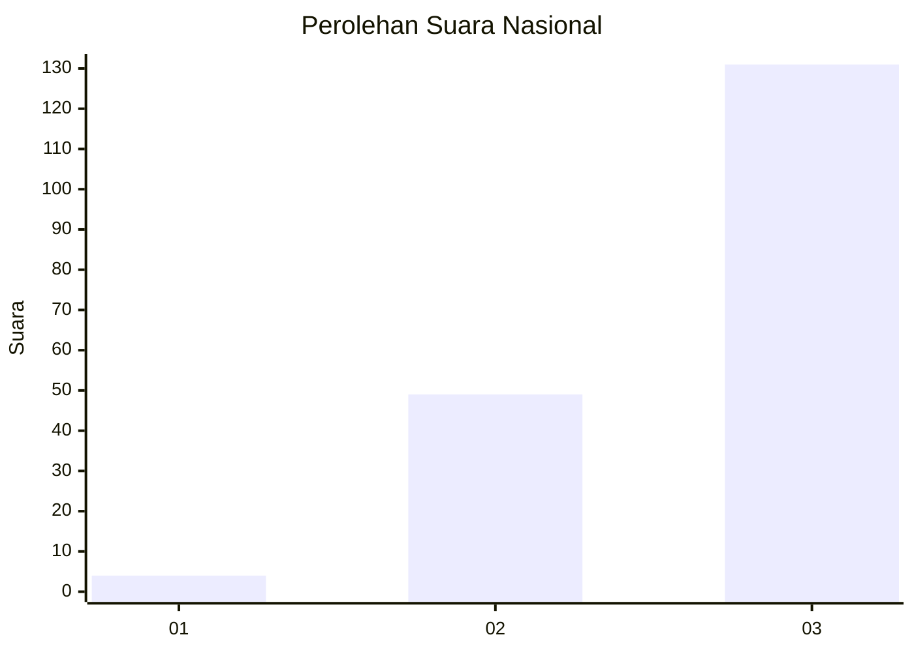
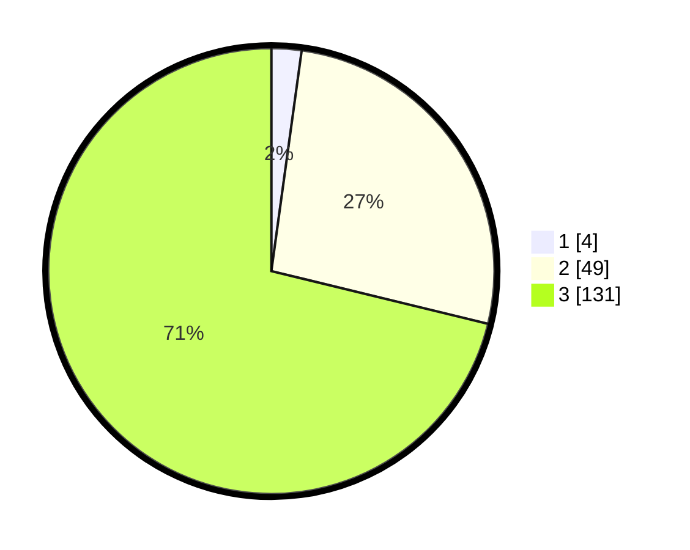

# Hasil

## Grafik

## Tabel

| No. | Nama Paslon    | Suara | Suara (raw) | Persentase |
|:--- |:-------------- | -----:| -----------:| ----------:|
| 1   | ANIES MUHAIMIN | 4     | [4][p-1]    | 2,17       |
| 2   | PRABOWO GIBRAN | 49    | [49][p-2]   | 26,63      |
| 3   | GANJAR MAHFUD  | 131   | [131][p-3]  | 71,20      |

[p-1]: https://github.com/gigit-pemilu/pemilu-2024/blob/main/pilpres/hitung-suara/sub/61-kalimantan-barat/sub/03-sanggau/sub/01-kapuas/sub/2016-penyalimau/sub/006-tps/sub/paslon-1.txt
[p-2]: https://github.com/gigit-pemilu/pemilu-2024/blob/main/pilpres/hitung-suara/sub/61-kalimantan-barat/sub/03-sanggau/sub/01-kapuas/sub/2016-penyalimau/sub/006-tps/sub/paslon-2.txt
[p-3]: https://github.com/gigit-pemilu/pemilu-2024/blob/main/pilpres/hitung-suara/sub/61-kalimantan-barat/sub/03-sanggau/sub/01-kapuas/sub/2016-penyalimau/sub/006-tps/sub/paslon-3.txt

## Foto C Plano

https://sirekap-obj-formc.kpu.go.id/4629/pemilu/ppwp/61/03/01/20/16/6103012016006-20240215-093951--bcfe440f-fc52-499c-8717-3502e5e01e77.jpg

https://sirekap-obj-formc.kpu.go.id/4629/pemilu/ppwp/61/03/01/20/16/6103012016006-20240215-094122--9fa17df9-40c0-46e8-ae7f-4bd281139042.jpg

https://sirekap-obj-formc.kpu.go.id/4629/pemilu/ppwp/61/03/01/20/16/6103012016006-20240215-094138--89473854-db6d-4420-9fe4-a75bf52d90dd.jpg

## Metadata

| Key        | Value               |
| ---------- | ------------------- |
| Time Stamp | 2024-02-25 15:00:00 |

