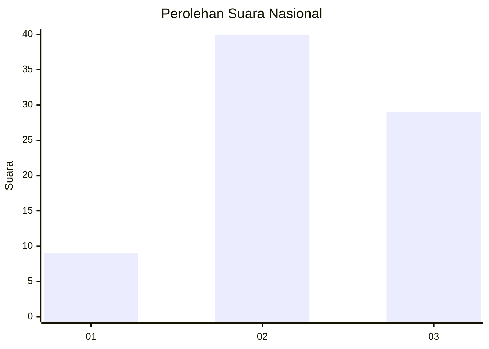
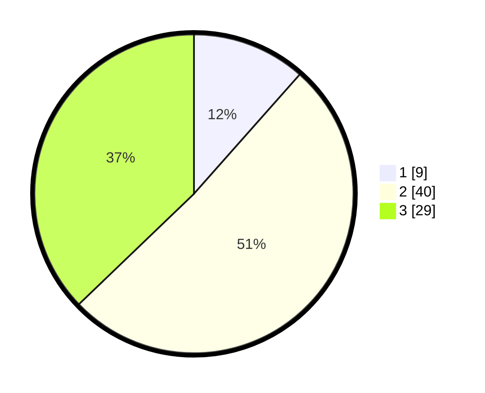

# Hasil

## Grafik

## Tabel

| No. | Nama Paslon    | Suara | Suara (raw) | Persentase |
|:--- |:-------------- | -----:| -----------:| ----------:|
| 1   | ANIES MUHAIMIN | 9     | [9][p-1]    | 11,54      |
| 2   | PRABOWO GIBRAN | 40    | [40][p-2]   | 51,28      |
| 3   | GANJAR MAHFUD  | 29    | [29][p-3]   | 37,18      |

[p-1]: https://github.com/gigit-pemilu/pemilu-2024/blob/main/pilpres/hitung-suara/sub/61-kalimantan-barat/sub/03-sanggau/sub/01-kapuas/sub/2017-sungai-alai/sub/004-tps/sub/paslon-1.txt
[p-2]: https://github.com/gigit-pemilu/pemilu-2024/blob/main/pilpres/hitung-suara/sub/61-kalimantan-barat/sub/03-sanggau/sub/01-kapuas/sub/2017-sungai-alai/sub/004-tps/sub/paslon-2.txt
[p-3]: https://github.com/gigit-pemilu/pemilu-2024/blob/main/pilpres/hitung-suara/sub/61-kalimantan-barat/sub/03-sanggau/sub/01-kapuas/sub/2017-sungai-alai/sub/004-tps/sub/paslon-3.txt

## Foto C Plano

https://sirekap-obj-formc.kpu.go.id/82bd/pemilu/ppwp/61/03/01/20/17/6103012017004-20240215-003956--b6394a55-34ff-4286-b924-91bff5cd7092.jpg

https://sirekap-obj-formc.kpu.go.id/82bd/pemilu/ppwp/61/03/01/20/17/6103012017004-20240215-004029--eaf24479-96ea-4990-905d-d1dcfad01455.jpg

https://sirekap-obj-formc.kpu.go.id/82bd/pemilu/ppwp/61/03/01/20/17/6103012017004-20240215-004113--3676686b-85b2-45b3-bbfa-2f8a1c0c47b2.jpg

## Metadata

| Key        | Value               |
| ---------- | ------------------- |
| Time Stamp | 2024-02-25 13:00:00 |

