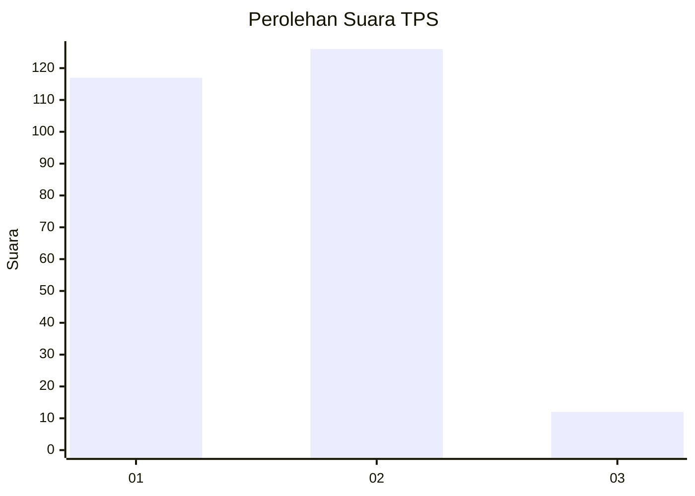
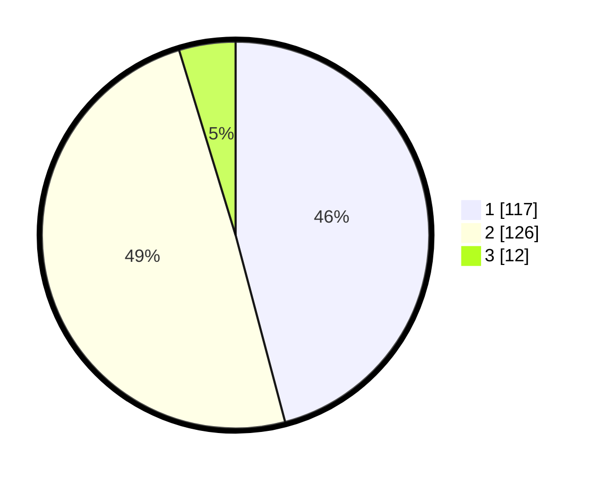

# Hasil

## Grafik

## Tabel

| No. | Nama Paslon    | Suara | Suara (raw) | Persentase |
|:--- |:-------------- | -----:| -----------:| ----------:|
| 1   | ANIES MUHAIMIN | 117   | [117][p-1]  | 45,88      |
| 2   | PRABOWO GIBRAN | 126   | [126][p-2]  | 49,41      |
| 3   | GANJAR MAHFUD  | 12    | [12][p-3]   | 4,71       |

[p-1]: https://github.com/gigit-pemilu/pemilu-2024-61-kalimantan-barat/blob/main/pilpres/hitung-suara/sub/61-kalimantan-barat/sub/03-sanggau/sub/01-kapuas/sub/2019-sungai-batu/sub/002-tps/sub/paslon-1.txt
[p-2]: https://github.com/gigit-pemilu/pemilu-2024-61-kalimantan-barat/blob/main/pilpres/hitung-suara/sub/61-kalimantan-barat/sub/03-sanggau/sub/01-kapuas/sub/2019-sungai-batu/sub/002-tps/sub/paslon-2.txt
[p-3]: https://github.com/gigit-pemilu/pemilu-2024-61-kalimantan-barat/blob/main/pilpres/hitung-suara/sub/61-kalimantan-barat/sub/03-sanggau/sub/01-kapuas/sub/2019-sungai-batu/sub/002-tps/sub/paslon-3.txt

## Foto C Plano

https://sirekap-obj-formc.kpu.go.id/7c98/pemilu/ppwp/61/03/01/20/19/6103012019002-20240215-053052--9b784fe2-14f7-40bc-b1c6-b47775c117bf.jpg

https://sirekap-obj-formc.kpu.go.id/7c98/pemilu/ppwp/61/03/01/20/19/6103012019002-20240215-052538--8e534f92-6d07-43de-9bc9-26c6b6ebfb98.jpg

https://sirekap-obj-formc.kpu.go.id/7c98/pemilu/ppwp/61/03/01/20/19/6103012019002-20240215-065744--fb6a8459-4fe1-4001-b4f0-6019df7914cc.jpg

## Metadata

| Key        | Value               |
| ---------- | ------------------- |
| Time Stamp | 2024-02-24 22:31:28 |

