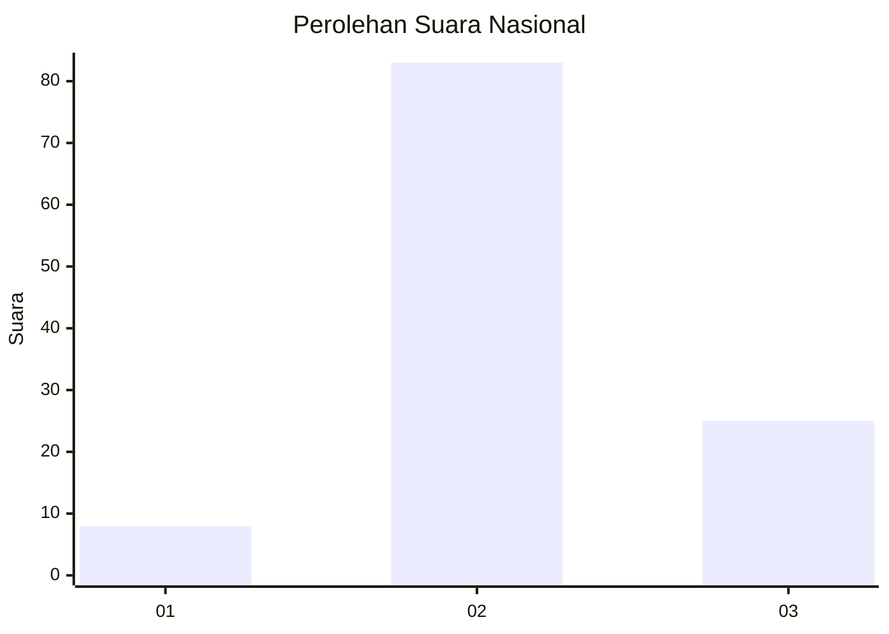

# Hasil

## Grafik

## Tabel

| No. | Nama Paslon    | Suara | Suara (raw) | Persentase |
|:--- |:-------------- | -----:| -----------:| ----------:|
| 1   | ANIES MUHAIMIN | 8     | [8][p-1]    | 6,90       |
| 2   | PRABOWO GIBRAN | 83    | [83][p-2]   | 71,55      |
| 3   | GANJAR MAHFUD  | 25    | [25][p-3]   | 21,55      |

[p-1]: https://github.com/gigit-pemilu/pemilu-2024/blob/main/pilpres/hitung-suara/sub/61-kalimantan-barat/sub/03-sanggau/sub/02-mukok/sub/2006-layak-omang/sub/001-tps/sub/paslon-1.txt
[p-2]: https://github.com/gigit-pemilu/pemilu-2024/blob/main/pilpres/hitung-suara/sub/61-kalimantan-barat/sub/03-sanggau/sub/02-mukok/sub/2006-layak-omang/sub/001-tps/sub/paslon-2.txt
[p-3]: https://github.com/gigit-pemilu/pemilu-2024/blob/main/pilpres/hitung-suara/sub/61-kalimantan-barat/sub/03-sanggau/sub/02-mukok/sub/2006-layak-omang/sub/001-tps/sub/paslon-3.txt

## Foto C Plano

https://sirekap-obj-formc.kpu.go.id/98a4/pemilu/ppwp/61/03/02/20/06/6103022006001-20240215-022041--c1634069-0d84-4c31-8109-36d5e14c9bd3.jpg

https://sirekap-obj-formc.kpu.go.id/98a4/pemilu/ppwp/61/03/02/20/06/6103022006001-20240215-022133--292ac046-6b9a-4fb9-b6e4-8af8989747c1.jpg

https://sirekap-obj-formc.kpu.go.id/98a4/pemilu/ppwp/61/03/02/20/06/6103022006001-20240215-022206--b2b60bcd-192c-4ed3-b278-63a397f7055e.jpg

## Metadata

| Key        | Value               |
| ---------- | ------------------- |
| Time Stamp | 2024-02-15 15:00:29 |

