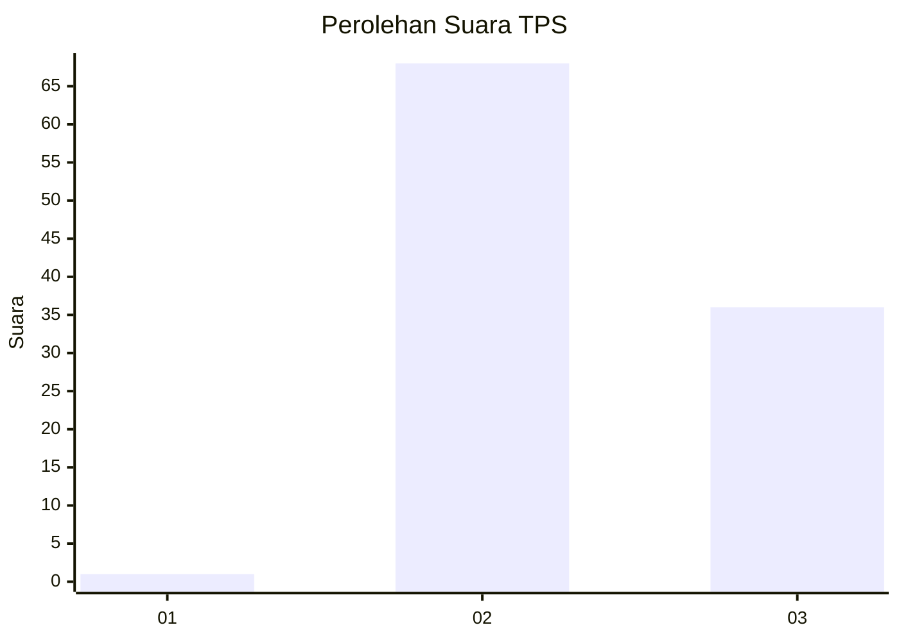
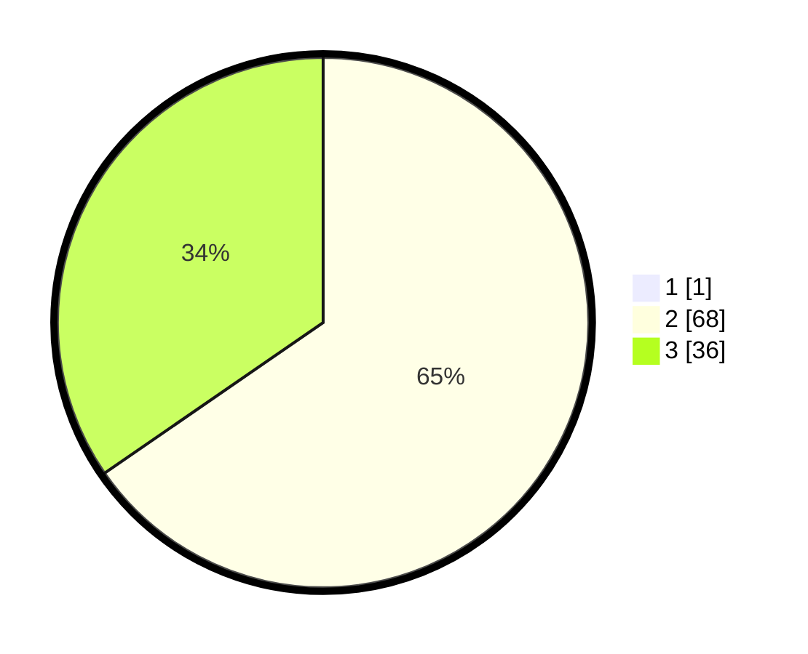

# Hasil

## Grafik

## Tabel

| No. | Nama Paslon    | Suara | Suara (raw) | Persentase |
|:--- |:-------------- | -----:| -----------:| ----------:|
| 1   | ANIES MUHAIMIN | 1     | [1][p-1]    | 0,95       |
| 2   | PRABOWO GIBRAN | 68    | [68][p-2]   | 64,76      |
| 3   | GANJAR MAHFUD  | 36    | [36][p-3]   | 34,29      |

[p-1]: https://github.com/gigit-pemilu/pemilu-2024-61-kalimantan-barat/blob/main/pilpres/hitung-suara/sub/61-kalimantan-barat/sub/03-sanggau/sub/04-jangkang/sub/2002-jangkang-benua/sub/009-tps/sub/paslon-1.txt
[p-2]: https://github.com/gigit-pemilu/pemilu-2024-61-kalimantan-barat/blob/main/pilpres/hitung-suara/sub/61-kalimantan-barat/sub/03-sanggau/sub/04-jangkang/sub/2002-jangkang-benua/sub/009-tps/sub/paslon-2.txt
[p-3]: https://github.com/gigit-pemilu/pemilu-2024-61-kalimantan-barat/blob/main/pilpres/hitung-suara/sub/61-kalimantan-barat/sub/03-sanggau/sub/04-jangkang/sub/2002-jangkang-benua/sub/009-tps/sub/paslon-3.txt

## Foto C Plano

https://sirekap-obj-formc.kpu.go.id/643a/pemilu/ppwp/61/03/04/20/02/6103042002009-20240215-024045--e92a584d-ff62-4954-85cb-a133725892e4.jpg

https://sirekap-obj-formc.kpu.go.id/643a/pemilu/ppwp/61/03/04/20/02/6103042002009-20240214-201702--009e082b-2783-4528-acfe-fbbb1885965b.jpg

https://sirekap-obj-formc.kpu.go.id/643a/pemilu/ppwp/61/03/04/20/02/6103042002009-20240215-024524--a0a58fbd-a35f-49b7-982d-c17de54eb266.jpg

## Metadata

| Key        | Value               |
| ---------- | ------------------- |
| Time Stamp | 2024-02-15 12:00:28 |

