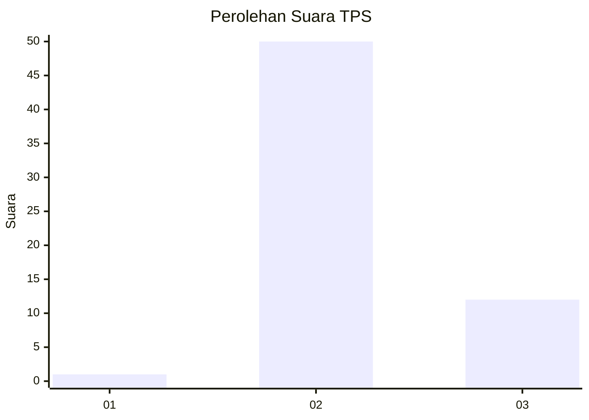
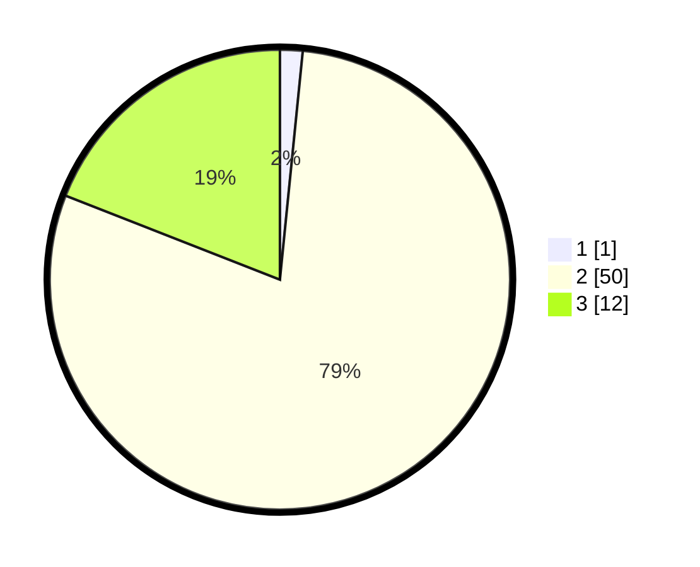

# Hasil

## Grafik

## Tabel

| No. | Nama Paslon    | Suara | Suara (raw) | Persentase |
|:--- |:-------------- | -----:| -----------:| ----------:|
| 1   | ANIES MUHAIMIN | 1     | [1][p-1]    | 1,59       |
| 2   | PRABOWO GIBRAN | 50    | [50][p-2]   | 79,37      |
| 3   | GANJAR MAHFUD  | 12    | [12][p-3]   | 19,05      |

[p-1]: https://github.com/gigit-pemilu/pemilu-2024-61-kalimantan-barat/blob/main/pilpres/hitung-suara/sub/61-kalimantan-barat/sub/03-sanggau/sub/04-jangkang/sub/2003-tanggung/sub/008-tps/sub/paslon-1.txt
[p-2]: https://github.com/gigit-pemilu/pemilu-2024-61-kalimantan-barat/blob/main/pilpres/hitung-suara/sub/61-kalimantan-barat/sub/03-sanggau/sub/04-jangkang/sub/2003-tanggung/sub/008-tps/sub/paslon-2.txt
[p-3]: https://github.com/gigit-pemilu/pemilu-2024-61-kalimantan-barat/blob/main/pilpres/hitung-suara/sub/61-kalimantan-barat/sub/03-sanggau/sub/04-jangkang/sub/2003-tanggung/sub/008-tps/sub/paslon-3.txt

## Foto C Plano

https://sirekap-obj-formc.kpu.go.id/625f/pemilu/ppwp/61/03/04/20/03/6103042003008-20240215-143532--a014bd47-6094-4745-ad0a-5bc3f6836317.jpg

https://sirekap-obj-formc.kpu.go.id/625f/pemilu/ppwp/61/03/04/20/03/6103042003008-20240215-143607--569d99d9-eae0-478f-8626-da5ac7bb42c4.jpg

https://sirekap-obj-formc.kpu.go.id/625f/pemilu/ppwp/61/03/04/20/03/6103042003008-20240215-143649--df0ea398-4131-4613-8c47-a91492a08fe5.jpg

## Metadata

| Key        | Value               |
| ---------- | ------------------- |
| Time Stamp | 2024-02-15 19:00:26 |

