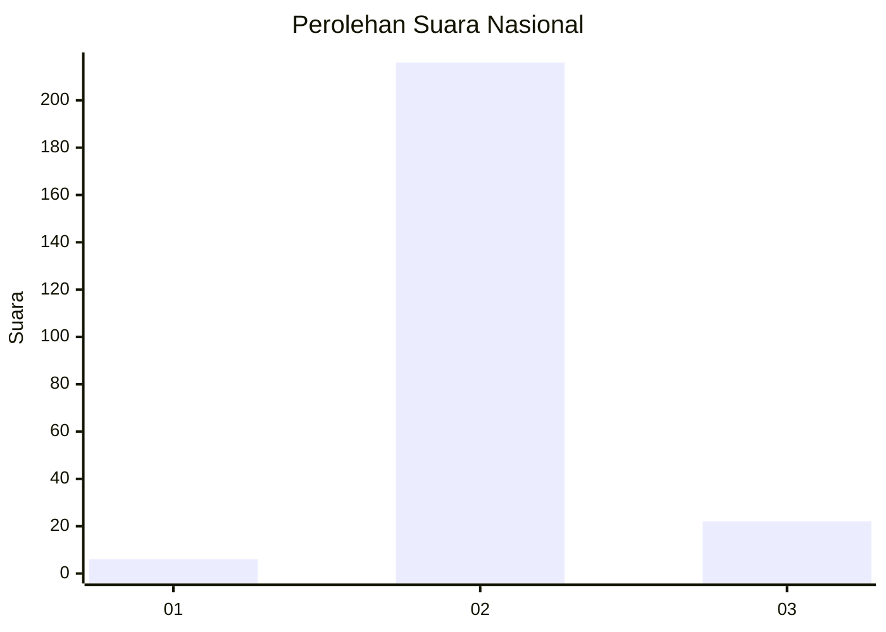
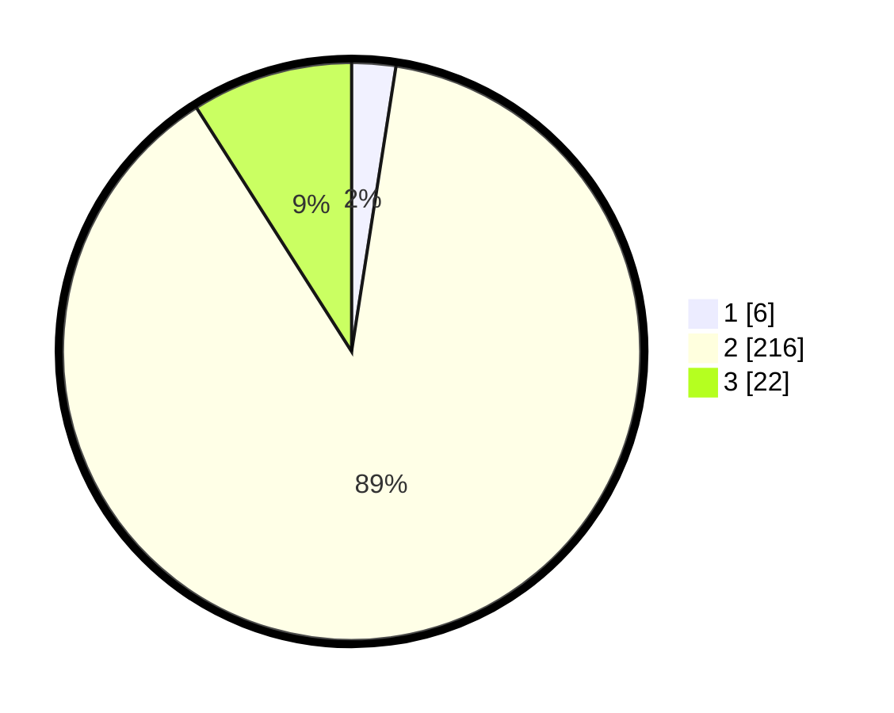

# Hasil

## Grafik

## Tabel

| No. | Nama Paslon    | Suara | Suara (raw) | Persentase |
|:--- |:-------------- | -----:| -----------:| ----------:|
| 1   | ANIES MUHAIMIN | 6     | [6][p-1]    | 2,46       |
| 2   | PRABOWO GIBRAN | 216   | [216][p-2]  | 88,52      |
| 3   | GANJAR MAHFUD  | 22    | [22][p-3]   | 9,02       |

[p-1]: https://github.com/gigit-pemilu/pemilu-2024/blob/main/pilpres/hitung-suara/sub/61-kalimantan-barat/sub/03-sanggau/sub/04-jangkang/sub/2010-selampung/sub/001-tps/sub/paslon-1.txt
[p-2]: https://github.com/gigit-pemilu/pemilu-2024/blob/main/pilpres/hitung-suara/sub/61-kalimantan-barat/sub/03-sanggau/sub/04-jangkang/sub/2010-selampung/sub/001-tps/sub/paslon-2.txt
[p-3]: https://github.com/gigit-pemilu/pemilu-2024/blob/main/pilpres/hitung-suara/sub/61-kalimantan-barat/sub/03-sanggau/sub/04-jangkang/sub/2010-selampung/sub/001-tps/sub/paslon-3.txt

## Foto C Plano

https://sirekap-obj-formc.kpu.go.id/c381/pemilu/ppwp/61/03/04/20/10/6103042010001-20240215-060924--d0dc2e23-b832-4352-8b6f-f5cd135d6ce1.jpg

https://sirekap-obj-formc.kpu.go.id/c381/pemilu/ppwp/61/03/04/20/10/6103042010001-20240215-061245--60bf99b8-fa58-4251-8234-58ec452c60c6.jpg

https://sirekap-obj-formc.kpu.go.id/c381/pemilu/ppwp/61/03/04/20/10/6103042010001-20240215-062306--74472e98-8b58-46c0-9da1-7cdfdf0eec2a.jpg

## Metadata

| Key        | Value               |
| ---------- | ------------------- |
| Time Stamp | 2024-02-15 17:30:25 |

