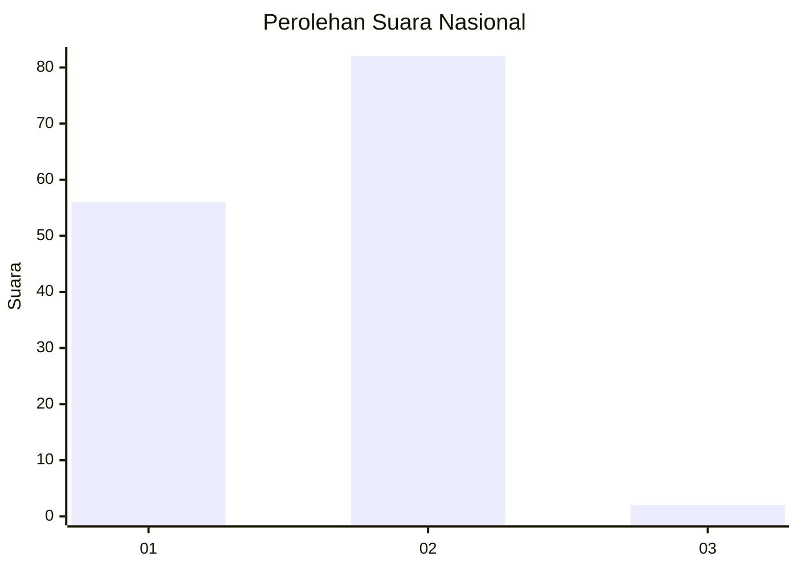
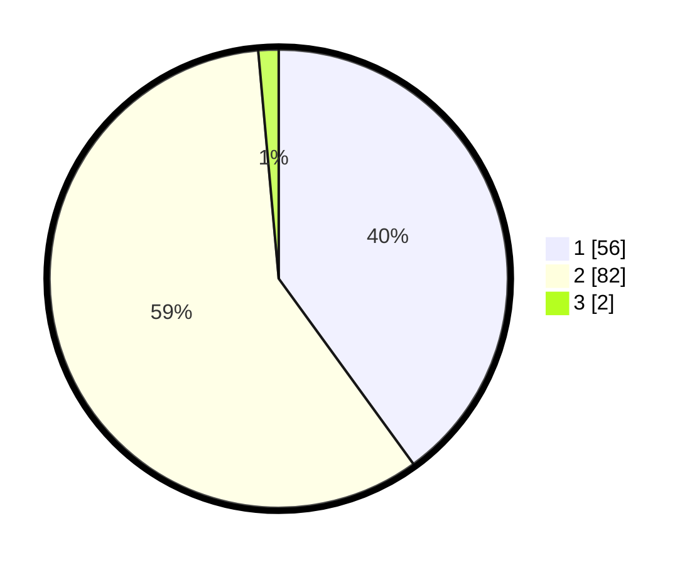

# Hasil

## Grafik

## Tabel

| No. | Nama Paslon    | Suara | Suara (raw) | Persentase |
|:--- |:-------------- | -----:| -----------:| ----------:|
| 1   | ANIES MUHAIMIN | 56    | [56][p-1]   | 40,00      |
| 2   | PRABOWO GIBRAN | 82    | [82][p-2]   | 58,57      |
| 3   | GANJAR MAHFUD  | 2     | [2][p-3]    | 1,43       |

[p-1]: https://github.com/gigit-pemilu/pemilu-2024/blob/main/pilpres/hitung-suara/sub/61-kalimantan-barat/sub/03-sanggau/sub/07-sekayam/sub/2001-balai-karangan/sub/005-tps/sub/paslon-1.txt
[p-2]: https://github.com/gigit-pemilu/pemilu-2024/blob/main/pilpres/hitung-suara/sub/61-kalimantan-barat/sub/03-sanggau/sub/07-sekayam/sub/2001-balai-karangan/sub/005-tps/sub/paslon-2.txt
[p-3]: https://github.com/gigit-pemilu/pemilu-2024/blob/main/pilpres/hitung-suara/sub/61-kalimantan-barat/sub/03-sanggau/sub/07-sekayam/sub/2001-balai-karangan/sub/005-tps/sub/paslon-3.txt

## Foto C Plano

https://sirekap-obj-formc.kpu.go.id/212e/pemilu/ppwp/61/03/07/20/01/6103072001005-20240215-052938--781768b5-de79-40fd-95a0-ea6322a143e7.jpg

https://sirekap-obj-formc.kpu.go.id/212e/pemilu/ppwp/61/03/07/20/01/6103072001005-20240214-201218--1fbc3233-a01b-4760-8d5d-1e86e920d82d.jpg

https://sirekap-obj-formc.kpu.go.id/212e/pemilu/ppwp/61/03/07/20/01/6103072001005-20240215-054354--946cf9d9-93ef-4c45-89f9-d73a10880dc1.jpg

## Metadata

| Key        | Value               |
| ---------- | ------------------- |
| Time Stamp | 2024-02-15 17:30:25 |

