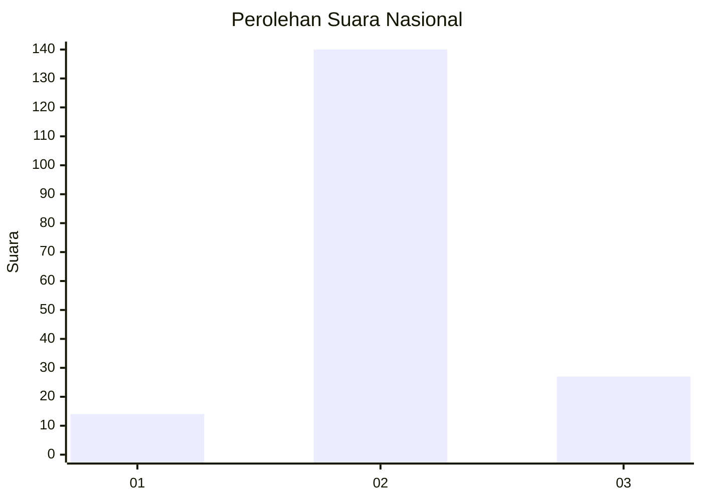

# Hasil

## Grafik

## Tabel

| No. | Nama Paslon    | Suara | Suara (raw) | Persentase |
|:--- |:-------------- | -----:| -----------:| ----------:|
| 1   | ANIES MUHAIMIN | 14    | [14][p-1]   | 7,73       |
| 2   | PRABOWO GIBRAN | 140   | [140][p-2]  | 77,35      |
| 3   | GANJAR MAHFUD  | 27    | [27][p-3]   | 14,92      |

[p-1]: https://github.com/gigit-pemilu/pemilu-2024/blob/main/pilpres/hitung-suara/sub/61-kalimantan-barat/sub/03-sanggau/sub/07-sekayam/sub/2008-lubuk-sabuk/sub/002-tps/sub/paslon-1.txt
[p-2]: https://github.com/gigit-pemilu/pemilu-2024/blob/main/pilpres/hitung-suara/sub/61-kalimantan-barat/sub/03-sanggau/sub/07-sekayam/sub/2008-lubuk-sabuk/sub/002-tps/sub/paslon-2.txt
[p-3]: https://github.com/gigit-pemilu/pemilu-2024/blob/main/pilpres/hitung-suara/sub/61-kalimantan-barat/sub/03-sanggau/sub/07-sekayam/sub/2008-lubuk-sabuk/sub/002-tps/sub/paslon-3.txt

## Foto C Plano

https://sirekap-obj-formc.kpu.go.id/01fc/pemilu/ppwp/61/03/07/20/08/6103072008002-20240214-234842--655eab1d-7d66-4847-9fce-af2202535223.jpg

https://sirekap-obj-formc.kpu.go.id/01fc/pemilu/ppwp/61/03/07/20/08/6103072008002-20240214-235756--64e7ae99-7b6e-4bd8-be4e-1a30ae7d0397.jpg

https://sirekap-obj-formc.kpu.go.id/01fc/pemilu/ppwp/61/03/07/20/08/6103072008002-20240214-235834--b6470f2a-eb07-420c-8f7b-82aa15543241.jpg

## Metadata

| Key        | Value               |
| ---------- | ------------------- |
| Time Stamp | 2024-02-15 15:00:29 |

