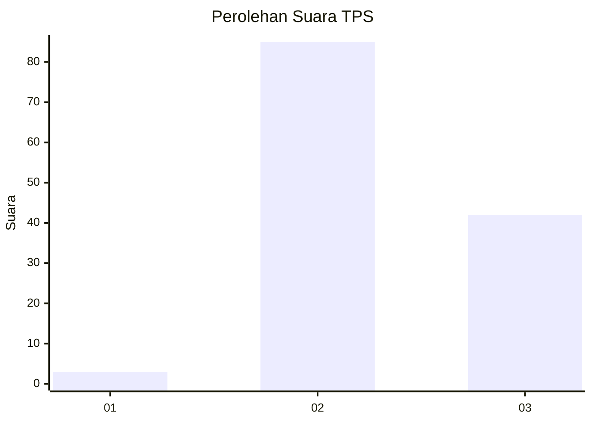
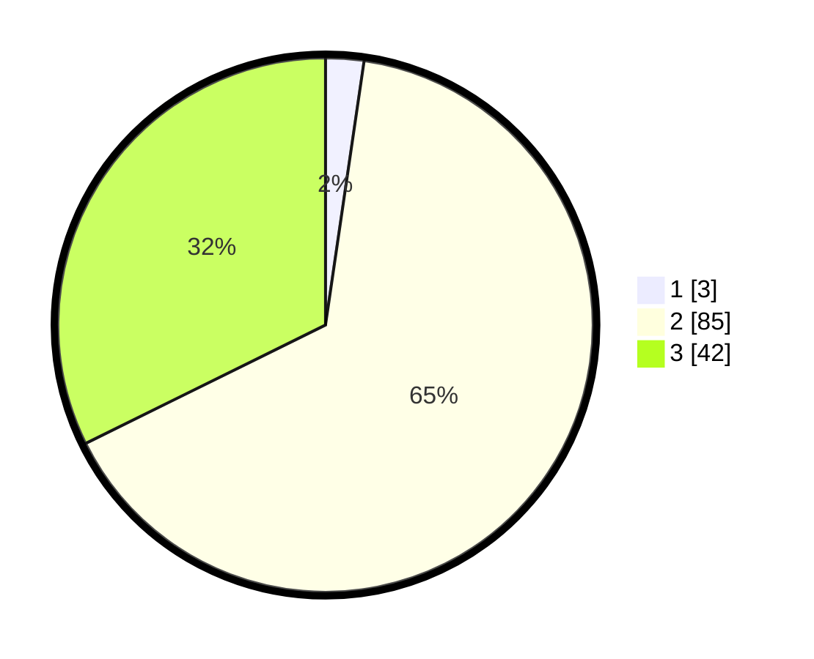

# Hasil

## Grafik

## Tabel

| No. | Nama Paslon    | Suara | Suara (raw) | Persentase |
|:--- |:-------------- | -----:| -----------:| ----------:|
| 1   | ANIES MUHAIMIN | 3     | [3][p-1]    | 2,31       |
| 2   | PRABOWO GIBRAN | 85    | [85][p-2]   | 65,38      |
| 3   | GANJAR MAHFUD  | 42    | [42][p-3]   | 32,31      |

[p-1]: https://github.com/gigit-pemilu/pemilu-2024-61-kalimantan-barat/blob/main/pilpres/hitung-suara/sub/61-kalimantan-barat/sub/03-sanggau/sub/09-parindu/sub/2001-pusat-damai/sub/004-tps/sub/paslon-1.txt
[p-2]: https://github.com/gigit-pemilu/pemilu-2024-61-kalimantan-barat/blob/main/pilpres/hitung-suara/sub/61-kalimantan-barat/sub/03-sanggau/sub/09-parindu/sub/2001-pusat-damai/sub/004-tps/sub/paslon-2.txt
[p-3]: https://github.com/gigit-pemilu/pemilu-2024-61-kalimantan-barat/blob/main/pilpres/hitung-suara/sub/61-kalimantan-barat/sub/03-sanggau/sub/09-parindu/sub/2001-pusat-damai/sub/004-tps/sub/paslon-3.txt

## Foto C Plano

https://sirekap-obj-formc.kpu.go.id/d816/pemilu/ppwp/61/03/09/20/01/6103092001004-20240219-185308--3416af67-0ee4-428e-a434-3ade18d77a9d.jpg

https://sirekap-obj-formc.kpu.go.id/d816/pemilu/ppwp/61/03/09/20/01/6103092001004-20240219-185415--dda7e93d-7539-4e72-bf1e-541bab874e91.jpg

https://sirekap-obj-formc.kpu.go.id/d816/pemilu/ppwp/61/03/09/20/01/6103092001004-20240219-185819--4d6f8267-d5d6-4aa8-8733-1ed1d546aabc.jpg

## Metadata

| Key        | Value               |
| ---------- | ------------------- |
| Time Stamp | 2024-02-24 22:31:28 |

