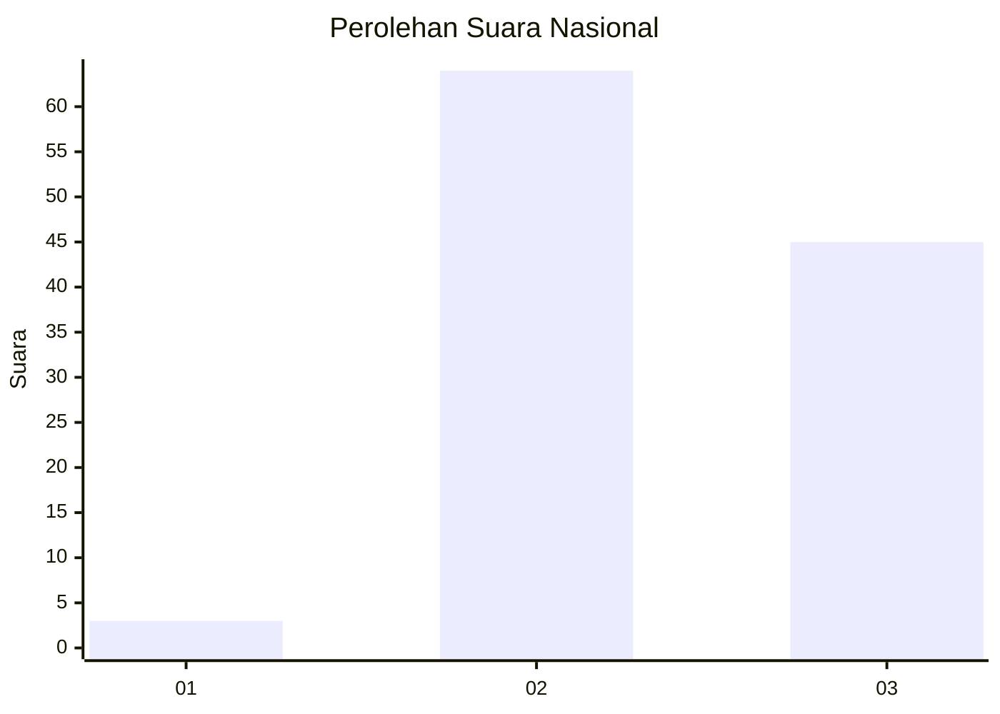
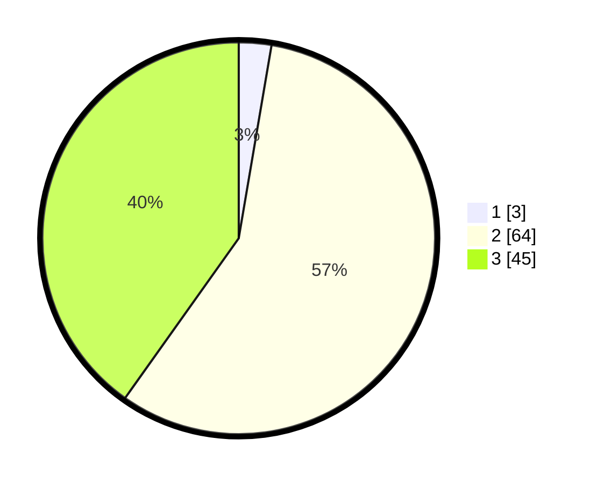

# Hasil

## Grafik

## Tabel

| No. | Nama Paslon    | Suara | Suara (raw) | Persentase |
|:--- |:-------------- | -----:| -----------:| ----------:|
| 1   | ANIES MUHAIMIN | 3     | [3][p-1]    | 2,68       |
| 2   | PRABOWO GIBRAN | 64    | [64][p-2]   | 57,14      |
| 3   | GANJAR MAHFUD  | 45    | [45][p-3]   | 40,18      |

[p-1]: https://github.com/gigit-pemilu/pemilu-2024/blob/main/pilpres/hitung-suara/sub/61-kalimantan-barat/sub/03-sanggau/sub/09-parindu/sub/2007-maringin-jaya/sub/003-tps/sub/paslon-1.txt
[p-2]: https://github.com/gigit-pemilu/pemilu-2024/blob/main/pilpres/hitung-suara/sub/61-kalimantan-barat/sub/03-sanggau/sub/09-parindu/sub/2007-maringin-jaya/sub/003-tps/sub/paslon-2.txt
[p-3]: https://github.com/gigit-pemilu/pemilu-2024/blob/main/pilpres/hitung-suara/sub/61-kalimantan-barat/sub/03-sanggau/sub/09-parindu/sub/2007-maringin-jaya/sub/003-tps/sub/paslon-3.txt

## Foto C Plano

https://sirekap-obj-formc.kpu.go.id/3e68/pemilu/ppwp/61/03/09/20/07/6103092007003-20240221-130449--84d1fe6b-af14-43fb-8fa3-a18e812ac5ab.jpg

https://sirekap-obj-formc.kpu.go.id/3e68/pemilu/ppwp/61/03/09/20/07/6103092007003-20240221-130534--355a7c70-660b-4a87-80a3-085e4256a0ea.jpg

https://sirekap-obj-formc.kpu.go.id/3e68/pemilu/ppwp/61/03/09/20/07/6103092007003-20240221-130603--25cc141f-fff7-4f90-9e4a-b88847ab0d88.jpg

## Metadata

| Key        | Value               |
| ---------- | ------------------- |
| Time Stamp | 2024-02-21 14:00:00 |

## DATA PEMILIH TETAP

Jumlah pemilih dalam DPT: **811**.
 * L: **7**.
 * P: **10**.

## DATA PENGGUNA HAK PILIH

Jumlah pengguna hak pilih dalam DPT: **555**.
 * L: **77**.
 * P: **750**.

Jumlah pengguna hak pilih dalam DPTb: **222**.
 * L: **222**.
 * P: **222**.

Jumlah pengguna hak pilih dalam DPK: **871**.
 * L: **81**.
 * P: **80**.

Jumlah pengguna hak pilih: **211**.
 * L: **106**.
 * P: **105**.

## JUMLAH SUARA SAH DAN TIDAK SAH

JUMLAH SELURUH SUARA SAH: **209**.

JUMLAH SUARA TIDAK SAH: **2**.

JUMLAH SELURUH SUARA SAH DAN SUARA TIDAK SAH: **211**.

