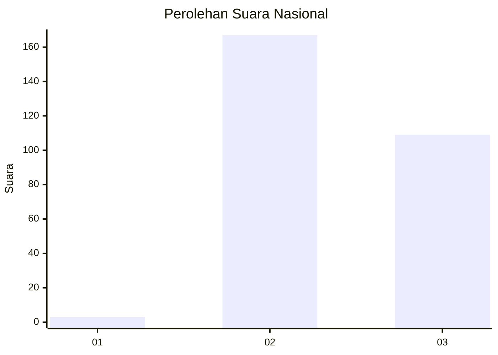
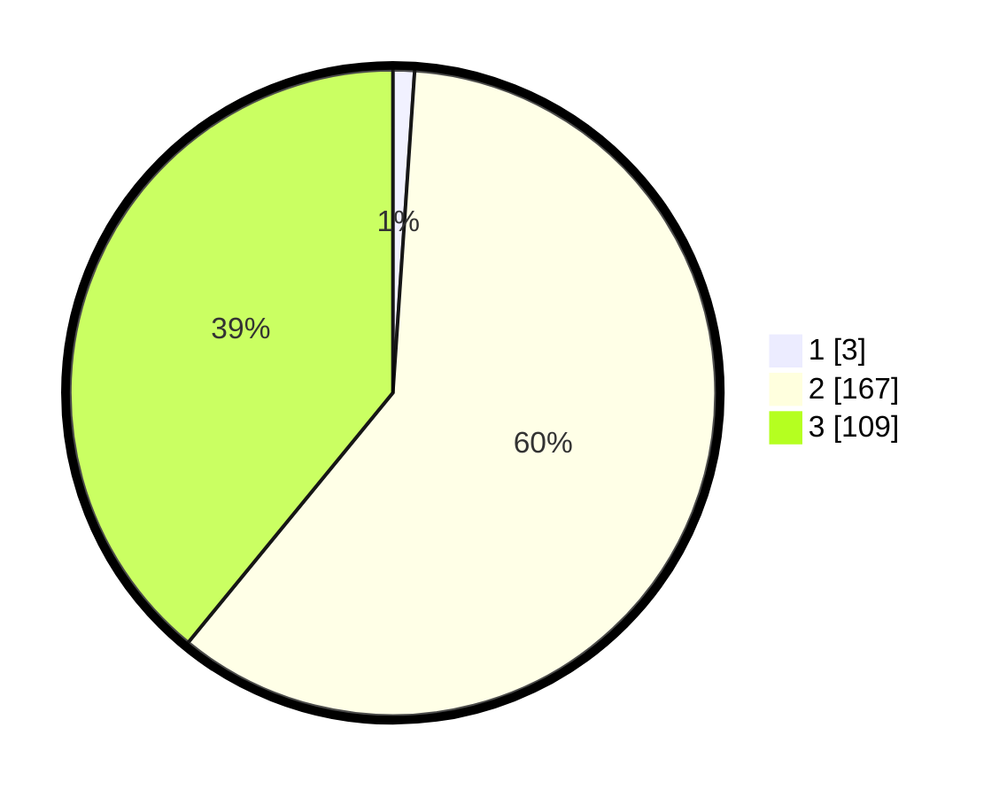

# Hasil

## Grafik

## Tabel

| No. | Nama Paslon    | Suara | Suara (raw) | Persentase |
|:--- |:-------------- | -----:| -----------:| ----------:|
| 1   | ANIES MUHAIMIN | 3     | [3][p-1]    | 1,08       |
| 2   | PRABOWO GIBRAN | 167   | [167][p-2]  | 59,86      |
| 3   | GANJAR MAHFUD  | 109   | [109][p-3]  | 39,07      |

[p-1]: https://github.com/gigit-pemilu/pemilu-2024/blob/main/pilpres/hitung-suara/sub/61-kalimantan-barat/sub/03-sanggau/sub/10-tayan-hulu/sub/2008-engkasan/sub/004-tps/sub/paslon-1.txt
[p-2]: https://github.com/gigit-pemilu/pemilu-2024/blob/main/pilpres/hitung-suara/sub/61-kalimantan-barat/sub/03-sanggau/sub/10-tayan-hulu/sub/2008-engkasan/sub/004-tps/sub/paslon-2.txt
[p-3]: https://github.com/gigit-pemilu/pemilu-2024/blob/main/pilpres/hitung-suara/sub/61-kalimantan-barat/sub/03-sanggau/sub/10-tayan-hulu/sub/2008-engkasan/sub/004-tps/sub/paslon-3.txt

## Foto C Plano

https://sirekap-obj-formc.kpu.go.id/178e/pemilu/ppwp/61/03/10/20/08/6103102008004-20240219-194231--bebbfb00-4a67-4825-ad25-2b7e245eae7a.jpg

https://sirekap-obj-formc.kpu.go.id/178e/pemilu/ppwp/61/03/10/20/08/6103102008004-20240219-194428--c05a16a6-6fe6-4902-a565-b50da6631784.jpg

https://sirekap-obj-formc.kpu.go.id/178e/pemilu/ppwp/61/03/10/20/08/6103102008004-20240219-194538--78bcb800-ae4f-4aa7-a940-f65d40f7c0d8.jpg

## Metadata

| Key        | Value               |
| ---------- | ------------------- |
| Time Stamp | 2024-02-24 22:31:28 |

