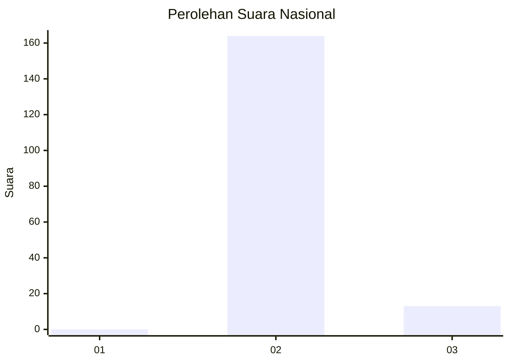
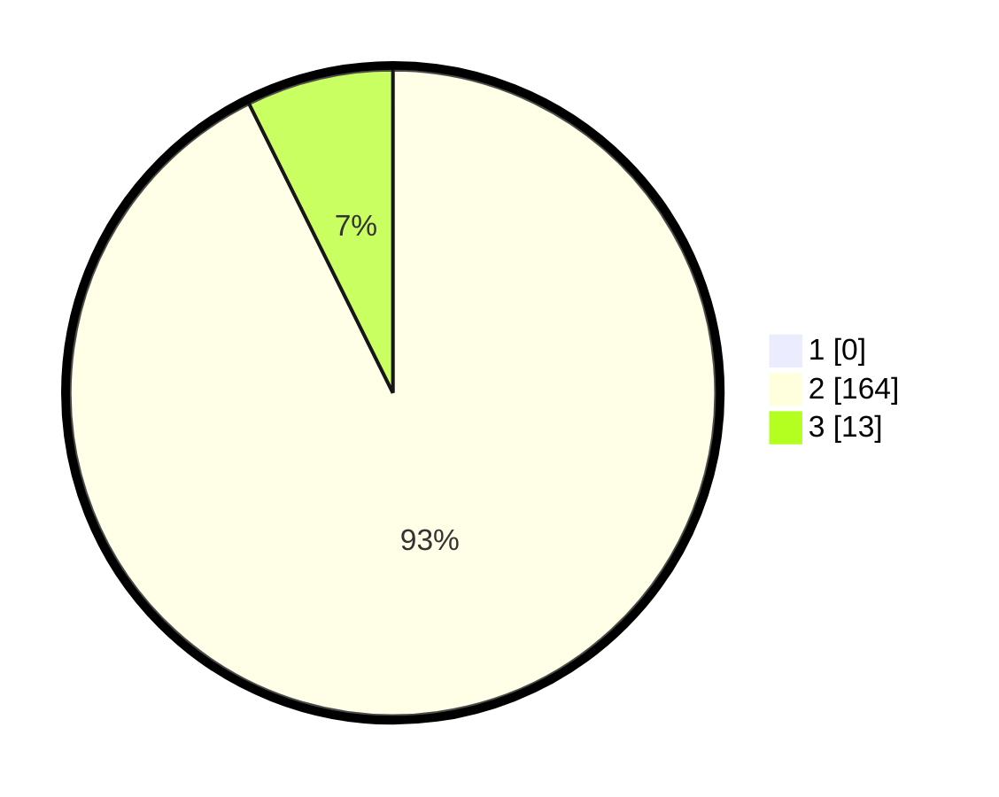

# Hasil

## Grafik

## Tabel

| No. | Nama Paslon    | Suara | Suara (raw) | Persentase |
|:--- |:-------------- | -----:| -----------:| ----------:|
| 1   | ANIES MUHAIMIN | 0     | [0][p-1]    | 0,00       |
| 2   | PRABOWO GIBRAN | 164   | [164][p-2]  | 92,66      |
| 3   | GANJAR MAHFUD  | 13    | [13][p-3]   | 7,34       |

[p-1]: https://github.com/gigit-pemilu/pemilu-2024/blob/main/pilpres/hitung-suara/sub/61-kalimantan-barat/sub/03-sanggau/sub/10-tayan-hulu/sub/2008-engkasan/sub/005-tps/sub/paslon-1.txt
[p-2]: https://github.com/gigit-pemilu/pemilu-2024/blob/main/pilpres/hitung-suara/sub/61-kalimantan-barat/sub/03-sanggau/sub/10-tayan-hulu/sub/2008-engkasan/sub/005-tps/sub/paslon-2.txt
[p-3]: https://github.com/gigit-pemilu/pemilu-2024/blob/main/pilpres/hitung-suara/sub/61-kalimantan-barat/sub/03-sanggau/sub/10-tayan-hulu/sub/2008-engkasan/sub/005-tps/sub/paslon-3.txt

## Foto C Plano

https://sirekap-obj-formc.kpu.go.id/543a/pemilu/ppwp/61/03/10/20/08/6103102008005-20240220-004335--8fb06502-9859-470c-8704-fe72cc18e962.jpg

https://sirekap-obj-formc.kpu.go.id/543a/pemilu/ppwp/61/03/10/20/08/6103102008005-20240220-004530--1ede4ddd-1295-4984-8773-7b426cb3e277.jpg

https://sirekap-obj-formc.kpu.go.id/543a/pemilu/ppwp/61/03/10/20/08/6103102008005-20240220-004950--f216edb8-382e-4123-9ee0-28435ddaeb12.jpg

## Metadata

| Key        | Value               |
| ---------- | ------------------- |
| Time Stamp | 2024-02-26 03:00:00 |

