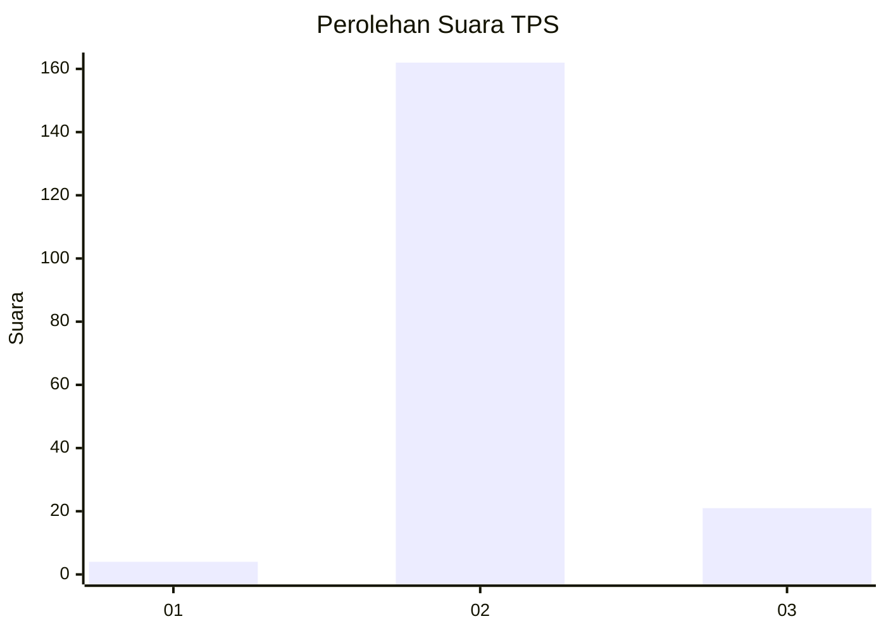
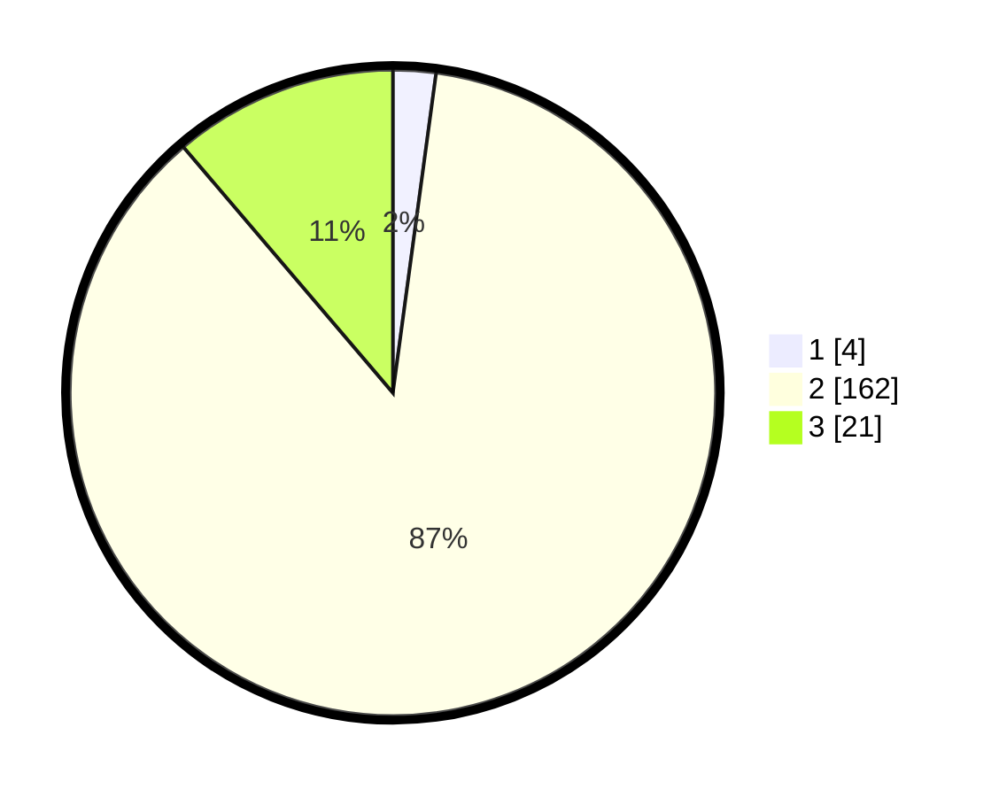

# Hasil

## Grafik

## Tabel

| No. | Nama Paslon    | Suara | Suara (raw) | Persentase |
|:--- |:-------------- | -----:| -----------:| ----------:|
| 1   | ANIES MUHAIMIN | 4     | [4][p-1]    | 2,14       |
| 2   | PRABOWO GIBRAN | 162   | [162][p-2]  | 86,63      |
| 3   | GANJAR MAHFUD  | 21    | [21][p-3]   | 11,23      |

[p-1]: https://github.com/gigit-pemilu/pemilu-2024-61-kalimantan-barat/blob/main/pilpres/hitung-suara/sub/61-kalimantan-barat/sub/03-sanggau/sub/10-tayan-hulu/sub/2009-pandan-sembuat/sub/004-tps/sub/paslon-1.txt
[p-2]: https://github.com/gigit-pemilu/pemilu-2024-61-kalimantan-barat/blob/main/pilpres/hitung-suara/sub/61-kalimantan-barat/sub/03-sanggau/sub/10-tayan-hulu/sub/2009-pandan-sembuat/sub/004-tps/sub/paslon-2.txt
[p-3]: https://github.com/gigit-pemilu/pemilu-2024-61-kalimantan-barat/blob/main/pilpres/hitung-suara/sub/61-kalimantan-barat/sub/03-sanggau/sub/10-tayan-hulu/sub/2009-pandan-sembuat/sub/004-tps/sub/paslon-3.txt

## Foto C Plano

https://sirekap-obj-formc.kpu.go.id/e33e/pemilu/ppwp/61/03/10/20/09/6103102009004-20240215-113948--9c35a300-7bc7-4c11-8e99-3b98c6bf6df4.jpg

https://sirekap-obj-formc.kpu.go.id/e33e/pemilu/ppwp/61/03/10/20/09/6103102009004-20240215-114025--4e92ea28-75d5-4bc3-b739-feb78ffecfea.jpg

https://sirekap-obj-formc.kpu.go.id/e33e/pemilu/ppwp/61/03/10/20/09/6103102009004-20240215-114131--64087d00-e491-4f2a-a09f-9e2c023ff79d.jpg

## Metadata

| Key        | Value               |
| ---------- | ------------------- |
| Time Stamp | 2024-02-25 17:00:00 |

