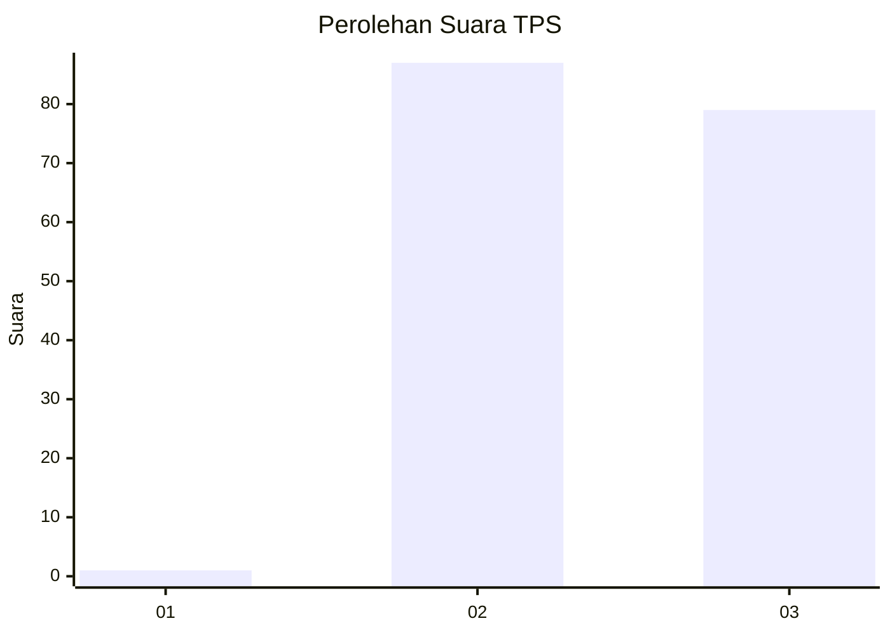
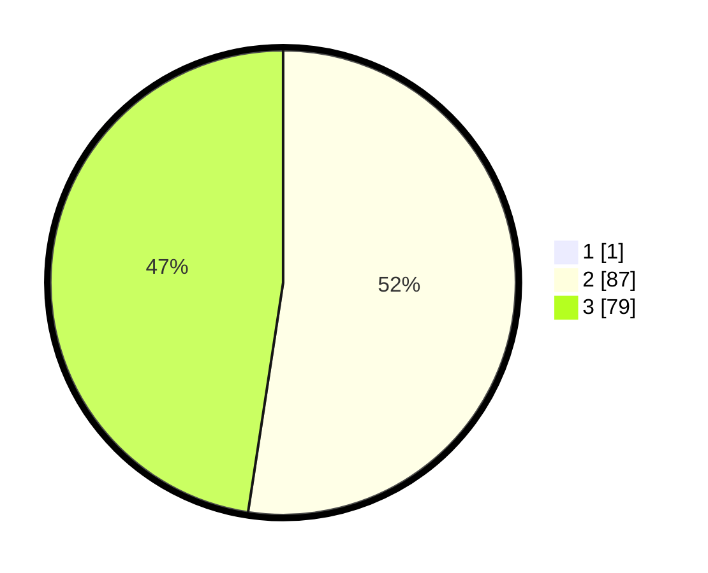

# Hasil

## Grafik

## Tabel

| No. | Nama Paslon    | Suara | Suara (raw) | Persentase |
|:--- |:-------------- | -----:| -----------:| ----------:|
| 1   | ANIES MUHAIMIN | 1     | [1][p-1]    | 0,60       |
| 2   | PRABOWO GIBRAN | 87    | [87][p-2]   | 52,10      |
| 3   | GANJAR MAHFUD  | 79    | [79][p-3]   | 47,31      |

[p-1]: https://github.com/gigit-pemilu/pemilu-2024-61-kalimantan-barat/blob/main/pilpres/hitung-suara/sub/61-kalimantan-barat/sub/03-sanggau/sub/11-tayan-hilir/sub/2007-melugai/sub/005-tps/sub/paslon-1.txt
[p-2]: https://github.com/gigit-pemilu/pemilu-2024-61-kalimantan-barat/blob/main/pilpres/hitung-suara/sub/61-kalimantan-barat/sub/03-sanggau/sub/11-tayan-hilir/sub/2007-melugai/sub/005-tps/sub/paslon-2.txt
[p-3]: https://github.com/gigit-pemilu/pemilu-2024-61-kalimantan-barat/blob/main/pilpres/hitung-suara/sub/61-kalimantan-barat/sub/03-sanggau/sub/11-tayan-hilir/sub/2007-melugai/sub/005-tps/sub/paslon-3.txt

## Foto C Plano

https://sirekap-obj-formc.kpu.go.id/509d/pemilu/ppwp/61/03/11/20/07/6103112007005-20240215-145948--0a5c050a-ad78-4be5-8bbc-92a5e759330b.jpg

https://sirekap-obj-formc.kpu.go.id/509d/pemilu/ppwp/61/03/11/20/07/6103112007005-20240215-145919--9a8be556-1863-457d-9199-573bf90bf0f7.jpg

https://sirekap-obj-formc.kpu.go.id/509d/pemilu/ppwp/61/03/11/20/07/6103112007005-20240215-145958--bd808065-b89a-4541-bf9f-490888b4e6ce.jpg

## Metadata

| Key        | Value               |
| ---------- | ------------------- |
| Time Stamp | 2024-02-16 16:25:10 |

## DATA PEMILIH TETAP

Jumlah pemilih dalam DPT: **184**.
 * L: **104**.
 * P: **80**.

## DATA PENGGUNA HAK PILIH

Jumlah pengguna hak pilih dalam DPT: **166**.
 * L: **895**.
 * P: **871**.

Jumlah pengguna hak pilih dalam DPTb: **88**.
 * L: **20**.
 * P: **200**.

Jumlah pengguna hak pilih dalam DPK: **81**.
 * L: **881**.
 * P: **838**.

Jumlah pengguna hak pilih: **167**.
 * L: **896**.
 * P: **871**.

## JUMLAH SUARA SAH DAN TIDAK SAH

JUMLAH SELURUH SUARA SAH: **167**.

JUMLAH SUARA TIDAK SAH: **0**.

JUMLAH SELURUH SUARA SAH DAN SUARA TIDAK SAH: **167**.

