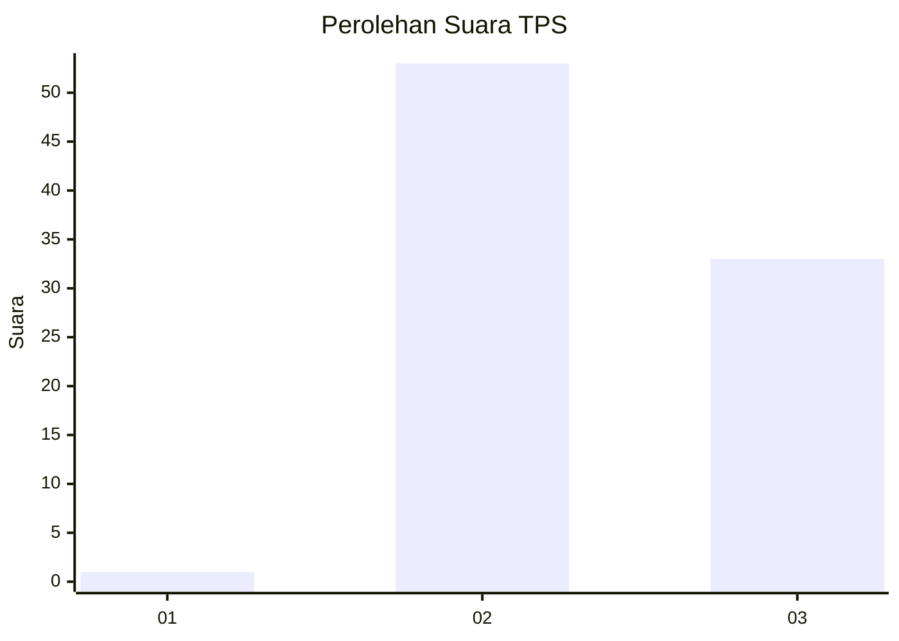
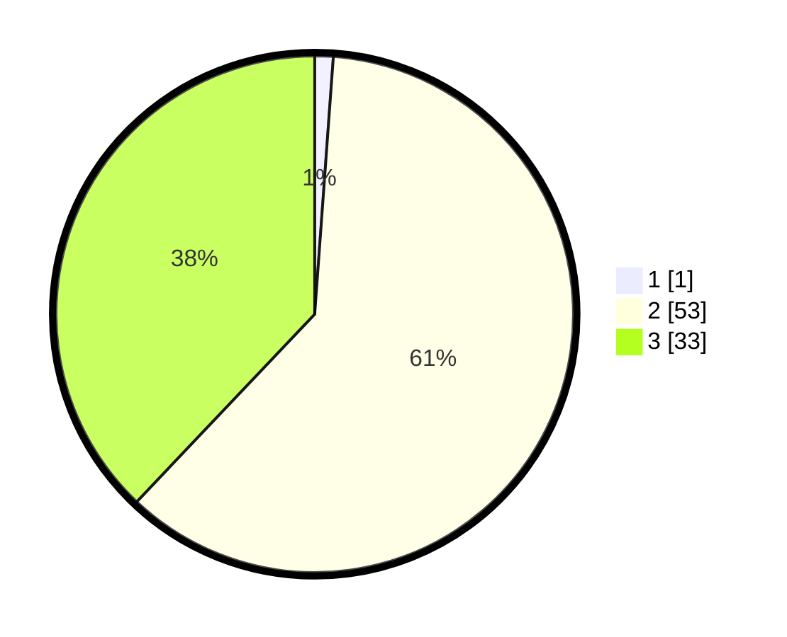

# Hasil

## Grafik

## Tabel

| No. | Nama Paslon    | Suara | Suara (raw) | Persentase |
|:--- |:-------------- | -----:| -----------:| ----------:|
| 1   | ANIES MUHAIMIN | 1     | [1][p-1]    | 1,15       |
| 2   | PRABOWO GIBRAN | 53    | [53][p-2]   | 60,92      |
| 3   | GANJAR MAHFUD  | 33    | [33][p-3]   | 37,93      |

[p-1]: https://github.com/gigit-pemilu/pemilu-2024-61-kalimantan-barat/blob/main/pilpres/hitung-suara/sub/61-kalimantan-barat/sub/03-sanggau/sub/11-tayan-hilir/sub/2008-emberas/sub/008-tps/sub/paslon-1.txt
[p-2]: https://github.com/gigit-pemilu/pemilu-2024-61-kalimantan-barat/blob/main/pilpres/hitung-suara/sub/61-kalimantan-barat/sub/03-sanggau/sub/11-tayan-hilir/sub/2008-emberas/sub/008-tps/sub/paslon-2.txt
[p-3]: https://github.com/gigit-pemilu/pemilu-2024-61-kalimantan-barat/blob/main/pilpres/hitung-suara/sub/61-kalimantan-barat/sub/03-sanggau/sub/11-tayan-hilir/sub/2008-emberas/sub/008-tps/sub/paslon-3.txt

## Foto C Plano

https://sirekap-obj-formc.kpu.go.id/7ca3/pemilu/ppwp/61/03/11/20/08/6103112008008-20240215-104326--4e2033f9-68e5-4c5c-90ab-e99141a4b2bc.jpg

https://sirekap-obj-formc.kpu.go.id/7ca3/pemilu/ppwp/61/03/11/20/08/6103112008008-20240215-104528--f43a8562-9972-4043-a9c5-da1ad0139f32.jpg

https://sirekap-obj-formc.kpu.go.id/7ca3/pemilu/ppwp/61/03/11/20/08/6103112008008-20240215-104520--9f380e98-a850-4d79-866e-a561fb4c535e.jpg

## Metadata

| Key        | Value               |
| ---------- | ------------------- |
| Time Stamp | 2024-02-25 07:00:00 |

## DATA PEMILIH TETAP

Jumlah pemilih dalam DPT: **104**.
 * L: **58**.
 * P: **48**.

## DATA PENGGUNA HAK PILIH

Jumlah pengguna hak pilih dalam DPT: **88**.
 * L: **46**.
 * P: **42**.

Jumlah pengguna hak pilih dalam DPTb: **334**.
 * L: **0**.
 * P: **200**.

Jumlah pengguna hak pilih dalam DPK: **334**.
 * L: **0**.
 * P: **2**.

Jumlah pengguna hak pilih: **222**.
 * L: **46**.
 * P: **40**.

## JUMLAH SUARA SAH DAN TIDAK SAH

JUMLAH SELURUH SUARA SAH: **87**.

JUMLAH SUARA TIDAK SAH: **1**.

JUMLAH SELURUH SUARA SAH DAN SUARA TIDAK SAH: **88**.

