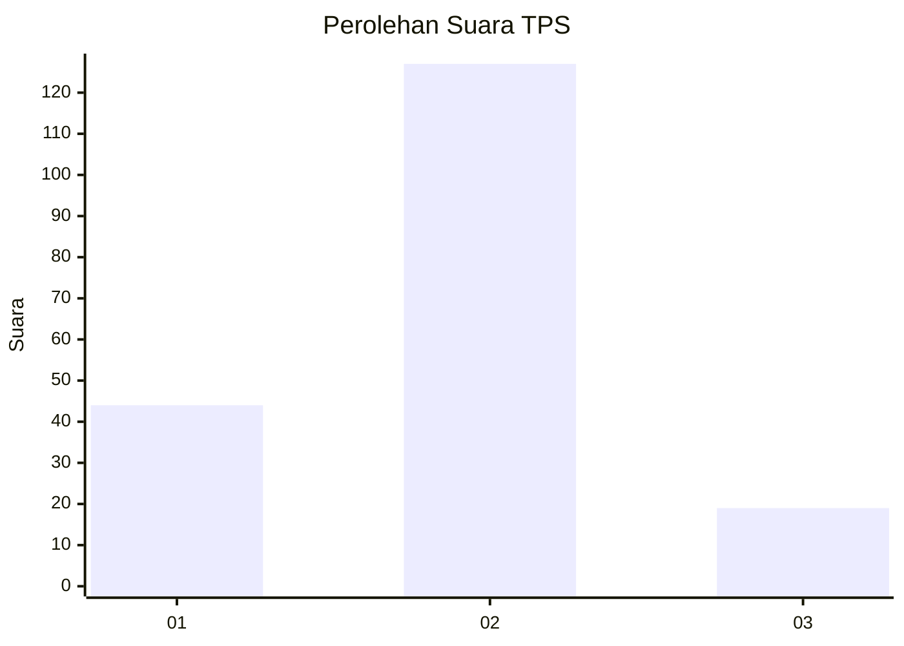

# Hasil

## Grafik

## Tabel

| No. | Nama Paslon    | Suara | Suara (raw) | Persentase |
|:--- |:-------------- | -----:| -----------:| ----------:|
| 1   | ANIES MUHAIMIN | 44    | [44][p-1]   | 23,16      |
| 2   | PRABOWO GIBRAN | 127   | [127][p-2]  | 66,84      |
| 3   | GANJAR MAHFUD  | 19    | [19][p-3]   | 10,00      |

[p-1]: https://github.com/gigit-pemilu/pemilu-2024-61-kalimantan-barat/blob/main/pilpres/hitung-suara/sub/61-kalimantan-barat/sub/03-sanggau/sub/12-balai/sub/2001-hilir/sub/002-tps/sub/paslon-1.txt
[p-2]: https://github.com/gigit-pemilu/pemilu-2024-61-kalimantan-barat/blob/main/pilpres/hitung-suara/sub/61-kalimantan-barat/sub/03-sanggau/sub/12-balai/sub/2001-hilir/sub/002-tps/sub/paslon-2.txt
[p-3]: https://github.com/gigit-pemilu/pemilu-2024-61-kalimantan-barat/blob/main/pilpres/hitung-suara/sub/61-kalimantan-barat/sub/03-sanggau/sub/12-balai/sub/2001-hilir/sub/002-tps/sub/paslon-3.txt

## Foto C Plano

https://sirekap-obj-formc.kpu.go.id/adfe/pemilu/ppwp/61/03/12/20/01/6103122001002-20240215-003900--dc96aef6-e057-4d9e-b040-b4801e151c0a.jpg

https://sirekap-obj-formc.kpu.go.id/adfe/pemilu/ppwp/61/03/12/20/01/6103122001002-20240215-003956--28b51cde-b954-4a8f-96ae-9d19f2a03299.jpg

https://sirekap-obj-formc.kpu.go.id/adfe/pemilu/ppwp/61/03/12/20/01/6103122001002-20240215-004121--19671231-4ba1-4255-b5a0-d040f5cd853c.jpg

## Metadata

| Key        | Value               |
| ---------- | ------------------- |
| Time Stamp | 2024-02-15 15:00:29 |

