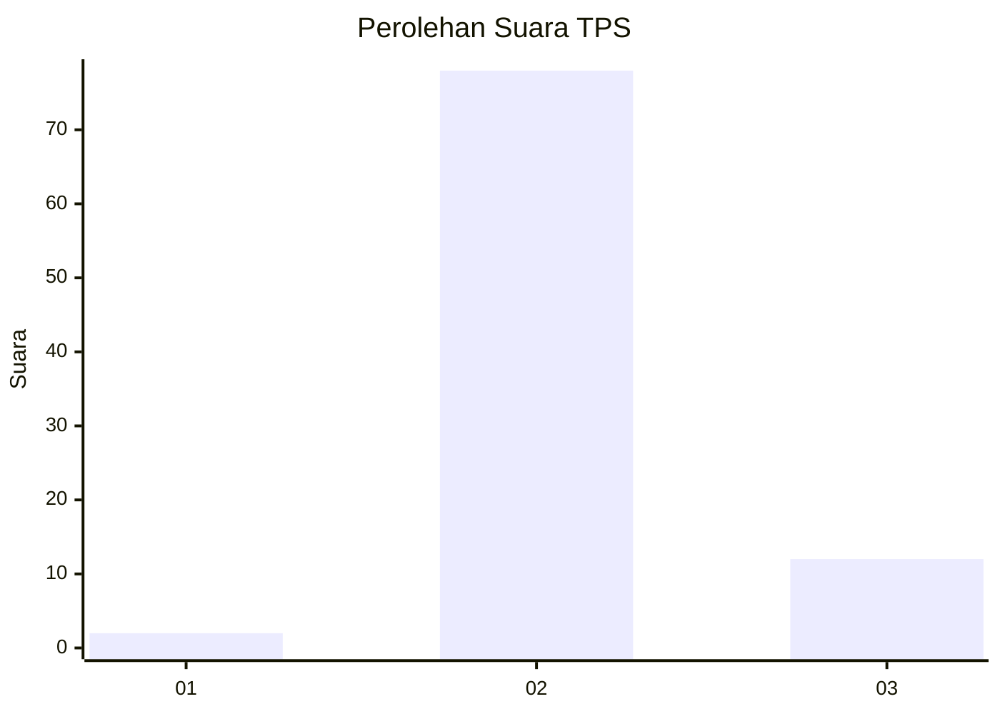
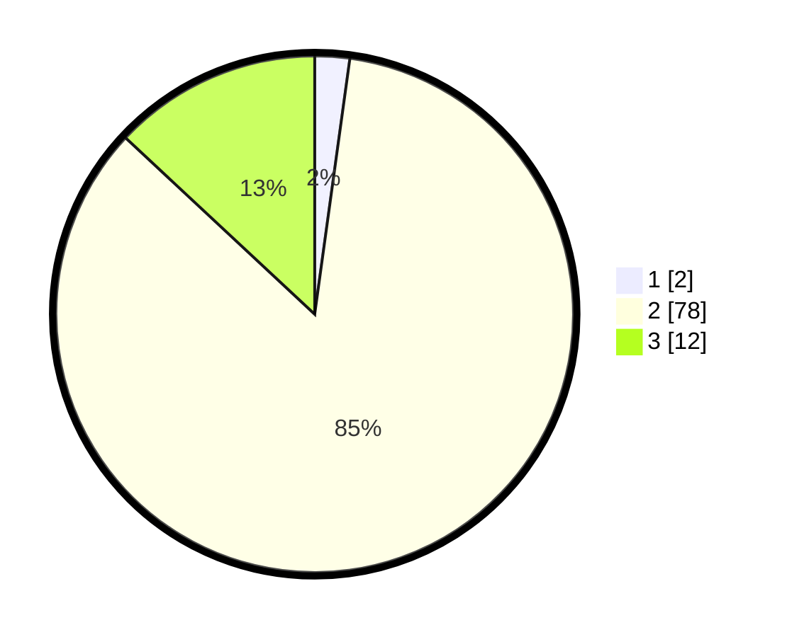

# Hasil

## Grafik

## Tabel

| No. | Nama Paslon    | Suara | Suara (raw) | Persentase |
|:--- |:-------------- | -----:| -----------:| ----------:|
| 1   | ANIES MUHAIMIN | 2     | [2][p-1]    | 2,17       |
| 2   | PRABOWO GIBRAN | 78    | [78][p-2]   | 84,78      |
| 3   | GANJAR MAHFUD  | 12    | [12][p-3]   | 13,04      |

[p-1]: https://github.com/gigit-pemilu/pemilu-2024-61-kalimantan-barat/blob/main/pilpres/hitung-suara/sub/61-kalimantan-barat/sub/03-sanggau/sub/12-balai/sub/2012-senyabang/sub/007-tps/sub/paslon-1.txt
[p-2]: https://github.com/gigit-pemilu/pemilu-2024-61-kalimantan-barat/blob/main/pilpres/hitung-suara/sub/61-kalimantan-barat/sub/03-sanggau/sub/12-balai/sub/2012-senyabang/sub/007-tps/sub/paslon-2.txt
[p-3]: https://github.com/gigit-pemilu/pemilu-2024-61-kalimantan-barat/blob/main/pilpres/hitung-suara/sub/61-kalimantan-barat/sub/03-sanggau/sub/12-balai/sub/2012-senyabang/sub/007-tps/sub/paslon-3.txt

## Foto C Plano

https://sirekap-obj-formc.kpu.go.id/9a71/pemilu/ppwp/61/03/12/20/12/6103122012007-20240215-094454--57056233-c38c-4a25-b96d-a04fbc770bf2.jpg

https://sirekap-obj-formc.kpu.go.id/9a71/pemilu/ppwp/61/03/12/20/12/6103122012007-20240215-094632--7ad9fff1-8a1d-4f57-bbcb-7f5432e93b1b.jpg

https://sirekap-obj-formc.kpu.go.id/9a71/pemilu/ppwp/61/03/12/20/12/6103122012007-20240214-213734--06c9d7c8-7a4c-44df-a135-f7f2f9e94c7c.jpg

## Metadata

| Key        | Value               |
| ---------- | ------------------- |
| Time Stamp | 2024-02-25 22:00:00 |

