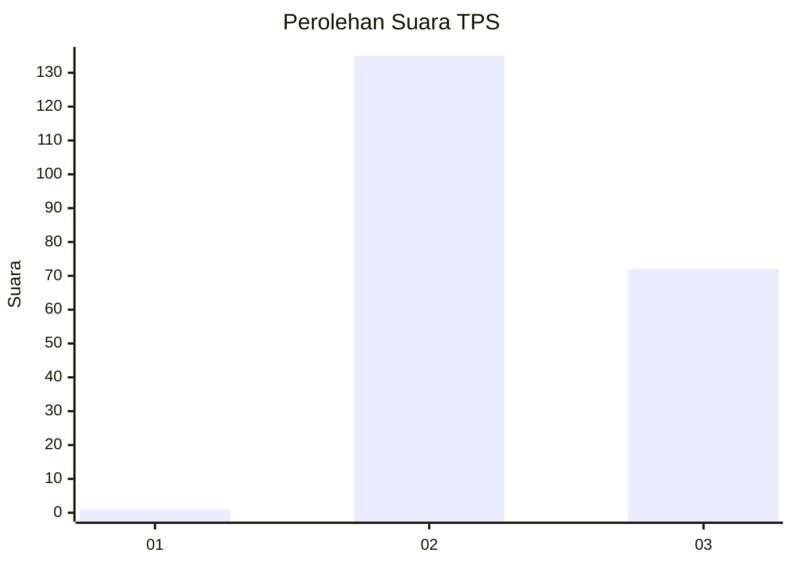
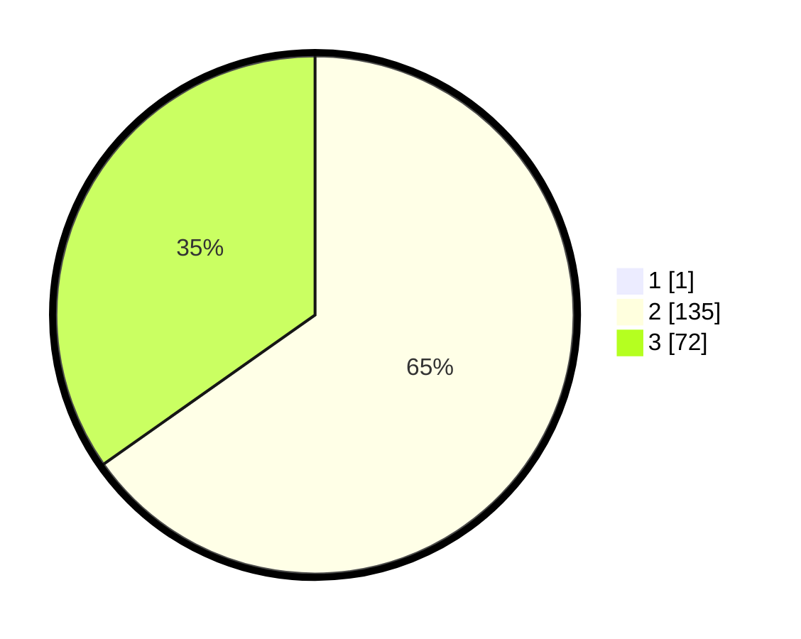

# Hasil

## Grafik

## Tabel

| No. | Nama Paslon    | Suara | Suara (raw) | Persentase |
|:--- |:-------------- | -----:| -----------:| ----------:|
| 1   | ANIES MUHAIMIN | 1     | [1][p-1]    | 0,48       |
| 2   | PRABOWO GIBRAN | 135   | [135][p-2]  | 64,90      |
| 3   | GANJAR MAHFUD  | 72    | [72][p-3]   | 34,62      |

[p-1]: https://github.com/gigit-pemilu/pemilu-2024-61-kalimantan-barat/blob/main/pilpres/hitung-suara/sub/61-kalimantan-barat/sub/03-sanggau/sub/13-toba/sub/2001-teraju/sub/001-tps/sub/paslon-1.txt
[p-2]: https://github.com/gigit-pemilu/pemilu-2024-61-kalimantan-barat/blob/main/pilpres/hitung-suara/sub/61-kalimantan-barat/sub/03-sanggau/sub/13-toba/sub/2001-teraju/sub/001-tps/sub/paslon-2.txt
[p-3]: https://github.com/gigit-pemilu/pemilu-2024-61-kalimantan-barat/blob/main/pilpres/hitung-suara/sub/61-kalimantan-barat/sub/03-sanggau/sub/13-toba/sub/2001-teraju/sub/001-tps/sub/paslon-3.txt

## Foto C Plano

https://sirekap-obj-formc.kpu.go.id/de4b/pemilu/ppwp/61/03/13/20/01/6103132001001-20240215-065715--62591700-b11f-4517-be5c-5f76dbbd5002.jpg

https://sirekap-obj-formc.kpu.go.id/de4b/pemilu/ppwp/61/03/13/20/01/6103132001001-20240215-065905--13089fb2-1b4f-4e66-9bab-cc7c57c4fac2.jpg

https://sirekap-obj-formc.kpu.go.id/de4b/pemilu/ppwp/61/03/13/20/01/6103132001001-20240215-070044--8e82dd45-fa12-4cfb-ac88-031f89f89b83.jpg

## Metadata

| Key        | Value               |
| ---------- | ------------------- |
| Time Stamp | 2024-02-15 17:30:25 |

