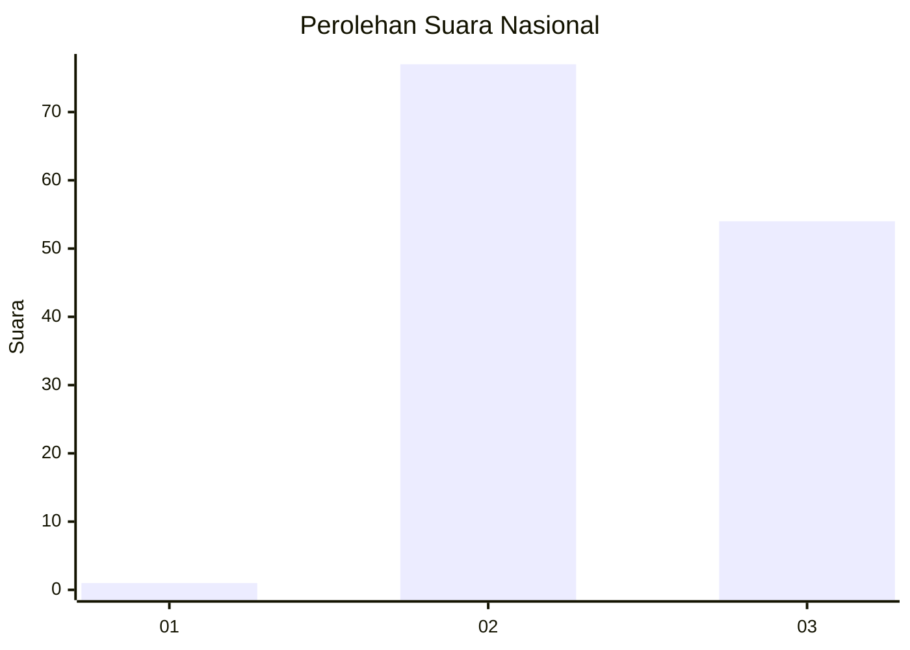
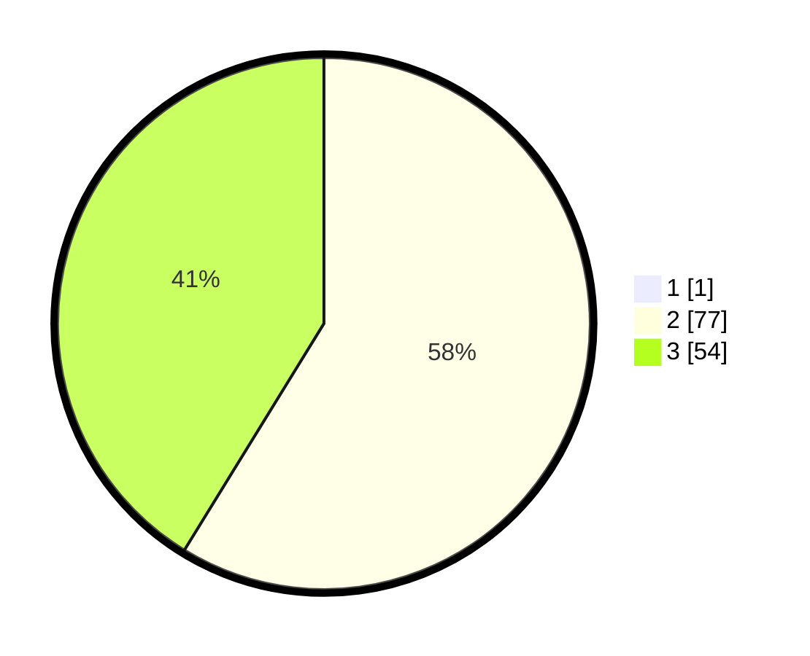

# Hasil

## Grafik

## Tabel

| No. | Nama Paslon    | Suara | Suara (raw) | Persentase |
|:--- |:-------------- | -----:| -----------:| ----------:|
| 1   | ANIES MUHAIMIN | 1     | [1][p-1]    | 0,76       |
| 2   | PRABOWO GIBRAN | 77    | [77][p-2]   | 58,33      |
| 3   | GANJAR MAHFUD  | 54    | [54][p-3]   | 40,91      |

[p-1]: https://github.com/gigit-pemilu/pemilu-2024/blob/main/pilpres/hitung-suara/sub/61-kalimantan-barat/sub/03-sanggau/sub/13-toba/sub/2001-teraju/sub/007-tps/sub/paslon-1.txt
[p-2]: https://github.com/gigit-pemilu/pemilu-2024/blob/main/pilpres/hitung-suara/sub/61-kalimantan-barat/sub/03-sanggau/sub/13-toba/sub/2001-teraju/sub/007-tps/sub/paslon-2.txt
[p-3]: https://github.com/gigit-pemilu/pemilu-2024/blob/main/pilpres/hitung-suara/sub/61-kalimantan-barat/sub/03-sanggau/sub/13-toba/sub/2001-teraju/sub/007-tps/sub/paslon-3.txt

## Foto C Plano

https://sirekap-obj-formc.kpu.go.id/1560/pemilu/ppwp/61/03/13/20/01/6103132001007-20240215-094046--5179394e-1fbe-4166-a3cc-a8ee86a7651b.jpg

https://sirekap-obj-formc.kpu.go.id/1560/pemilu/ppwp/61/03/13/20/01/6103132001007-20240215-094215--4c2c46f1-3baa-43df-a8de-0632c5843ffe.jpg

https://sirekap-obj-formc.kpu.go.id/1560/pemilu/ppwp/61/03/13/20/01/6103132001007-20240215-094317--c3697a0a-e0ca-48a9-8a83-6463fef2601b.jpg

## Metadata

| Key        | Value               |
| ---------- | ------------------- |
| Time Stamp | 2024-02-25 11:00:00 |

