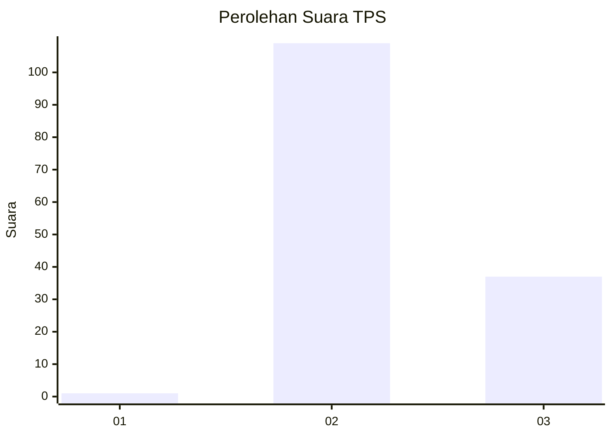
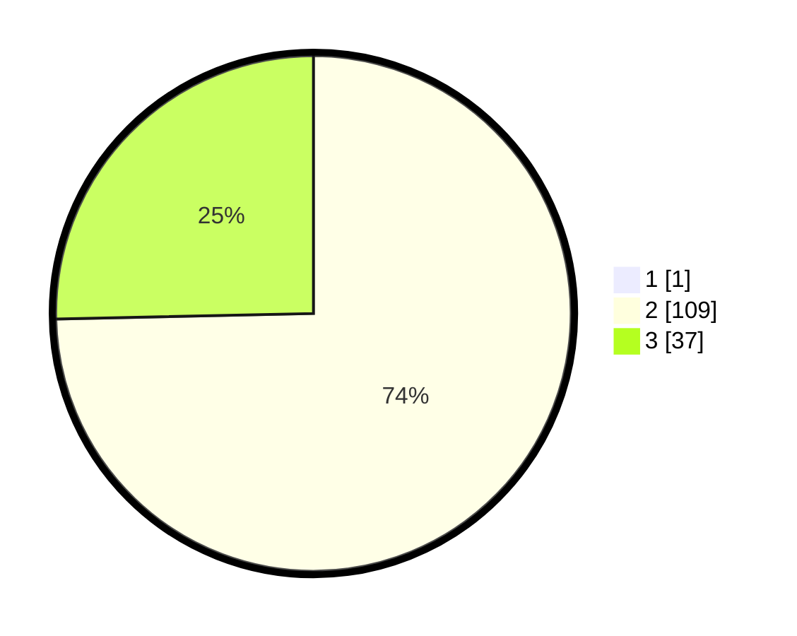

# Hasil

## Grafik

## Tabel

| No. | Nama Paslon    | Suara | Suara (raw) | Persentase |
|:--- |:-------------- | -----:| -----------:| ----------:|
| 1   | ANIES MUHAIMIN | 1     | [1][p-1]    | 0,68       |
| 2   | PRABOWO GIBRAN | 109   | [109][p-2]  | 74,15      |
| 3   | GANJAR MAHFUD  | 37    | [37][p-3]   | 25,17      |

[p-1]: https://github.com/gigit-pemilu/pemilu-2024-61-kalimantan-barat/blob/main/pilpres/hitung-suara/sub/61-kalimantan-barat/sub/03-sanggau/sub/13-toba/sub/2001-teraju/sub/009-tps/sub/paslon-1.txt
[p-2]: https://github.com/gigit-pemilu/pemilu-2024-61-kalimantan-barat/blob/main/pilpres/hitung-suara/sub/61-kalimantan-barat/sub/03-sanggau/sub/13-toba/sub/2001-teraju/sub/009-tps/sub/paslon-2.txt
[p-3]: https://github.com/gigit-pemilu/pemilu-2024-61-kalimantan-barat/blob/main/pilpres/hitung-suara/sub/61-kalimantan-barat/sub/03-sanggau/sub/13-toba/sub/2001-teraju/sub/009-tps/sub/paslon-3.txt

## Foto C Plano

https://sirekap-obj-formc.kpu.go.id/0484/pemilu/ppwp/61/03/13/20/01/6103132001009-20240215-020757--6a45ead8-68b1-49d0-b2e3-3726a67b2f15.jpg

https://sirekap-obj-formc.kpu.go.id/0484/pemilu/ppwp/61/03/13/20/01/6103132001009-20240215-020922--78900fb0-39ee-4e44-b19a-53404eaa06a5.jpg

https://sirekap-obj-formc.kpu.go.id/0484/pemilu/ppwp/61/03/13/20/01/6103132001009-20240215-021050--81102b10-e63f-4e36-8b4c-e7b59dd763a1.jpg

## Metadata

| Key        | Value               |
| ---------- | ------------------- |
| Time Stamp | 2024-02-15 15:00:29 |

