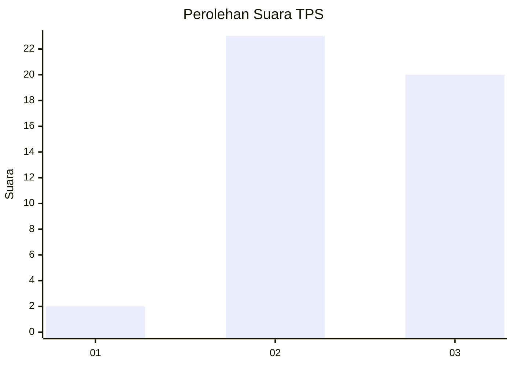
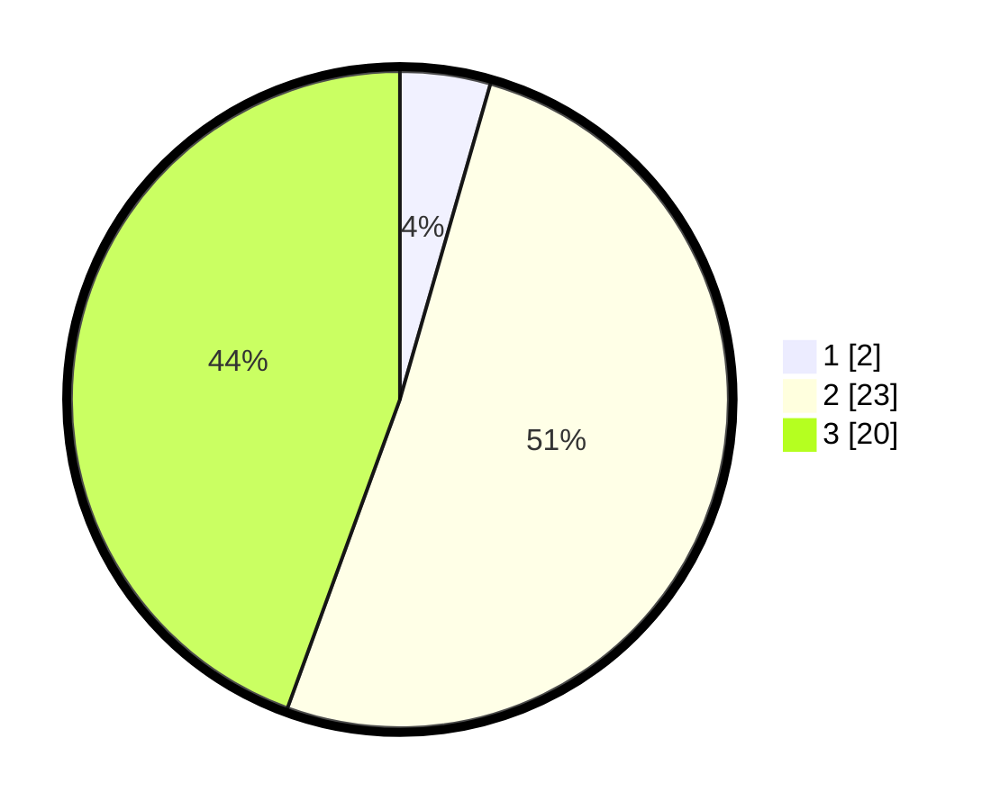

# Hasil

## Grafik

## Tabel

| No. | Nama Paslon    | Suara | Suara (raw) | Persentase |
|:--- |:-------------- | -----:| -----------:| ----------:|
| 1   | ANIES MUHAIMIN | 2     | [2][p-1]    | 4,44       |
| 2   | PRABOWO GIBRAN | 23    | [23][p-2]   | 51,11      |
| 3   | GANJAR MAHFUD  | 20    | [20][p-3]   | 44,44      |

[p-1]: https://github.com/gigit-pemilu/pemilu-2024-61-kalimantan-barat/blob/main/pilpres/hitung-suara/sub/61-kalimantan-barat/sub/03-sanggau/sub/13-toba/sub/2001-teraju/sub/012-tps/sub/paslon-1.txt
[p-2]: https://github.com/gigit-pemilu/pemilu-2024-61-kalimantan-barat/blob/main/pilpres/hitung-suara/sub/61-kalimantan-barat/sub/03-sanggau/sub/13-toba/sub/2001-teraju/sub/012-tps/sub/paslon-2.txt
[p-3]: https://github.com/gigit-pemilu/pemilu-2024-61-kalimantan-barat/blob/main/pilpres/hitung-suara/sub/61-kalimantan-barat/sub/03-sanggau/sub/13-toba/sub/2001-teraju/sub/012-tps/sub/paslon-3.txt

## Foto C Plano

https://sirekap-obj-formc.kpu.go.id/fa0c/pemilu/ppwp/61/03/13/20/01/6103132001012-20240215-094611--2c439fd2-7b5e-4be8-8b16-36ed3f77119a.jpg

https://sirekap-obj-formc.kpu.go.id/fa0c/pemilu/ppwp/61/03/13/20/01/6103132001012-20240215-094533--ba9e0a66-d9dd-4848-8a94-7a5562905ef9.jpg

https://sirekap-obj-formc.kpu.go.id/fa0c/pemilu/ppwp/61/03/13/20/01/6103132001012-20240215-094630--7b02eab2-baef-4ad3-aa7a-4e23a19ca8a9.jpg

## Metadata

| Key        | Value               |
| ---------- | ------------------- |
| Time Stamp | 2024-02-15 17:30:25 |

