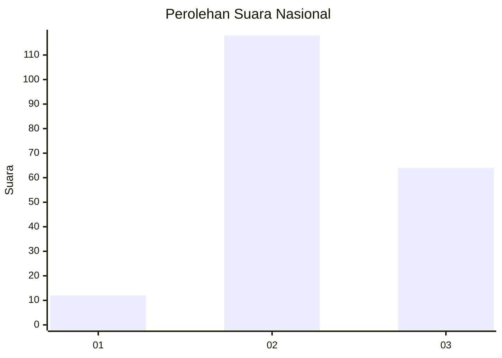
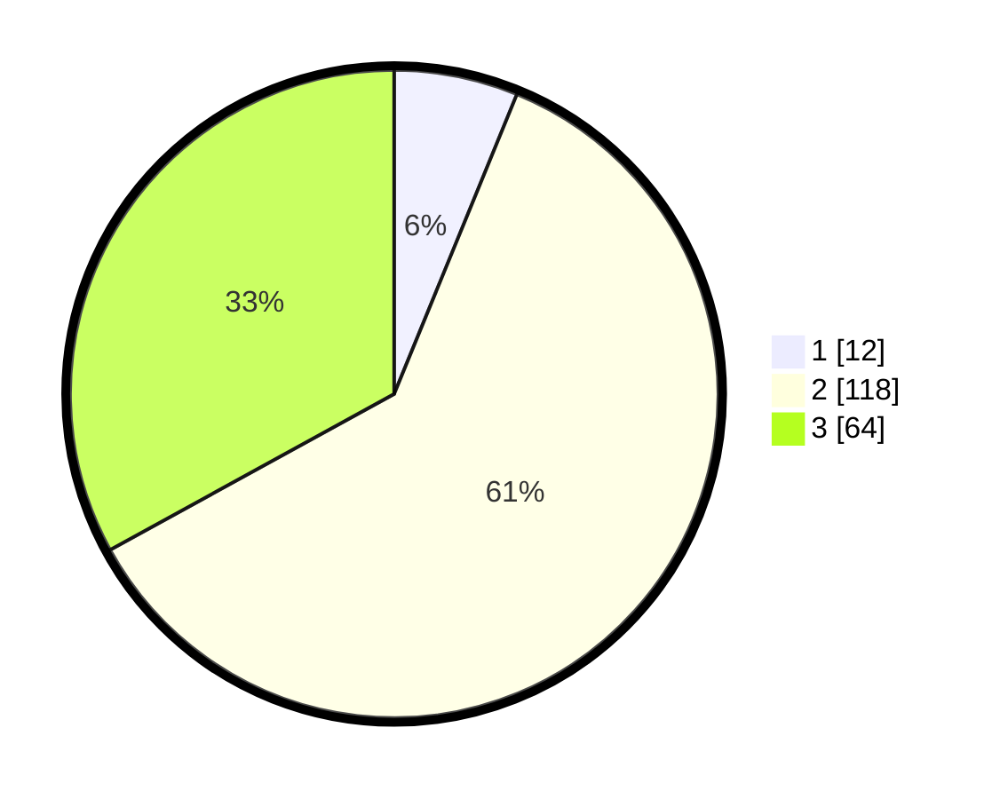

# Hasil

## Grafik

## Tabel

| No. | Nama Paslon    | Suara | Suara (raw) | Persentase |
|:--- |:-------------- | -----:| -----------:| ----------:|
| 1   | ANIES MUHAIMIN | 12    | [12][p-1]   | 6,19       |
| 2   | PRABOWO GIBRAN | 118   | [118][p-2]  | 60,82      |
| 3   | GANJAR MAHFUD  | 64    | [64][p-3]   | 32,99      |

[p-1]: https://github.com/gigit-pemilu/pemilu-2024/blob/main/pilpres/hitung-suara/sub/61-kalimantan-barat/sub/03-sanggau/sub/20-meliau/sub/2001-meliau-hilir/sub/001-tps/sub/paslon-1.txt
[p-2]: https://github.com/gigit-pemilu/pemilu-2024/blob/main/pilpres/hitung-suara/sub/61-kalimantan-barat/sub/03-sanggau/sub/20-meliau/sub/2001-meliau-hilir/sub/001-tps/sub/paslon-2.txt
[p-3]: https://github.com/gigit-pemilu/pemilu-2024/blob/main/pilpres/hitung-suara/sub/61-kalimantan-barat/sub/03-sanggau/sub/20-meliau/sub/2001-meliau-hilir/sub/001-tps/sub/paslon-3.txt

## Foto C Plano

https://sirekap-obj-formc.kpu.go.id/e392/pemilu/ppwp/61/03/20/20/01/6103202001001-20240215-192507--c683ef22-be8c-44e0-b4cc-d3c2c82bef5b.jpg

https://sirekap-obj-formc.kpu.go.id/e392/pemilu/ppwp/61/03/20/20/01/6103202001001-20240215-193401--5a732e11-a69b-493e-be1e-e763bb86c25b.jpg

https://sirekap-obj-formc.kpu.go.id/e392/pemilu/ppwp/61/03/20/20/01/6103202001001-20240219-034153--dbf2a2dc-9719-439e-995e-8ee26806f1a4.jpg

## Metadata

| Key        | Value               |
| ---------- | ------------------- |
| Time Stamp | 2024-02-19 06:16:00 |

