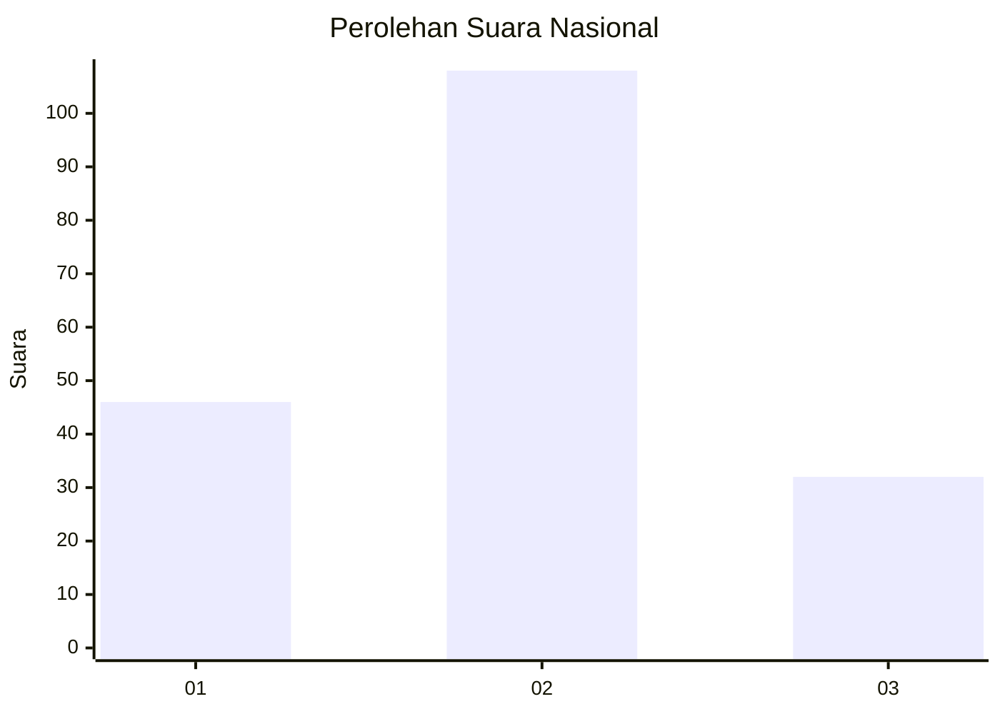
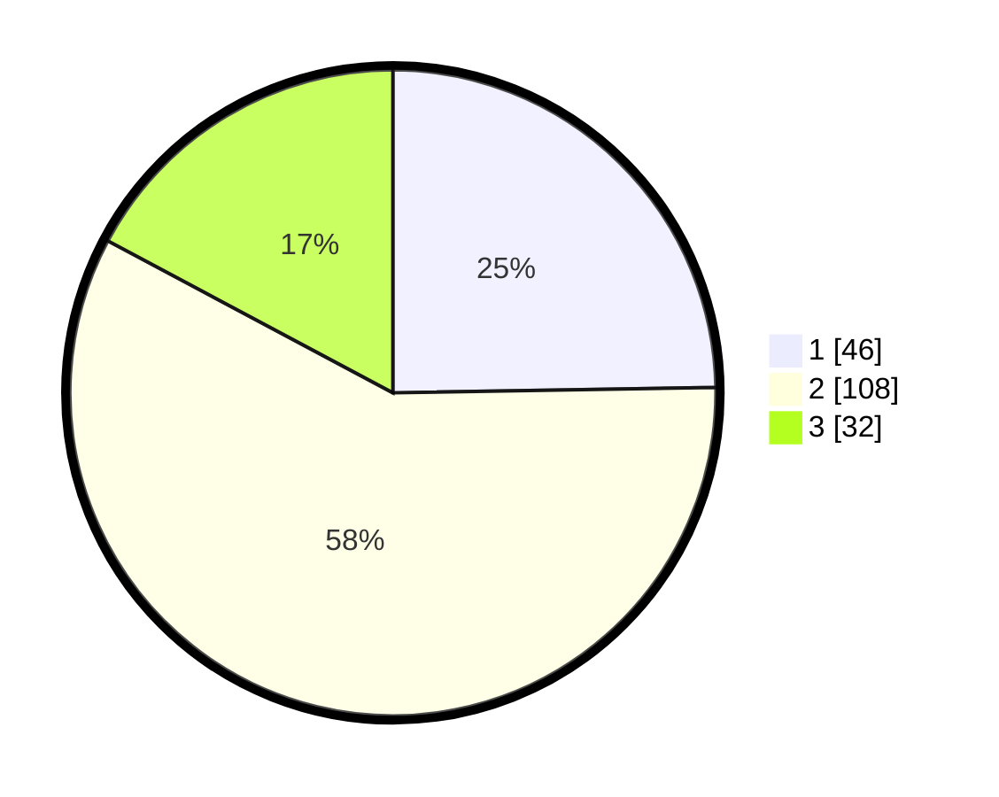

# Hasil

## Grafik

## Tabel

| No. | Nama Paslon    | Suara | Suara (raw) | Persentase |
|:--- |:-------------- | -----:| -----------:| ----------:|
| 1   | ANIES MUHAIMIN | 46    | [46][p-1]   | 24,73      |
| 2   | PRABOWO GIBRAN | 108   | [108][p-2]  | 58,06      |
| 3   | GANJAR MAHFUD  | 32    | [32][p-3]   | 17,20      |

[p-1]: https://github.com/gigit-pemilu/pemilu-2024/blob/main/pilpres/hitung-suara/sub/61-kalimantan-barat/sub/03-sanggau/sub/20-meliau/sub/2001-meliau-hilir/sub/006-tps/sub/paslon-1.txt
[p-2]: https://github.com/gigit-pemilu/pemilu-2024/blob/main/pilpres/hitung-suara/sub/61-kalimantan-barat/sub/03-sanggau/sub/20-meliau/sub/2001-meliau-hilir/sub/006-tps/sub/paslon-2.txt
[p-3]: https://github.com/gigit-pemilu/pemilu-2024/blob/main/pilpres/hitung-suara/sub/61-kalimantan-barat/sub/03-sanggau/sub/20-meliau/sub/2001-meliau-hilir/sub/006-tps/sub/paslon-3.txt

## Foto C Plano

https://sirekap-obj-formc.kpu.go.id/10a8/pemilu/ppwp/61/03/20/20/01/6103202001006-20240215-092123--afcaa4c6-bb86-45b8-af14-0cac993747fe.jpg

https://sirekap-obj-formc.kpu.go.id/10a8/pemilu/ppwp/61/03/20/20/01/6103202001006-20240215-032911--6b5eb1aa-7fd1-493f-b51b-5658767c61f0.jpg

https://sirekap-obj-formc.kpu.go.id/10a8/pemilu/ppwp/61/03/20/20/01/6103202001006-20240215-032913--fde20f6f-4cdf-484a-892a-cd5fde7610bc.jpg

## Metadata

| Key        | Value               |
| ---------- | ------------------- |
| Time Stamp | 2024-02-15 15:00:29 |

