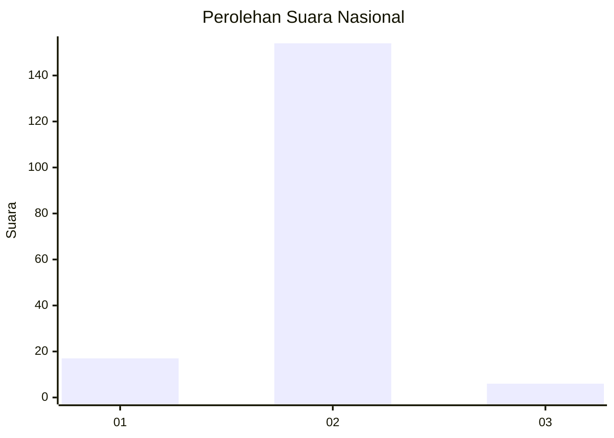
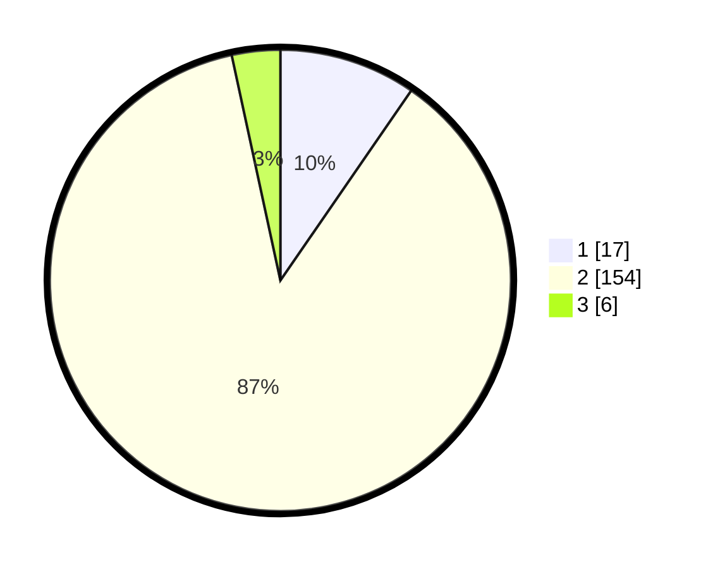

# Hasil

## Grafik

## Tabel

| No. | Nama Paslon    | Suara | Suara (raw) | Persentase |
|:--- |:-------------- | -----:| -----------:| ----------:|
| 1   | ANIES MUHAIMIN | 17    | [17][p-1]   | 9,60       |
| 2   | PRABOWO GIBRAN | 154   | [154][p-2]  | 87,01      |
| 3   | GANJAR MAHFUD  | 6     | [6][p-3]    | 3,39       |

[p-1]: https://github.com/gigit-pemilu/pemilu-2024/blob/main/pilpres/hitung-suara/sub/61-kalimantan-barat/sub/03-sanggau/sub/20-meliau/sub/2003-kuala-buayan/sub/004-tps/sub/paslon-1.txt
[p-2]: https://github.com/gigit-pemilu/pemilu-2024/blob/main/pilpres/hitung-suara/sub/61-kalimantan-barat/sub/03-sanggau/sub/20-meliau/sub/2003-kuala-buayan/sub/004-tps/sub/paslon-2.txt
[p-3]: https://github.com/gigit-pemilu/pemilu-2024/blob/main/pilpres/hitung-suara/sub/61-kalimantan-barat/sub/03-sanggau/sub/20-meliau/sub/2003-kuala-buayan/sub/004-tps/sub/paslon-3.txt

## Foto C Plano

https://sirekap-obj-formc.kpu.go.id/3cb7/pemilu/ppwp/61/03/20/20/03/6103202003004-20240214-215640--ebb794d9-bd23-4f7a-8f30-8503d46f1907.jpg

https://sirekap-obj-formc.kpu.go.id/3cb7/pemilu/ppwp/61/03/20/20/03/6103202003004-20240214-215923--88171653-acc3-46cc-b73b-ffbfa5192017.jpg

https://sirekap-obj-formc.kpu.go.id/3cb7/pemilu/ppwp/61/03/20/20/03/6103202003004-20240214-220746--8925b989-4eda-44be-ae99-6a995259e468.jpg

## Metadata

| Key        | Value               |
| ---------- | ------------------- |
| Time Stamp | 2024-02-15 17:30:25 |

