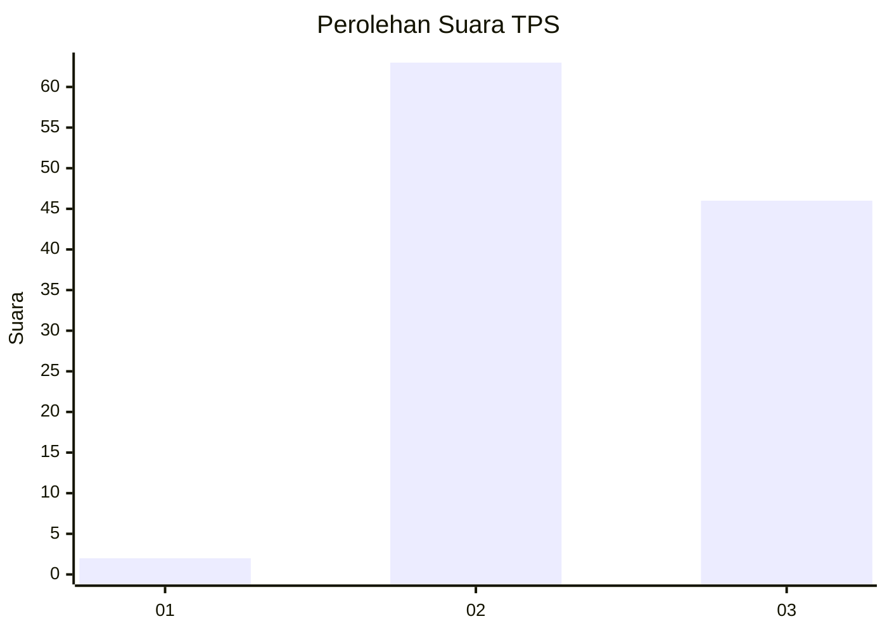
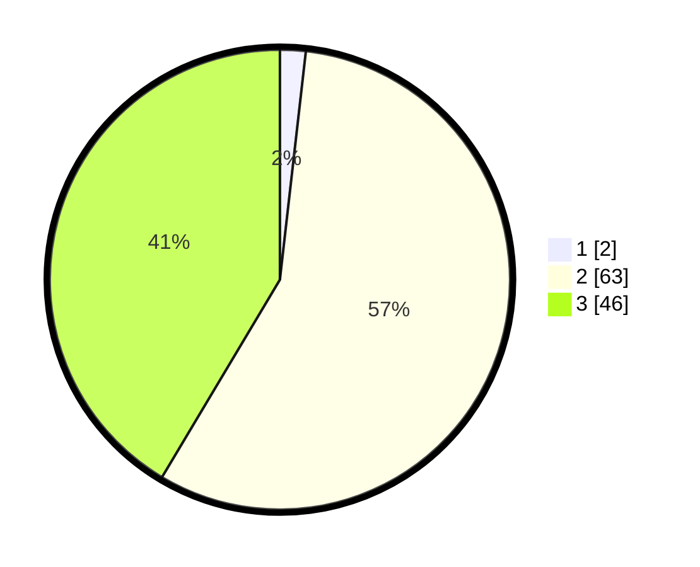

# Hasil

## Grafik

## Tabel

| No. | Nama Paslon    | Suara | Suara (raw) | Persentase |
|:--- |:-------------- | -----:| -----------:| ----------:|
| 1   | ANIES MUHAIMIN | 2     | [2][p-1]    | 1,80       |
| 2   | PRABOWO GIBRAN | 63    | [63][p-2]   | 56,76      |
| 3   | GANJAR MAHFUD  | 46    | [46][p-3]   | 41,44      |

[p-1]: https://github.com/gigit-pemilu/pemilu-2024-61-kalimantan-barat/blob/main/pilpres/hitung-suara/sub/61-kalimantan-barat/sub/03-sanggau/sub/20-meliau/sub/2006-sungai-mayam/sub/004-tps/sub/paslon-1.txt
[p-2]: https://github.com/gigit-pemilu/pemilu-2024-61-kalimantan-barat/blob/main/pilpres/hitung-suara/sub/61-kalimantan-barat/sub/03-sanggau/sub/20-meliau/sub/2006-sungai-mayam/sub/004-tps/sub/paslon-2.txt
[p-3]: https://github.com/gigit-pemilu/pemilu-2024-61-kalimantan-barat/blob/main/pilpres/hitung-suara/sub/61-kalimantan-barat/sub/03-sanggau/sub/20-meliau/sub/2006-sungai-mayam/sub/004-tps/sub/paslon-3.txt

## Foto C Plano

https://sirekap-obj-formc.kpu.go.id/cec4/pemilu/ppwp/61/03/20/20/06/6103202006004-20240215-010157--fd6dea80-eaf9-439d-949b-ec30017265cc.jpg

https://sirekap-obj-formc.kpu.go.id/cec4/pemilu/ppwp/61/03/20/20/06/6103202006004-20240215-010334--4011a8d8-fed0-4e16-a7db-e1fd8f91fede.jpg

https://sirekap-obj-formc.kpu.go.id/cec4/pemilu/ppwp/61/03/20/20/06/6103202006004-20240215-010455--a05b43b7-ff53-44ec-a574-6d7c193fae70.jpg

## Metadata

| Key        | Value               |
| ---------- | ------------------- |
| Time Stamp | 2024-02-27 21:00:04 |

