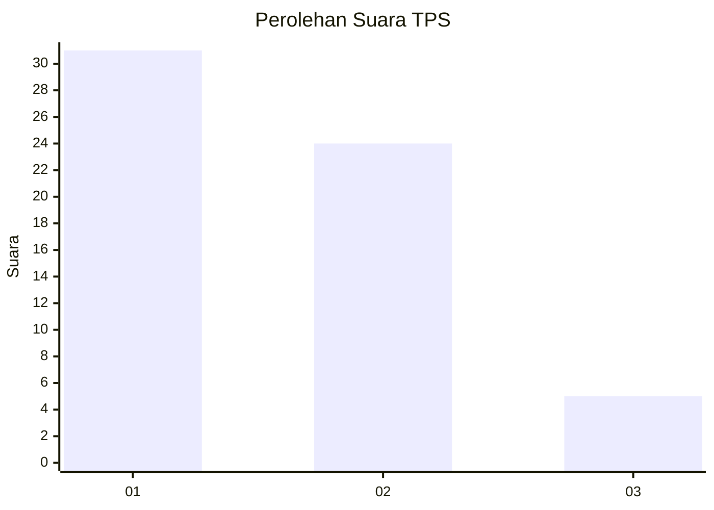
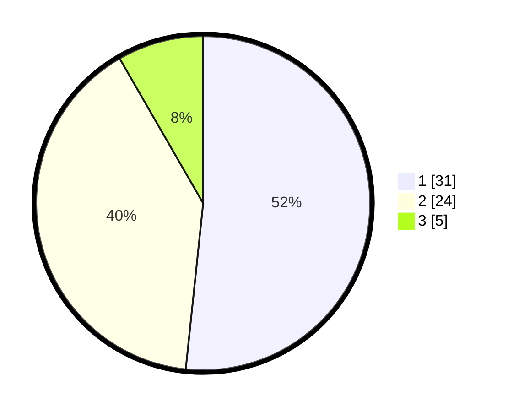

# Hasil

## Grafik

## Tabel

| No. | Nama Paslon    | Suara | Suara (raw) | Persentase |
|:--- |:-------------- | -----:| -----------:| ----------:|
| 1   | ANIES MUHAIMIN | 31    | [31][p-1]   | 51,67      |
| 2   | PRABOWO GIBRAN | 24    | [24][p-2]   | 40,00      |
| 3   | GANJAR MAHFUD  | 5     | [5][p-3]    | 8,33       |

[p-1]: https://github.com/gigit-pemilu/pemilu-2024-61-kalimantan-barat/blob/main/pilpres/hitung-suara/sub/61-kalimantan-barat/sub/03-sanggau/sub/20-meliau/sub/2011-cupang/sub/002-tps/sub/paslon-1.txt
[p-2]: https://github.com/gigit-pemilu/pemilu-2024-61-kalimantan-barat/blob/main/pilpres/hitung-suara/sub/61-kalimantan-barat/sub/03-sanggau/sub/20-meliau/sub/2011-cupang/sub/002-tps/sub/paslon-2.txt
[p-3]: https://github.com/gigit-pemilu/pemilu-2024-61-kalimantan-barat/blob/main/pilpres/hitung-suara/sub/61-kalimantan-barat/sub/03-sanggau/sub/20-meliau/sub/2011-cupang/sub/002-tps/sub/paslon-3.txt

## Foto C Plano

https://sirekap-obj-formc.kpu.go.id/ea4b/pemilu/ppwp/61/03/20/20/11/6103202011002-20240215-181747--e4ec01ca-82fb-47e9-8cfb-b1a4f58eb5ec.jpg

https://sirekap-obj-formc.kpu.go.id/ea4b/pemilu/ppwp/61/03/20/20/11/6103202011002-20240215-134339--9e9d085f-3e7f-4afc-85a1-8ade38d3befe.jpg

https://sirekap-obj-formc.kpu.go.id/ea4b/pemilu/ppwp/61/03/20/20/11/6103202011002-20240215-124028--62c4486e-8cc4-4aec-a773-e108e0ea80d0.jpg

## Metadata

| Key        | Value               |
| ---------- | ------------------- |
| Time Stamp | 2024-02-16 00:00:26 |

