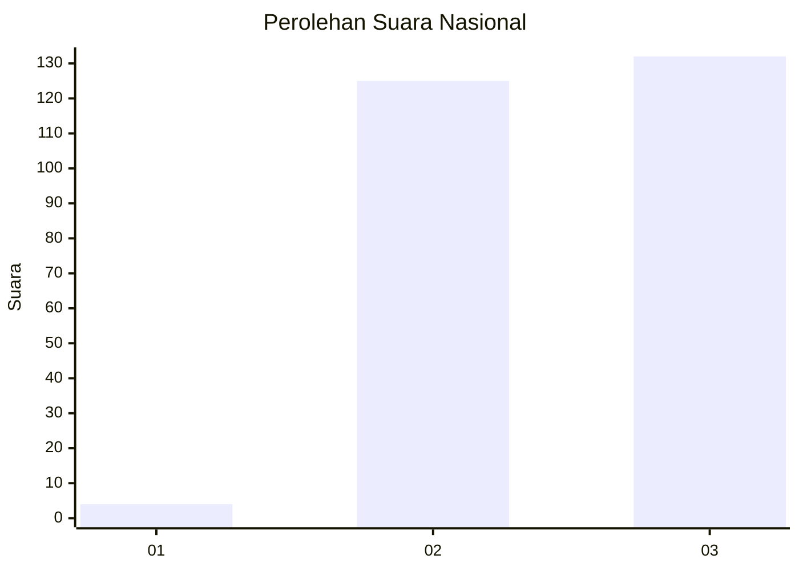
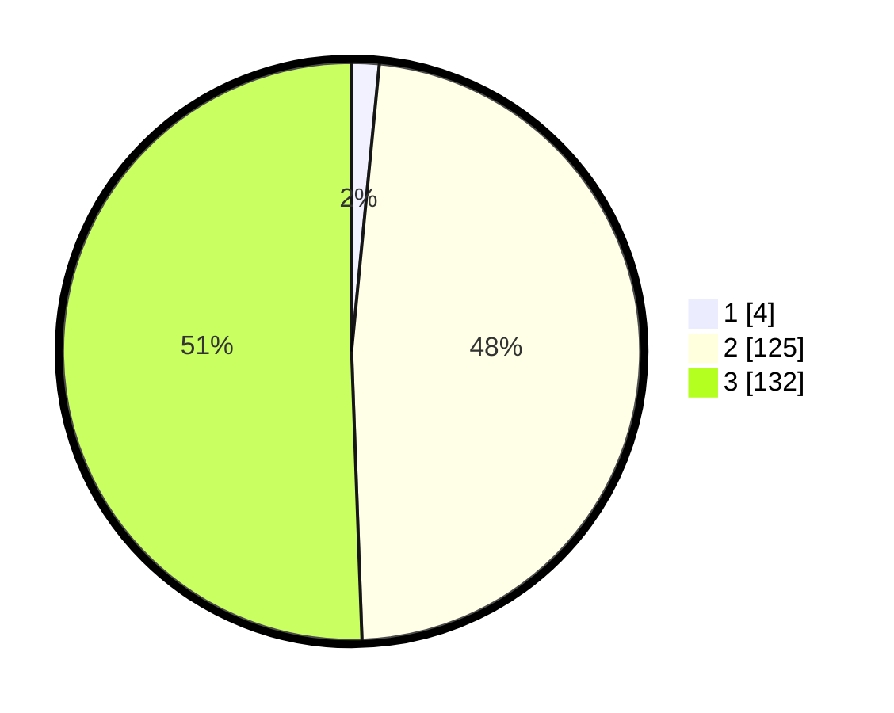

# Hasil

## Grafik

## Tabel

| No. | Nama Paslon    | Suara | Suara (raw) | Persentase |
|:--- |:-------------- | -----:| -----------:| ----------:|
| 1   | ANIES MUHAIMIN | 4     | [4][p-1]    | 1,53       |
| 2   | PRABOWO GIBRAN | 125   | [125][p-2]  | 47,89      |
| 3   | GANJAR MAHFUD  | 132   | [132][p-3]  | 50,57      |

[p-1]: https://github.com/gigit-pemilu/pemilu-2024/blob/main/pilpres/hitung-suara/sub/61-kalimantan-barat/sub/03-sanggau/sub/20-meliau/sub/2018-mukti-jaya/sub/001-tps/sub/paslon-1.txt
[p-2]: https://github.com/gigit-pemilu/pemilu-2024/blob/main/pilpres/hitung-suara/sub/61-kalimantan-barat/sub/03-sanggau/sub/20-meliau/sub/2018-mukti-jaya/sub/001-tps/sub/paslon-2.txt
[p-3]: https://github.com/gigit-pemilu/pemilu-2024/blob/main/pilpres/hitung-suara/sub/61-kalimantan-barat/sub/03-sanggau/sub/20-meliau/sub/2018-mukti-jaya/sub/001-tps/sub/paslon-3.txt

## Foto C Plano

https://sirekap-obj-formc.kpu.go.id/07d0/pemilu/ppwp/61/03/20/20/18/6103202018001-20240219-132656--24ec4196-401f-40bd-a38b-f9b7d51ba23e.jpg

https://sirekap-obj-formc.kpu.go.id/07d0/pemilu/ppwp/61/03/20/20/18/6103202018001-20240219-132734--755999e1-3dcb-45f0-b812-f489a5dea702.jpg

https://sirekap-obj-formc.kpu.go.id/07d0/pemilu/ppwp/61/03/20/20/18/6103202018001-20240219-132810--041c258a-81ca-436c-85dd-447756b8b3ef.jpg

## Metadata

| Key        | Value               |
| ---------- | ------------------- |
| Time Stamp | 2024-02-24 22:31:28 |

